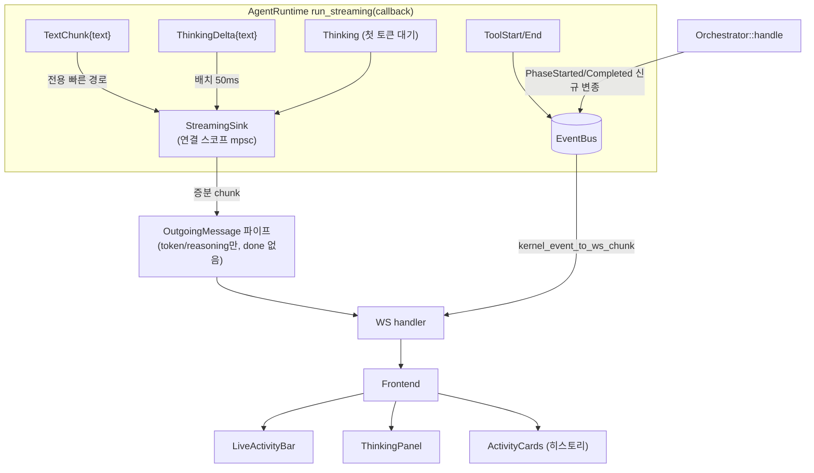

# 채팅 투명성 완성 — 응답 대기 중 실시간 추론/진행 가시화

> **상태:** Draft
> **날짜:** 2026-06-28
> **영역:** oxios-kernel (agent_runtime, orchestrator, event_bus), oxios-gateway (message), src/api/routes/chat.rs, oxios-web (chat UI)
> **관계:** [RFC-015 Chat Transparency](../rfc-015-chat-transparency.md)의 **완성(amendment)**. 본 문서는 RFC-015를 대체하지 않고, 절반만 구현된 부분을 메운다.
> **목표 체감:** Claude 웹 UI / Gemini 웹 UI 수준의 응답 대기 중 가시성

---

## 1. 문제

사용자가 메시지를 보낸 뒤 응답이 올 때까지 **검은 상자**가 된다:

- "Thinking..." 점 3개만 깜빡임
- 에이전트가 무엇을 하는지(추론, 도구 호출, 페이즈 전환) 불투명
- 답변이 통째로 한 번에 나타남 (타자기 효과 없음)

RFC-015가 정확히 이 문제를 설계했고 **절반은 구현**되어 있다. 그러나 결정적 부분이 빠져 Claude/Gemini처럼 느껴지지 않는다. 본 설계는 RFC-015의 빈 곳을 메우는 데 집중한다.

---

## 2. 현재 상태 (검증 완료)

RFC-015가 이미 구축한 것:

| 구성 요소 | 위치 | 상태 |
|---|---|---|
| 도구 투명성 이벤트 | `agent_runtime.rs:1036-1124` (`ToolExecutionStarted/Finished/Progress`) | ✅ 발행 |
| 토큰 사용량 | `agent_runtime.rs:1182` (`TokenUsageUpdate`) | ✅ 발행 |
| 압축 reasoning | `agent_runtime.rs:1205` (`ReasoningFragment { source: "compaction" }`) | ✅ 발행 |
| WS chunk 변환 | `chat.rs:1094-1172` (`kernel_event_to_ws_chunk`) | ✅ tool/progress/memory/usage/reasoning |
| 프론트엔드 렌더링 | `activity-card.tsx`, `activity-timeline.tsx`, `stores/chat.ts`, `types/index.ts`, i18n | ✅ |
| WS 이중 전송 | `chat.rs:379-387` (`outgoing_rx` = 게이트웨이 채널, `kernel_event_rx` = EventBus) | ✅ |

두 개의 독립된 전송 채널(핵심):

```
chat.rs send_task 의 select!:
  biased;
  outgoing_rx.recv()        → 게이트웨이 OutgoingMessage 파이프 (token + done, 연결 스코프, 정렬됨)
  kernel_event_rx.recv()    → EventBus 브로드캐스트 (RFC-015 투명성 chunk, 팬아웃, session 필터)
```

---

## 3. 핵심 갭 분석 (파일:라인 증거)

| # | 갭 | 증거 | 영향 |
|---|---|---|---|
| **A** | **보이는 텍스트가 라이브 스트리밍되지 않음** | `agent_runtime.rs:1212`의 `_ => {}`가 `AgentEvent::TextChunk` 폐기. `handle_unified` → `handle()` → `execute_directive()`가 `OrchestrationResult.response` **전체 문자열**을 반환 → 게이트웨이가 **1개의** `OutgoingMessage`로 발행. | 답변이 한 번에 통째로 나타남. 타자기 효과 없음. "기다림" 체감의 대부분. |
| **B** | **모델 thinking 스트림이 연결되지 않음** | oxi-agent 0.45.1 `AgentEvent::Thinking`/`ThinkingDelta{text}` 존재 (`events.rs:245-251`); oxi-ai 0.45.1 `ProviderEvent::ThinkingStart/Delta/End` (`event.rs:90-112`). 그러나 런타임 `_ => {}`가 폐기. 유일한 reasoning은 compaction. | Claude/Gemini 시그니처 "생각 과정" 패널이 절대 안 나타남. |
| **C** | **phase `KernelEvent` 변종 자체가 없음** | `event_bus.rs:31-322` enum에 `PhaseStarted`/`PhaseCompleted`/`SeedCreated`/`EvaluationComplete` **없음**. RFC-015 §3.2.1이 제안했으나 tool/usage/reasoning 부분집합만 출하. `kernel_event_to_ws_chunk`(1094-1172)에 phase arm 없음(1149의 "orchestrator already publishes" 주석은 **거짓/stale**). ARCHITECTURE.md의 변종 목록은 aspirational. | assess→plan→execute→review 진행이 안 보임. |
| **D** | **통합 실시간 상태 라인 없음** | `typing-indicator.tsx`는 점 3개. activity 카드는 답변 **아래에** historical log로만 append. | 긴 LLM thinking 간극에 "지금 뭘 하는지"가 안 보임. |

### 핵심 인사이트 (전송 라우팅)

`AgentEvent::TextChunk` / `ThinkingDelta`는 **토큰 속도 데이터**(고빈도)다. 반면 RFC-015가 EventBus에 흘린 reasoning은 compaction을 위한 것(1회성, 저빈도)이었다. 토큰 속도 데이터를 EventBus로 보내면:

1. 감사 트레일이 per-token 노이즈로 홍수 (`event_bus.rs:439`가 모든 이벤트를 `AuditAction::Other`로 매핑)
2. token chunk와 정렬 보장 없음 (다른 전송이 `select!`를 통과)
3. mid-stream drop이 resync 경로 트리거

→ **고빈도 라이브 스트림(text + thinking)은 연결 스코프 OutgoingMessage 파이프**로, **저빈도 의미 이벤트(phase/tool/usage)는 EventBus**로. (RFC-015 §8이 reasoning throttling을 이미 지적한 것과 정합.)

---

## 4. 설계

### 4.1 목표 데이터 흐름



**분리 원칙:**
- **연결 스코프 OutgoingMessage 파이프** (고빈도): 라이브 텍스트 델타 + 라이브 thinking 델타. 정렬됨, 팬아웃 없음, 감사 오염 없음.
- **EventBus** (저빈도): phase 전환(신규), tool_start/end, usage. 감사 가능, 의미적.

---

### 4.2 P1 — 라이브 텍스트 스트리밍 (갭 A) + 게이트웨이 경계 재작업

**이것만으로도 체감이 완전히 바뀐다.** 답변이 타자기처럼 흘러나온다.

#### 4.2.1 게이트웨이→WS 경계 재작업 (필수, 범위 확장)

현재 불변량(`chat.rs:568-612`): **1개 OutgoingMessage → 1개 token chunk + 무조건 1개 done chunk**. `done`이 최종 `phase`/`evaluation_passed`/`tool_calls`/`duration_ms`를 매 반복마다 무조건 내보낸다.

> N개 증분 텍스트 OutgoingMessage를 그냥 흘리면 `done`이 N번 발생 → 첫 `done`이 턴을 조기 종료하고 mid-stream에 최종 phase/tool_calls를 붙이며, 프론트엔드의 `scheduleTokenFlush`(non-token chunk에서 동기 flush)를 건드린다.

**해결:** `OutgoingMessage`에 부분/종료 구분 필드 추가.

```rust
// oxios-gateway/src/message.rs
pub struct OutgoingMessage {
    // ... 기존 필드 ...
    /// 이 메시지가 스트림의 일부인지(true), 종료인지(false).
    /// 미설정(None) 시 기존 동작 유지(= 종료) — 하위 호환.
    #[serde(default, skip_serializing_if = "Option::is_none")]
    pub partial: Option<bool>,
}
```

`chat.rs` send_task 변경:
- `partial == Some(true)` → token chunk만, **done 생략**.
- `partial != Some(true)` (종료) → token + done (기존 동작).

`done`은 오직 종료 메시지에서만. 증분 텍스트는 `done` 없이 token만.

#### 4.2.2 스트리밍 싱크 주입

`run_streaming(prompt, callback)`에 선택적 `StreamingSink` 주입:

```rust
/// 연결 스코프 스트리밍 싱크. token 속도 데이터를 게이트웨이 파이프로.
/// EventBus가 아님 — 감사/팬아웃 오염 방지.
pub struct StreamingSink {
    tx: mpsc::UnboundedSender<StreamDelta>,
}

pub enum StreamDelta {
    Text(String),           // TextChunk →
    Thinking(String),       // ThinkingDelta → (배치됨)
    ThinkingStarted,        // Thinking (첫 토큰 대기)
}
```

오케스트레이터가 세션 시작 시 `mpsc` 채널 생성 → `StreamingSink`를 라이프사이클→런타임으로 전달(`session_id` 주입과 동일한 패턴). 별도 태스크가 `StreamDelta`를 `partial: Some(true)` OutgoingMessage로 변환해 `outgoing_tx`에 브로드캐스트.

런타임 콜백 arm:
```rust
AgentEvent::TextChunk { text } => {
    if let Some(sink) = &streaming_sink {
        let _ = sink.text(text);
    }
}
```

> **연결 스코프 보존**: 증분 OutgoingMessage는 기존 token 경로가 쓰는 것과 동일한 라우팅/필터링을 타야 한다. `outgoing_tx`가 broadcast-to-all이면 WS send_task에서 session_id로 필터(token chunk에 이미 `session_id` 부여됨). 단일 활성 세션이 일반적이므로 저위험이나, 구현 시 검증 필수.

---

### 4.3 P2 — LiveActivityBar (갭 D) — 프론트엔드

`typing-indicator.tsx`(점 3개)를 `LiveActivityBar`로 교체. **가장 최근 진행 중 활동 하나**를 롤업:

| 상태 | 표시 |
|---|---|
| `Thinking` / 텍스트 없음 | `💭 생각하는 중...` (펄스) |
| `tool_start`, `tool_end` 안 옴 | `🔍 read_file 실행 중` (Loader2 스피너) |
| `reasoning` 스트리밍 중 | `✨ 추론 중` |
| 텍스트 스트리밍 시작 | 바 페이드아웃, 타자기 텍스트가 인계 |

store 파생 셀렉터: `currentActivity = activities.findLast(status==='running') ?? currentPhase ?? 기본 'Thinking'`. 아래 activity 카드들은 히스토리 타임라인으로 유지.

---

### 4.4 P3 — Phase 이벤트 (갭 C) — 백엔드 풀 수직 슬라이스

> "publish 호출만 추가"가 **아님**. 변종 자체가 없다. 전체 슬라이스 필요.

#### 4.4.1 KernelEvent 변종 추가 (`event_bus.rs`)

```rust
// ── RFC-015 Chat Transparency: lifecycle phases (P3) ──
/// 오우로보로스/인텐트 페이즈 시작.
PhaseStarted {
    session_id: String,
    phase: String,   // "assess" | "plan" | "execute" | "review" | "thinking"
    summary: Option<String>,
},
/// 페이즈 완료.
PhaseCompleted {
    session_id: String,
    phase: String,
},
```

#### 4.4.2 감사 매핑 추가 (`event_bus.rs::kernel_event_to_audit_action`)

```rust
KernelEvent::PhaseStarted { phase, .. } => AuditAction::Other {
    detail: format!("phase_started:{phase}"),
},
KernelEvent::PhaseCompleted { phase, .. } => AuditAction::Other {
    detail: format!("phase_completed:{phase}"),
},
```

#### 4.4.3 WS chunk 매핑 추가 (`chat.rs::kernel_event_to_ws_chunk`)

```rust
KernelEvent::PhaseStarted { phase, summary, .. } => {
    let mut obj = json!({ "type": "phase", "phase": phase, "status": "started" });
    if let Some(s) = summary { obj["summary"] = json!(s); }
    Some(obj)
}
KernelEvent::PhaseCompleted { phase, .. } => Some(json!({
    "type": "phase", "phase": phase, "status": "completed"
})),
```

> 1149-1152의 거짓 주석 제거.

#### 4.4.4 발행 호출 추가 (`orchestrator.rs::handle`, 461-516)

```
assess() 전후      → PhaseStarted{phase:"assess"} / Completed
crystallize() 전후 → PhaseStarted{phase:"plan"} / Completed
execute_directive() 전후 → PhaseStarted{phase:"execute"} / Completed
verify_or_retry() 전후   → PhaseStarted{phase:"review"} / Completed
```

`session_id`는 `MsgCtx`에서. 프론트엔드 `phase` 타입/스토어/카드/i18n는 **이미 존재**(dormant)하므로 chunk가 도착하면 즉시 렌더링된다.

---

### 4.5 P4 — Thinking 스트림 + 접히는 패널 (갭 B)

#### 백엔드

런타임 콜백 arm:
- `AgentEvent::Thinking` → `sink.thinking_started()` (P2 라이브 상태 라인 트리거)
- `AgentEvent::ThinkingDelta { text }` → **50ms 배치**로 `sink.thinking(batched)` (per-delta 발행은 파이프 홍수). 런타임에 작은 버퍼/타이머.

`StreamDelta::Thinking`은 `partial: Some(true)` OutgoingMessage의 `reasoning` chunk로 변환. 프론트엔드는 이미 `reasoning` chunk를 처리(`stores/chat.ts:1011`).

#### 프론트엔드

답변 텍스트 **위에** 접히는 "💭 생각 과정" 패널(Claude 방식). 기본 한 줄("생각하는 중..." + 펄스), 클릭 시 chain-of-thought 실시간 스트리밍. 기존 `activity-card` reasoning 렌더링을 승격.

#### Provider별 추론 노출 범위 (SDK 설계상 제약)

| Provider | 열람 가능 | 비고 |
|---|---|---|
| **Anthropic (Claude)** | 전체 사고 텍스트, 토큰 단위 | thinking signature 포함, 사용자 열람 허용 |
| **Google (Gemini)** | 전체 사고 텍스트 | `thought: true` 블록 |
| **OpenAI o-시리즈** | **요약(summary)만** | raw reasoning 토큰 미노출 — `summary_text`만 |
| **일반 모델** | 없음 | 패널 자체 미표시 (자연스러운 저하) |

"항상 전체 추론"이 아니라 **"해당 모델이 노출하는 만큼"**. Claude·Gemini는 거의 전문, OpenAI 추론 모델은 요약본.

---

## 5. 구현 단계 (수정된 범위/위험)

| 단계 | 갭 | 범위 | 위험 | 체감 기여 |
|---|---|---|---|---|
| **P1** | A | ① OutgoingMessage `partial` 필드 + WS 경계 토큰-only/done 분리 ② StreamingSink 주입 ③ TextChunk arm | **중간** (경계 재작업 + 싱크 수명주기) | ★★★★★ |
| **P2** | D | LiveActivityBar 프론트엔드 | 낮음 | ★★★★ |
| **P3** | C | 변종 + 감사 매핑 + chunk 매핑 + 발행 호출 (백엔드 슬라이스) | 낮음~중간 | ★★★ |
| **P4** | B | ThinkingDelta 연결 + 50ms 배치 + ThinkingPanel | 중간 (provider 편차) | ★★★★ |

P1+P2만으로도 Claude/Gemini 체감의 대부분 해결.

---

## 6. 검증 계획

- **P1**: reasoning 모델로 메시지 전송 → token chunk가 도착하는 동안 `done`이 단 한 번만(종료 시) 발생하는지 WS 로그로 확인. `scheduleTokenFlush` 동기 flush가 mid-stream에 트리거되지 않는지.
- **P3**: phase chunk가 `assess→plan→execute→review` 순으로 activity 타임라인에 나타나는지.
- **P4**: Anthropic Claude로 thinking 텍스트가 접히는 패널에 실시간 스트리밍되는지; 일반 모델(GPT-4o)에서 패널이 나타나지 않는지(자연스러운 저하).
- **전송 정렬**: 같은 턴에서 text/reasoning/tool chunk가 시간 순으로 프론트엔드에 도착하는지.

---

## 7. Reasoning 영속성 — 라이브/히스토리 일관성

**검증된 현황:** 도구 호출은 영속화된다 — `TrajectoryStepRecord` → `session.extend_trajectory()` (`chat.rs:192/226/954/988`) → `loadSession`에서 `trajectoryToActivity`로 복원 (`chat.ts:785`, 턴별 `trajectory_range`). 반면 reasoning은 **영속화 없이** EventBus/파이프로 fire-and-forget.

**가시적 불일치:** thinking이 라이브로 흐르는 걸 본 사용자가 스크롤 업하거나 세션을 다시 열면, 도구 카드는 남아있지만 "💭 생각 과정" 패널은 비어 있음 → "thinking이 어디 갔지?" (`types/index.ts:183` 주석 자체가 trajectory 복원을 명시하므로 대조가 두드러짐).

**결정: reasoning도 trajectory와 동일하게 영속화하되, 용량을 위해 캡(cap)한다.** tool 출력이 이미 `output_summary`(~200자)로 잘려 영속되는 패턴과 정합.

**구현 (기존 패턴 정확히 미러링):**
1. 런타임 `ExecState`에 `trajectory_steps`와 나란히 `reasoning_accumulator` 추가 (`agent_runtime.rs:1029` push 지점과 동일 위치에서 `ThinkingDelta`/`ReasoningFragment` 누적).
2. `ExecutionResult` 메타데이터에 `reasoning_fragments` 노출 (`tool_calls` 메타데이터 흐름과 동일).
3. `chat.rs`에서 `tool_calls` → `extend_trajectory` 파싱 지점(`chat.rs:155-192`)과 나란히 `reasoning_fragments` → 세션 영속. 캡: 전체 길이 상한(예: 첫 ~4KB) 초과 시 말줄임.
4. `loadSession`에서 `trajectoryToActivity`와 나란히 reasoning 레코드를 `reasoning` activity로 복원 → 히스토리에서도 패널 채워짐.

**라우팅과 무관한 별도 단계:** thinking을 OutgoingMessage 파이프로 보내든 EventBus로 보내든, 세션 영속화는 별도 명시적 기록 단계. 라이브 스트림은 그 자체로는 영속되지 않는다 — 콜렉터(런타임 누적기)가 버퍼링하고 턴 종료 시 `chat.rs`가 영속(tool_calls와 동일 흐름).

**검토된 대안:**
- *Ephemeral(라이브 전용)*: 단순하지만 도구 카드와의 가시적 대조로 기각.
- *전체 미캡 영속*: thinking이 수천 토큰일 수 있어 저장 비용으로 기각. 캡이 비용/일관성 균형.

---

## 8. 결정된 제약 (P1 구현 전제)

### 8.1 연결 스코프: `target_conn_id` 필수 (broadcast 누수 방지)

**검증된 메커니즘:** `OutgoingMessage` 기본 생성자는 `target_conn_id: None`(`message.rs:190,222,263,293`). WS send_task 필터(`chat.rs:459`)는 `Some(conn_id) != mine`만 스킵 — **`None`(broadcast)은 모든 연결에 전달**. 종결 응답이 안전하게 가는 이유는 gateway가 `outgoing.target_conn_id = conn_id`를 명시적으로 박기 때문(`gateway.rs:491,506`).

**StreamingSink 위험:** collector가 기본 생성자로 partial을 만들면 라이브 텍스트가 **모든 열린 연결에 broadcast** — 멀티탭/멀티사용자 누수. 1차 출하에서 반드시 막아야 함.

**해결(conn_id 스레딩):**
1. WS recv_task는 이미 `incoming.metadata["conn_id"]`를 박음(`chat.rs:747,790`).
2. 게이트웨이 디스패치(`gateway.rs` ~485)에서 conn_id가 이미 스코프에 있음 → **StreamingSink/collector는 여기서 생성**. collector 태스크가 receiver를 드레인하고 `target_conn_id = Some(conn_id)`로 `partial: Some(true)` `OutgoingMessage`를 만들어 `outgoing_tx`에 송신(종결 경로 `gateway.rs:491` 정확히 미러).
3. Sender(`mpsc::UnboundedSender<StreamDelta>`)는 `Option<...>`으로 오케스트레이터→라이프사이클→런타임 콜백까지 전달. 콜백은 `AgentEvent::TextChunk { text }`에서 `sink.send(StreamDelta::Text(text))`. conn_id 자체는 런타임에 도달하지 않음 — collector에 캡슐화됨.

**Registry 불필요:** sink가 턴 단위로 생성·소멸되고 collector가 그 턴의 conn_id로 봉인되므로 session_id→sender 글로벌 맵이 필요 없음.

### 8.2 `partial` 필드 형태
`Option<bool>` 채택. `Some(true)`=스트리밍 델타(WS는 token만, done 생략), `Some(false)`=명시 종결(레거시와 동일), `None`=레거시 종결(하위 호환). 빌더 `with_partial(bool)` 추가(`message.rs:237`).

---

## 9. 남은 열린 결정

1. **thinking 배치 임계값**: 50ms vs 100ms — 지연과 채팅성 트레이드오프. (P4)
2. **thinking 기본 상태**: Claude처럼 기본 펼침 vs 기본 접힘(한 줄). (P4)
