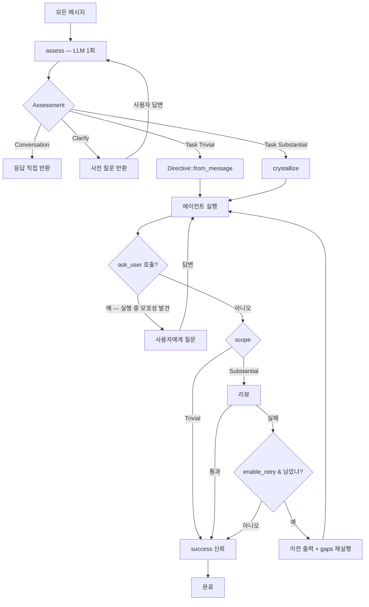

# RFC-027: Ouroboros 폐지 — 통합 인텐트 처리 설계

> **Status:** Proposed
> **Created:** 2026-06-22
> **Supersedes:** `rfc-ouroboros-redesign.md`, `rfc-ouroboros-refinement.md`

## Problem

현재 시스템은 메시지를 처리하는 두 개의 완전히 분리된 경로를 가진다.

```
Gateway → detect_spec_mode(키워드 "#spec"/"#plan" 접두사 매칭)
  ├─ is_spec  → Orchestrator::handle_message()  (5단계 의례)
  └─ !is_spec → Orchestrator::chat()            (인터뷰 없이 직접 실행)
```

이 이분법의 근본 문제:

1. **키워드가 깊이를 결정한다.** 의도의 명확도가 아니라 사용자가 `#spec`를
   쳤는지가 경로를 갈라버린다. 명확한 태스크에 `#spec`를 붙이면 5단계 의례가
   강제되고, 모호한 태스크에 키워드가 없으면 질문 없이 찍는다.

2. **Seed는 god-object다.** 실행 컨텍스트(goal, constraints, workspace, mount_paths),
   검증 계약(acceptance_criteria, output_schema), 진화 이력(generation,
   parent_seed_id), 도메인 온톨로지(Entity)가 전부 하나의 구조체에 짜여 있다.
   그래서 `chat()` 경로도 의례적으로 `Seed::from_message()`로 가짜 Seed를 만들어야
   한다 — 타입 시그니처를 만족시키기 위함이지 실제 필요해서가 아니다.

3. **OuroborosProtocol 트레이트는 단일 구현체를 가진다.** `OuroborosEngine`이 유일한
   구현체. `Arc<dyn OuroborosProtocol>` 동적 디스패치는 교체 가능성을 위한 것이지만
   교체 대상이 없다. 게다가 `execute()` 메서드는 데드 코드다 — Orchestrator가 절대
   호출하지 않는다 (주석에 "exists for protocol completeness but the Orchestrator
   does not invoke it"라고 적혀 있다).

4. **Phase enum은 경직된 시퀀스를 강제한다.** `Interview → Seed → Execute →
   Evaluate → Evolve`를 선언하지만, 실제로는 4개 이상의 우회 경로가 이미 존재한다:
   비-태스크 메시지(Interview에서 종료), 단순 태스크(`Seed::from_message()`,
   evaluate/evolve 스킵), output_schema(검증만), 멀티에이전트 분할(evaluate/evolve
   스킵). 코드 자체가 "모든 것이 전체 파이프라인을 필요로 하지 않는다"는 걸 이미
   알고 있다.

### 핵심 통찰

> **인터뷰는 "모드"가 아니라 자연스러운 행동이다.** 사용자 의도가 불명확하면
> 묻고, 명확하면 그냥 한다. 이건 키워드로 옵트인하는 기능이 아니라 모든 메시지가
> 통과하는 하나의 흐름이어야 한다.

우로보로스 프로젝트의 핵심 아이디어 세 가지 — (1) 대화와 태스크를 구분하라,
(2) 모호하면 먼저 물어봐라, (3) 큰 일은 결과를 검증하라 — 는 옳다. 문제는 이
아이디어들이 5단계 파이프라인 + Seed + 트레이트라는 과도한 추상화에 갇혀 있다는
것. 이 RFC는 추상화를 걷어내고 아이디어만 녹여낸다.

## Design Overview

### 핵심 원칙

> **하나의 경로. 모든 메시지는 assess된다. 깊이는 메시지가 결정한다.**

```
message → assess (LLM 1회) → Assessment
  ├─ Conversation → 응답 (에이전트 없음)
  ├─ Clarify      → 질문 반환 (사용자 답변 대기)
  └─ Task(scope)  → Directive 빌드 → 실행 → (Substantial만) 검증
```

언어 종속적 휴리스틱(단어 매칭)은 사용하지 않는다. assess LLM 호출이 유일한
라우터이며, 언어에 무관하다.

### 범위

이 RFC는 **인텐트 처리 아키텍처의 재설계**를 다룬다. 구체적으로:

- `oxios-ouroboros` 크레이트의 공개 API 재설계 (Seed, Phase, OuroborosProtocol 폐지)
- Orchestrator의 단일 진입점 통합 (`chat()` + `handle_message()` → `handle()`)
- Gateway의 키워드 기반 모드 분기 제거
- 검증/재시도 메커니즘의 단순화 (evolve → retry)

멀티에이전트 분할 로직(`should_split_seed`, `delegate_subtasks`)은 이 설계와
직교하므로 별개로 유지한다 — 다만 Seed 대신 Directive를 받도록 시그니처만
조정한다. **중요: 멀티에이전트 결과도 Directive의 acceptance_criteria에 대해
검증된다.** 현재 시스템은 멀티에이전트 경로에서 evaluate/evolve를 스킵하지만,
새 설계에서는 스코프(Substantial)가 검증을 결정하므로 멀티에이전트든 단일
에이전트든 동일하게 검증된다. 서브태스크 결과 취합 후 전체 Directive 기준으로
검증한다.

## Detailed Design

### 1. 타입

일곱 개의 타입이 전부다. 각각 명확한 단일 목적을 가진다.

```rust
/// 메시지 1건에 대한 assess 결과. 유일한 라우팅 결정.
enum Assessment {
    /// 인사, 잡담, 기능 질문 — 에이전트 spawn 없이 응답.
    Conversation(String),

    /// 태스크이나 모호 — 실행 전에 질문.
    Clarify { questions: Vec<Question> },

    /// 명확한 태스크 — 실행. scope가 깊이를 결정.
    Task(Scope),
}

/// 태스크가 요구하는 프로세스의 양.
enum Scope {
    /// 자명한 1회성 요청. 메시지 원문이 Directive가 된다. 검증 없음.
    /// 예: "package.json 읽어줘", "날씨 알려줘"
    Trivial,

    /// 다단계 또는 고위험. crystallize로 구조화 Directive 생성. 실행 후 검증.
    /// 예: "인증 시스템 리팩터링", "Jest 테스트 전부 Vitest로 마이그레이션"
    Substantial,
}

/// 에이전트가 수행할 과제. Trivial은 메시지 원문에서, Substantial은
/// crystallize LLM 호출에서 생성된다.
struct Directive {
    /// 달성해야 할 목표.
    goal: String,
    /// 사용자 원문 (언어 보존, 정확한 파일명/경로 유지).
    original_request: String,
    /// 준수해야 할 제약.
    constraints: Vec<String>,
    /// 검증 가능한 완료 기준. 에이전트 프롬프트에 주입되고 검증에도 사용.
    /// 비어있으면 검증을 생략한다 (Trivial의 경우).
    acceptance_criteria: Vec<String>,
    /// 출력 JSON Schema. 있으면 검증기가 스키마 적합성을 검사한다.
    output_schema: Option<serde_json::Value>,
}

/// 실행 환경. orchestrator가 태스크와 독립적으로 resolve한다.
struct ExecEnv {
    workspace_context: Option<String>,
    mount_paths: Vec<PathBuf>,
    project_id: Option<Uuid>,
    cspace_hint: Option<String>,
}

/// 검증 결과.
struct Verdict {
    passed: bool,
    /// 0.0–1.0 신뢰도.
    score: f64,
    /// 실패한 기준 — 재시도 컨텍스트로 주입된다.
    gaps: Vec<String>,
}
```

/// 메시지 처리 컨텍스트. handle()의 입력.
struct MsgCtx {
    session_id: String,
    /// 이전 메시지 교환 (clarify 컨텍스트 + 토픽 전환 감지용).
    /// 세션 스토어에서 로드.
    history: Vec<Exchange>,
    project_ids: Option<String>,
    mount_ids: Option<String>,
    user_id: String,
}

/// 단일 대화 교환 (사용자 메시지 → 에이전트 응답/질문).
struct Exchange {
    user: String,
    agent: String,
}

**Seed와의 대응:**

| Seed 필드 | 새 설계 | 비고 |
|---|---|---|
| `goal` | `Directive.goal` | 동일 |
| `original_request` | `Directive.original_request` | 동일 |
| `constraints` | `Directive.constraints` | 동일 |
| `acceptance_criteria` | `Directive.acceptance_criteria` | 동일 (이중 역할 유지: 프롬프트 + 검증) |
| `output_schema` | `Directive.output_schema` | 동일 |
| `workspace_context` | `ExecEnv.workspace_context` | 분리 — 태스크와 무관 |
| `mount_paths` | `ExecEnv.mount_paths` | 분리 |
| `cspace_hint` | `ExecEnv.cspace_hint` | 분리 |
| `project_id` | `ExecEnv.project_id` | 분리 |
| `id` (UUID) | — | 삭제. 세션/요청 ID로 충분 |
| `generation` | — | 삭제. 재시도 카운터로 대체 |
| `parent_seed_id` | — | 삭제. lineage 추적 불필요 |
| `ontology` | — | 삭제. 실질 가치 미미 (프롬프트에 주입되나 거의 활용되지 않음) |
| `created_at` | — | 삭제. 세션 메타데이터로 충분 |

### 2. 흐름



**두 단계의 명확화:** assess::Clarify는 메시지 자체에서 보이는 모호성을
처리한다. `ask_user` 도구는 실행 중에 발견한 모호성을 처리한다. 둘은 보완적이다.

### 3. 통합 핸들러

```rust
impl Orchestrator {
    /// 모든 메시지의 단일 진입점. 키워드 없음. 모드 없음.
    pub async fn handle(&self, msg: &str, ctx: &MsgCtx) -> Result<Response> {
        // 1. assess — 항상 1회. 라우팅만 수행.
        match self.engine.assess(msg, ctx).await? {
            Assessment::Conversation(reply) => Ok(Response::reply(reply)),

            Assessment::Clarify { questions } => Ok(Response::clarify(questions)),

            Assessment::Task(scope) => {
                // 2. Directive 빌드 (scope에 따라)
                let directive = match scope {
                    Scope::Trivial    => Directive::from_message(msg),
                    Scope::Substantial => self.engine.crystallize(msg, ctx).await?,
                };

                // 3. 환경 resolve (태스크와 무관, 이미 존재하는 로직)
                let env = self.resolve_exec_env(ctx);

                // 4. 실행 (항상). 멀티에이전트 분할(수용기준 3+개)은
                // lifecycle 내부에서 처리 — 단일/멀티 모두 동일한
                // ExecutionResult 반환.
                let result = self.lifecycle.execute(&directive, &env).await?;

                // 5. 검증 (Substantial만)
                let result = match scope {
                    Scope::Trivial    => result,
                    Scope::Substantial => self.verify_or_retry(&directive, &env, result).await?,
                };

                Ok(Response::result(result))
            }
        }
    }
}
```

하나의 메서드. 하나의 match. 깊이는 scope에서 자연스럽게 나온다.

### 4. The Assess Call

assess는 **분류만** 한다. Directive 생성은 하지 않는다. 이렇게 하면 assess 호출이
빠르고 집중된다.

**입력:** 사용자 메시지 + 대화 컨텍스트 (멀티턴 히스토리)

**출력 (JSON):**

```json
{
  "kind": "conversation" | "clarify" | "task",
  "reply": "...",                    // kind=conversation일 때
  "questions": [ ... ],              // kind=clarify일 때
  "scope": "trivial" | "substantial", // kind=task일 때
  "scores": {                         // kind=task일 때 (모호도 점수)
    "goal_clarity": 0.0–1.0,
    "constraint_clarity": 0.0–1.0,
    "success_criteria": 0.0–1.0
  }
}
```

**라우팅 로직:**

- `goal_clarity`, `constraint_clarity`, `success_criteria`의 가중 평균이
  임계값(0.2) 이하 → `kind=task`, 즉시 실행 가능
- 임계값 초과 → `kind=clarify`, 질문 반환
- 액션 동사(create, fix, read, deploy 등) 없음 → `kind=conversation`

현재 인터뷰 프롬프트가 이미 이 분류를 수행한다 (`is_task`, `complexity`,
`ambiguity scores`, `questions` 생성). assess는 출력 스키마를 라우팅 중심으로
재구성한 것이다. 핵심 로직은 동일하다.

**대화 처리:** `kind=conversation`일 때 assess 호출은 `reply`를 함께 생성한다.
즉 대화 메시지는 assess 1회로 끝난다 — 응답 생성을 위한 별도 호출이 없다.

**멀티턴 clarification:** `kind=clarify`가 반환되면 질문이 사용자에게 보여진다.
사용자의 답변이 오면, 전체 대화 히스토리(원래 메시지 + 질문 + 답변)와 함께
assess가 다시 실행된다. 명확해지면 `kind=task`로 진행. 최대 라운드 (기본 3) 초과
시 "이해한 내용으로 진행" + 강제 `task`.

### 5. 에이전트 주도 명확화 (`ask_user`)

assess::Clarify는 메시지 텍스트에서 보이는 모호성을 처리한다. 하지만 실행 중에야
비로소 드러나는 모호성도 있다:

- "다크 모드 추가해줘" → 에이전트가 UI 프레임워크 5개를 발견 → 어느 것?
- "버그 수정해줘" (이미 clarify 통과) → 에이전트가 코드 분석 중 두 가지 수정법
  발견 → 어느 쪽?

이런 실행 중 모호성을 위해 에이전트에게 `ask_user` 도구를 제공한다.

#### 작동 방식

`ask_user`는 표준 `AgentTool`이다. 에이전트가 툴콜 루프에서 이 도구를 호출하면:

1. 질문이 채널(Web/CLI/Telegram)을 통해 사용자에게 전달된다
2. 에이전트 실행이 일시 정지된다 (도구가 응답을 대기)
3. 사용자가 답변하면 도구가 답변을 반환하고, 에이전트가 계속 실행된다

이 패턴은 이미 존재하는 GatedTool 승인 메커니즘(RFC-017)과 동일한 인프라를
사용한다 — 동기적 사용자 상호작용을 위한 채널 기반 대기.

#### assess::Clarify와의 관계

| | assess::Clarify | ask_user 도구 |
|---|---|---|
| **시점** | 실행 전 | 실행 중 |
| **정보원** | 메시지 텍스트만 | 작업공간, 코드, 파일 내용 |
| **비용** | LLM 1회 (가벼움) | 에이전트 spawn 후 도구 호출 |
| **판단주체** | assess LLM | 에이전트 자신 |

둘은 보완적이다. assess::Clarify는 메시지만으로도 명백한 모호성을 빠르게 잡는다.
`ask_user`는 실행 컨텍스트가 있어야 발견할 수 있는 모호성을 잡는다.

#### 등록

`ask_user`는 커널 도구다 (`tools/ask_user_tool.rs`). 다른 커널 도구와 동일하게
`register_all_kernel_tools()`에 등록된다. Directive나 IntentEngine과 무관하게
작동한다 — 에이전트에게 사용 가능한 또 하나의 도구일 뿐이다.

### 6. Crystallize

Substantial 태스크만 crystallize를 호출한다. Trivial은 메시지 원문이 그대로
Directive가 된다.

**입력:** 사용자 메시지 + clarification Q&A (있으면) + 대화 컨텍스트

**출력 (JSON):**

```json
{
  "goal": "...",
  "constraints": [ "..." ],
  "acceptance_criteria": [ "..." ],
  "output_schema": null
}
```

현재 `generate_seed()` 프롬프트를 재사용한다. 핵심 원칙은 동일하다:
- COMPLETE: 에이전트가 필요한 모든 것을 포함
- SPECIFIC: 정확한 파일명, 경로, 언어
- MEASURABLE: 각 기준은 명령 실행이나 파일 확인으로 검증 가능
- SCOPE GUARD: 사용자 요청을 넘어 확장하지 않음

`ontology` 생성은 제거한다. 실질적으로 활용되지 않았다.

`output_schema`는 crystallize가 태스크의 성격에 따라 선택적으로 생성한다
(예: "JSON으로 응답해" 같은 명시적 요청). 기본은 `null`.

### 7. Review & Retry

#### 리뷰 전략 (다형적)

Directive의 내용이 검증 전략을 결정한다:

| Directive 내용 | 검증 전략 |
|---|---|
| `acceptance_criteria` 있음 | 기계적 검증 (파일 존재, 명령 출력 확인) + 의미론적 평가 (LLM) |
| `output_schema` 있음 | JSON Schema 적합성 검사 |
| 둘 다 있음 | 순차: Schema → Criteria |
| 둘 다 없음 (Trivial) | 검증 생략, `success = bool` 신뢰 |

기계적 검증(`MechanicalEvalResult`)은 현재 구현을 그대로 유지한다 — 언어에 무관하고
LLM 호출이 필요 없는 1단계 검증이다. 의미론적 평가는 현재 `evaluate()` 프롬프트를
재사용한다.

> **한계:** 기계적 검증과 의미론적 평가 모두 **출력 텍스트 기반**이다. 에이전트가
> 파일을 실제로 생성했는지 파일 시스템을 확인하거나, 테스트가 실제로 통과했는지
> 명령을 실행하지 않는다. 따라서 "검증"은 에이전트 출력에 대한 텍스트 분석이지,
> 실제 상태 검증이 아니다. 파일 시스템/명령 실행 기반의 실검증은 별개 관심사로
> 둔다.

#### 재시도 (evolve 대체)

Seed가 없으니 "진화"가 아니라 **재시도**다. 새 Directive를 만드는 것이 아니라,
실패 피드백을 컨텍스트에 추가해서 같은 Directive를 재실행한다.

```rust
async fn verify_or_retry(
    &self,
    directive: &Directive,
    env: &ExecEnv,
    initial: ExecutionResult,
) -> Result<ExecutionResult> {
    let max_retries = if self.config.enable_retry {
        self.config.max_retries // 기본 2
    } else {
        0 // 리뷰만 수행, 재시도 없음
    };
    let mut best = initial.clone();
    let mut best_score = -1.0;
    let mut prev_result = initial.clone();
    let mut last_gaps = Vec::new();

    for attempt in 0..=max_retries {
        let result = if attempt == 0 {
            initial.clone()
        } else {
            // 이전 실행 출력 + 실패 기준을 피드백으로 주입해서 재실행
            self.lifecycle
                .execute_with_feedback(directive, env, &prev_result, &last_gaps)
                .await?
        };

        let verdict = self.engine.verify(directive, &result).await?;

        // 최선 결과 추적 (점수가 감소해도 이전 최선을 유지)
        if verdict.score > best_score {
            best_score = verdict.score;
            best = result.clone();
        }

        if verdict.passed {
            return Ok(result);
        }

        prev_result = result;
        last_gaps = verdict.gaps;
        tracing::info!(
            attempt,
            score = verdict.score,
            gaps = last_gaps.len(),
            "Verification failed"
        );
    }

    tracing::warn!(
        attempts = max_retries + 1,
        best_score = best_score,
        "Retries exhausted, returning best effort"
    );
    Ok(best)
}
```

generation 카운터, parent_seed_id, lineage 트리 — 전부 필요 없다. "몇 번째
시도인가"만 추적한다. 최선 결과 추적으로 재시도 중 점수 하락을 방지한다 (현재
evolution 루프의 동작과 동일).

`execute_with_feedback`는 이전 실행의 **전체 출력**과 실패 기준을 함께 주입한다.
gaps만으로는 에이전트가 무엇을 고쳐야 할지 알 수 없다 — 실제 에러 메시지,
명령 출력 등이 필요하다:

```rust
async fn execute_with_feedback(
    &self,
    directive: &Directive,
    env: &ExecEnv,
    prev_result: &ExecutionResult,  // 이전 실행의 전체 출력
    gaps: &[String],                // 실패한 기준
) -> Result<ExecutionResult>
```

주입되는 컨텍스트:

```
{prev_result.output}

## 충족되지 않은 기준
1. ✓ 테스트 파일 생성됨
2. ✗ cargo test 통과 — 위 컴파일 에러 3건 참조

위 출력을 참조하여 실패한 기준을 보완하고 다시 시도하라.
```

### 8. IntentEngine

`OuroborosEngine`을 `IntentEngine`으로 재명명하고, 트레이트 없이 구체적 구조체로
둔다. 단일 구현체에 대한 트레이트는 순수한 간접층이다.

```rust
/// 인텐트 처리 엔진. assess, crystallize, verify 세 메서드를 제공한다.
pub struct IntentEngine {
    resolver: Arc<dyn ModelResolver>,
    /// 경량 모델 ID (옵션). None이면 resolver의 기본 모델을 사용한다.
    /// assess/crystallize/verify 호출에 사용된다.
    lightweight_model: Option<String>,
    persona_prompt: Mutex<Option<String>>,
}

impl IntentEngine {
    /// 메시지를 분석하여 라우팅 결정을 내린다.
    pub async fn assess(&self, msg: &str, ctx: &MsgCtx) -> Result<Assessment>;

    /// Substantial 태스크를 구조화 Directive로 변환한다.
    pub async fn crystallize(&self, msg: &str, ctx: &MsgCtx) -> Result<Directive>;

    /// 실행 결과를 Directive의 기준에 대해 검증한다.
    pub async fn verify(&self, directive: &Directive, result: &ExecutionResult) -> Result<Verdict>;

    /// 음성/페르소나 커스터마이제이션을 위한 시스템 프롬프트 주입.
    pub fn set_persona_prompt(&self, prompt: Option<String>);
}
```

#### 모델 선택

assess/crystallize/verify는 분류·검증 작업이지 생성 작업이 아니다. 기본적으로
에이전트 실행에 쓰는 동일한 모델(`ModelResolver`의 기본 모델)을 사용한다 — 사용자가
별도로 등록할 필요가 없다.

사용자가 비용/지연을 줄이고 싶다면 `config.toml`에 경량 모델을 지정할 수 있다:

```toml
[intent]
# assess/crystallize/verify에 사용할 경량 모델 (옵션).
# 미지정 시 에이전트 실행과 동일한 기본 모델을 사용한다.
# lightweight_model = "claude-3-5-haiku"
```

IntentEngine의 LLM 호출은 다음 순서로 모델을 결정한다:

```rust
// 1. lightweight_model이 설정되어 있으면 카탈로그에서 해석
// 2. 아니면 resolver의 기본 모델 (에이전트 실행 모델과 동일)
let model = self.lightweight_model
    .as_deref()
    .map(|id| self.resolver.resolve(id))
    .transpose()?
    .unwrap_or_else(|| self.resolver.default_model());
```

`ModelResolver`(`EngineHandle`)는 이미 동적 카탈로그(models.dev)를 통해 임의 모델
ID를 해석할 수 있으므로, 경량 모델 지정은 추가 인프라 없이 작동한다.

`OuroborosProtocol` 트레이트, `Phase` enum, `Seed` 구조체, `Entity` 구조체 — 전부
삭제된다. `AmbiguityScore`는 assess 내부에서 사용되므로 유지한다 (public에서
`pub(crate)`로 강등).

### 9. Gateway 단순화

```rust
// 전: 키워드로 두 경로 분기
let is_spec = detect_spec_mode(&msg, &spec_keywords);
let result = if is_spec {
    orchestrator.handle_message(...)
} else {
    orchestrator.chat(...)
};

// 후: 항상 하나의 호출
let result = orchestrator.handle(&msg.content, &ctx).await;
```

`detect_spec_mode()`, `strip_spec_keyword()`, `spec_keywords` 필드 — 전부 삭제.

CLI의 `run` / `chat` 명령도 동일하게 `handle()`로 통합된다. CLI 레벨에서의
구분은 프롬프트 포맷팅 등 UX 차이만 남긴다.

### 10. 상태 이벤트

`Phase` enum(`Interview / Seed / Execute / Evaluate / Evolve`)을 경량 상태로
대체한다. 경직된 시퀀스가 아니라, 흐름 중 자연스러운 지점에서 발행된다.

```rust
// 발행 시점
Status::Assessing    // assess 시작
Status::Clarifying   // 질문 반환
Status::Executing    // 에이전트 spawn
Status::Reviewing    // 리뷰 시작 (Substantial만)
Status::Complete     // 완료
```

Web UI는 이를 진행 표시로 매핑한다: "생각하는 중" → "질문" → "작업 중" →
"확인 중" → "완료". Trivial 태스크는 Assessing → Executing → Complete로
건너뛴다. Reviewing은 Substantial만 거친다.

## Module Structure

### oxios-ouroboros 크레이트 재구성

크레이트는 유지하되 (crates.io 호환성), 내부 구조를 완전히 재설계한다.

```
crates/oxios-ouroboros/src/
├── lib.rs               — 공개 API: Assessment, Scope, Directive, Verdict, IntentEngine
├── engine.rs            — IntentEngine (assess, crystallize, verify)
├── prompts.rs           — 시스템 프롬프트 (ASSESS, CRYSTALLIZE, VERIFY)
├── assessment.rs        — Assessment, Scope, Question, QuestionKind 타입
├── directive.rs         — Directive 타입 + from_message()
├── verdict.rs           — Verdict 타입
├── verify.rs            — 기계적 검증 (MechanicalEvalResult 유지)
├── degraded.rs          — LLM 실패 시 폴백 (유지)
├── model_resolver.rs    — ModelResolver (유지, EngineHandle 연동)
└── types.rs             — ExecutionResult, ToolCallRecord (kernel과 공유)
```

**삭제되는 파일/모듈:**
- `protocol.rs` — Phase enum, OuroborosProtocol 트레이트
- `seed.rs` — Seed, Entity
- `interview.rs` — InterviewResult, Exchange (Assessment/Question으로 대체)
- `evaluation.rs` — EvaluationResult (Verdict으로 대체)
- `ouroboros_engine.rs` — OuroborosEngine (engine.rs의 IntentEngine으로 대체)

### Orchestrator 변경

- `handle_message()` + `chat()` → `handle()`
- `OuroborosProtocol` 의존성 → `IntentEngine` 직접 사용
- `run_evolution_loop()` → `verify_or_retry()`
- 인메모리 인터뷰 세션(`Orchestrator::sessions`) → **삭제**. clarify 상태는 세션
  스토어의 대화 히스토리에서 자연스럽게 복원된다 (아래 "Decisions" 참조)
- `EvolutionConfig` → `IntentConfig`:

```rust
pub struct IntentConfig {
    /// Substantial 태스크의 최대 리뷰 재시도 횟수 (기본 2).
    pub max_retries: u32,
    /// 리뷰 통과 최소 점수 (기본 0.7).
    pub score_threshold: f64,
    /// 강제 실행 전 최대 clarification 라운드 (기본 3).
    pub max_clarify_rounds: u32,
    /// 재시도 활성화 (기본 true).
    /// false 시 Substantial 태스크도 단일 실행 후 결과 보고 (리뷰는 수행).
    /// 재시도가 실제로 점수를 개선하는지 계측 후 비활성화 여부 결정.
    pub enable_retry: bool,
    /// assess/crystallize/review용 경량 모델 (옵션).
    /// None이면 에이전트 실행 모델과 동일.
    pub lightweight_model: Option<String>,
}
```

```toml
[intent]
max_retries = 2
score_threshold = 0.7
max_clarify_rounds = 3
enable_retry = true
# lightweight_model = "claude-3-5-haiku"
```

## Prompt Design

### ASSESS_PROMPT

현재 `INTERVIEW_SYSTEM_PROMPT`를 라우팅 중심으로 재구성. 핵심 변경:

- 출력에서 `is_task` / `complexity` 대신 `kind`(`conversation`/`clarify`/`task`) +
  `scope`(`trivial`/`substantial`) 사용
- `kind=conversation`일 때 `reply` 필드로 응답을 함께 생성 (별도 호출 없음)
- `kind=clarify`일 때 구조화 질문(`structured_questions`) 생성 — Web UI 인터랙티브
  인터뷰용. 현재 면접 프롬프트의 질문 생성 로직을 그대로 유지
- 언어 충실도 규칙 유지 ("match the language of the user's message")
- 스코어링 정책 유지 ("Be HONEST, not generous", "When in doubt, score LOWER")
- **대화 히스토리 처리 (핵심):** 히스토리에 미응답 질문이 있으면, 이 메시지가
  (a) 그 질문에 대한 **답변**인지 (b) 완전히 **새 요청**인지(토픽 전환) 먼저
  판단해야 한다. 답변이면 원래 요청과 결합하여 평가하고, 새 요청이면 이전
  질문을 무시하고 독립적으로 평가한다. 이 판단이 실패하면 clarify 루프가 깨진다.
- **분류 편향:** Conversation과 Task 사이에서 불확실하면 Task를 선택한다
  (실행 후 검증이 가능하지만, 대화로 분류된 태스크는 실행 기회 자체가 없다).
  Task와 Clarify 사이에서 불확실하면 Clarify를 선택한다 (묻는 것이 찍는 것보다
  싸다).

### CRYSTALLIZE_PROMPT

현재 `SEED_SYSTEM_PROMPT`를 거의 그대로 사용. 변경점:

- `ontology` 생성 제거
- `output_schema` 선택적 생성 추가 ("태스크가 구조화된 출력을 요구하면 JSON
  Schema 제안")
- 출력을 `Directive` 형태로 직렬화 (`goal`, `constraints`,
  `acceptance_criteria`, `output_schema`)

### VERIFY_PROMPT

현재 `EVALUATE_SYSTEM_PROMPT`를 재사용. 2단계 검증 유지:

1. **기계적** (LLM 없음): 파일 존재, 명령 출력 확인 — `MechanicalEvalResult` 유지
2. **의미론적** (LLM): 출력이 실제로 사용자 의도를 해결하는가

출력을 `Verdict` 형태로 직렬화 (`passed`, `score`, `gaps`). `gaps`는 실패한 기준의
구체적 설명으로, 재시도 컨텍스트에 직접 주입된다.

`EVOLVE_SYSTEM_PROMPT`, `STUCK_RECOVERY_PROMPT` — 삭제. 재시도는 피드백 주입으로
대체되므로 별도 프롬프트가 불필요하다.

## Impact

### 삭제되는 것

| 대상 | 위치 | 이유 |
|---|---|---|
| `Seed` 구조체 | `oxios-ouroboros/src/seed.rs` | Directive + ExecEnv로 분해 |
| `Entity` 구조체 | 동일 | ontology 제거 |
| `OuroborosProtocol` 트레이트 | `protocol.rs` | 단일 구현체, execute() 데드 코드 |
| `Phase` enum | `protocol.rs` | 상태 이벤트로 대체 |
| `InterviewResult`, `Exchange` | `interview.rs` | Assessment/Question으로 대체 |
| `EvaluationResult` | `evaluation.rs` | Verdict으로 대체 |
| `OuroborosEngine::execute()` | `ouroboros_engine.rs` | 데드 코드 |
| `OuroborosEngine::evolve()` | 동일 | 재시도로 대체 |
| `EVOLVE_SYSTEM_PROMPT`, `STUCK_RECOVERY_PROMPT` | 동일 | 불필요 |
| `Gateway::detect_spec_mode()` | `gateway.rs` | assess가 라우터 |
| `Gateway::spec_keywords` | 동일 | 동일 |
| `Orchestrator::chat()` | `orchestrator.rs` | `handle()`에 흡수 |
| `Orchestrator::handle_message()` | 동일 | `handle()`로 통합 |
| `Orchestrator::run_evolution_loop()` | 동일 | `verify_or_retry()`로 대체 |
| `mode: "chat" \| "ouroboros"` 필드 | `message.rs`, `meta.rs` | 모드가 하나 |
| Seed state store 컬렉션 | `state_store` | 세션 히스토리로 충분 |
| Seed API 엔드포인트 | `api/routes/workspace.rs` | 동일 |

### 변경되는 것

| 대상 | 변경 내용 |
|---|---|
| `AgentRuntime::execute()` 시그니처 | `&Seed` → `&Directive, &ExecEnv` |
| `build_system_prompt()` | `&Seed` → `&Directive, &ExecEnv` 파라미터 |
| `Supervisor::spawn_and_run()` | 동일 시그니처 변경 |
| `AgentLifecycleManager` | `&Seed` → `&Directive` |
| `Gateway` 메시지 라우팅 | 단일 `handle()` 호출 |
| `KernelEvent` | `PhaseStarted`/`PhaseCompleted` → `Status` 이벤트 |
| Web UI 진행 표시 | Phase 기반 → Status 기반 |
| `OrchestrationResult` | `mode`, `phase_reached`, `interview_*` 필드 정리 |

### 유지되는 것

| 대상 | 이유 |
|---|---|
| `AmbiguityScore` | assess 내부 모호도 측정 |
| `MechanicalEvalResult` | 언어 무관 기계적 검증 (LLM 호출 없음) |
| `ModelResolver` / `EngineHandle` 연동 | 모델 해석 |
| `degraded.rs` 폴백 함수들 | LLM 실패 시 안전망 |
| 구조화 질문 타입 (`Question`, `QuestionKind`) | Web UI 인터랙티브 인터뷰 |
| `ExecutionResult`, `ToolCallRecord` | 에이전트 실행 결과 (intent 처리와 무관) |
| 멀티에이전트 분할 로직 | 직교 관심사 (시그니처만 조정) |
| CLI `run` / `chat` 명령 | UX 구분 유지, 내부는 동일 `handle()` |

### LLM 호출 비교

| 시나리오 | 현재 (최악) | 현재 (최선) | 새 설계 |
|---|---|---|---|
| 대화 ("안녕") | 1회 (chat) | 1회 | **1회** (assess에 응답 포함) |
| 단순 태스크 ("파일 읽어줘") | 1회 (chat) | 3회 (ouroboros) | **1회** (assess only) |
| 복합 태스크 ("인증 리팩터링") | 1회 (chat, 검증 없음) | 5회+ (ouroboros + evolve) | **2회** (assess + crystallize) + 실행 + 1회 (verify) |
| 모호 태스크 2라운드 | 1회 (chat, 질문 없음) | 4회 (ouroboros) | **2회** (assess×2) + crystallize + 실행 + verify |

새 설계는 모든 시나리오에서 최선과 동일하거나 더 적은 LLM 호출로, **검증을 포함한
완전한 처리**를 제공한다. 현재 chat 경로는 빠르지만 검증이 없고, ouroboros 경로는
검증이 있지만 evolve로 인해 호출이 많다.

## Alternatives Considered

### A. Seed 유지 + 라우팅만 통합 (rfc-ouroboros-redesign 방식)

기존 RFC들의 접근: Seed, 트레이트, Phase enum을 유지하고 complexity 기반 라우팅만
추가.

**기각 이유:** Seed가 god-object인 근본 문제를 해결하지 못한다. `chat()` 경로의
가짜 Seed 생성, acceptance_criteria의 이중 역할과 실행 컨텍스트의 결합 등
구조적 부채가 그대로 남는다. "레거시 신경 쓰지 말고 아이디어만 녹여내자"는
요구사항에 부합하지 않는다.

### B. Seed를 TaskSpec으로 rename

이름만 바꾸고 구조 유지.

**기각 이유:** god-object 문제는 이름이 아니라 구조다. rename은 19곳의
callsite를 건드리면서 구조적 개선은 없다.

### C. 트레이트 유지 + 다중 구현체

`IntentProtocol` 트레이트를 정의하고 여러 엔진 구현을 허용.

**기각 이유:** 현재 그리고 가까운 미래에 구현체가 하나뿐이다. 미래의 확장성을
위해 현재의 단순성을 희생하지 않는다. 필요해지면 그 때 트레이트를 도입한다
(YAGNI).

### D. 언어별 휴리스틱 빠른 경로

assess LLM 호출 전에 언어별 키워드("안녕", "hello", "merci")로 대화를 감지해서
LLM을 건너뛴다.

**기각 이유:** 언어 종속적이다. 시스템 전체가 다국어를 전제로 설계되어 있는데
빠른 경로만 특정 언어에 종속되면 커버리지에 구멍이 생긴다. assess 호출의
오버헤드는 무시할 수준이다 — 분류 작업은 저렴한 모델로 충분하며, 대화
메시지는 assess에 응답이 포함되어 추가 호출이 0회다.

### E. 멀티에이전트 분할을 assess에 통합

assess가 태스크를 즉시 서브태스크로 분할하게 한다.

**기각 이유:** 멀티에이전트 분할은 인텐트 처리와 직교하는 별개 관심사다.
현재 `should_split_seed()` 로직(수용기준 3+개)은 Directive로 시그니처만
조정하면 그대로 작동한다. 이 RFC의 범위를 넘어선다.

## Migration Notes

이 RFC는 clean-slate 설계이므로, 기존 데이터에 대한 마이그레이션은 최소화한다.

1. **기존 Seed JSON** (`state_store`의 "seeds" 컬렉션): 더 이상 읽지 않는다.
   세션 히스토리에 충분한 정보가 있으므로 Seed 영속성이 불필요하다. 기존 데이터는
   무시한다.

2. **기존 세션 메타데이터 `mode: "ouroboros"|"chat"`**: 새 시스템에서는 모드가
   하나뿐이므로 이 필드를 무시한다.

3. **Web UI seed lineage 뷰**: 제거한다. 세션 히스토리(사용자 메시지 → 에이전트
   응답 → 툴콜 궤적)가 충분한 가시성을 제공한다.

4. **`oxios-ouroboros` crates.io 호환성**: 크레이트 이름은 유지하되 major version
   bump로 breaking change를 표시한다. 공개 API가 완전히 변경된다.

5. **CLI `oxios run` / `oxios chat`**: 두 명령 모두 내부적으로 `handle()`을
   사용한다. `run`은 출력 포맷을, `chat`은 대화형 UX를 담당하는 UX 레이어로
   남는다.

## Decisions

여섯 가지 설계 결정을 픽스한다.

### 1. `max_retries = 2`

현재 `max_evolution_iterations = 3`에서 **2**로 감소.

evolve는 매 세대마다 새 Seed를 생성하는 LLM 호출이 필요했지만, 재시도는
피드백 주입만으로 비용이 낮다. 그러나 각 재시도는 에이전트 전체 실행(툴콜 루프
다회 LLM 호출)을 동반하므로 사용자 대기 시간이 핵심 제약이다.

- 0회: 검증만 하고 실패 시 즉시 보고 → 자가 수정 기회 없음
- 2회: 초기 실행 + 최대 2회 재시도 = 최대 3회 실행 → 합리적 자가 수정 예산
- 3회+: 대기 시간 과다, 사용자가 직접 방향을 조정하는 것이 더 효율적

`IntentConfig`에서 조정 가능하므로, 구현 후 실사용 피드백으로 튜닝한다.

### 2. 기본 모델 사용 + 경량 모델 옵션

assess/crystallize/verify는 **기본적으로 에이전트 실행과 동일한 모델**을
사용한다. 사용자가 별도로 등록할 필요가 없다.

분류 작업이므로 경량 모델이 비용/지연 면에서 유리하지만, 사용자가 빠른 모델을
별도로 등록하는 것은 기대하기 어렵다. 따라서:

- **기본**: `ModelResolver`의 기본 모델 (설정 불필요, 제로 컨피그)
- **옵션**: `[intent] lightweight_model = "..."` 로 경량 모델 지정 가능

`ModelResolver`는 이미 동적 카탈로그를 통해 임의 모델 ID를 해석하므로 추가
인프라가 불필요하다. §7 "모델 선택" 참조.

### 3. clarify 상태 = 대화 히스토리 (별도 영속화 없음)

현재 인터뷰 세션은 인메모리(`Orchestrator::sessions: RwLock<HashMap<...>>`)에
보관되어 프로세스 재시작 시 손실된다.

**결정: 인메모리 세션 맵을 삭제한다.** clarify 상태는 세션 스토어의 대화
히스토리에서 자연스럽게 복원된다.

작동 방식:

1. `Assessment::Clarify` 반환 시, 교환(사용자 메시지 → 질문)이 세션 히스토리에
   저장된다 (이미 영속화됨)
2. 프로세스 재시작 후 사용자가 답변을 보내면, `handle()`이 세션 스토어에서 대화
   히스토리를 로드한다
3. `assess()`가 전체 히스토리(원래 메시지 + 질문 + 답변)를 받아 맥락을 이해하고
   라우팅한다

clarify 라운드 카운터도 히스토리에서 도출된다: 연속된 Clarify 교환의 수를 세면
된다. `max_clarify_rounds` 초과 시 "이해한 내용으로 진행" + 강제 `Task`.

이 접근은 인메모리 상태를 제거하여 복잡도를 낮추면서도, 프로세스 재시작 후에도
clarify 맥락이 손실되지 않는다.

### 4. `ask_user` 도구 — 실행 중 명확화

assess::Clarify (사전) + `ask_user` 도구 (실행 중)의 2단계 명확화 체계를 채택한다.

assess만으로는 메시지 텍스트에 없는 정보(작업공간 상태, 코드 구조, 파일 내용)에
의존하는 모호성을 잡을 수 없다. `ask_user`는 에이전트가 이런 모호성을 실행 중
발견했을 때 직접 사용자에게 묻게 한다.

GatedTool 승인 메커니즘(RFC-017)의 동일한 인프라(채널 기반 동기 대기)를
재사용하므로 추가 아키텍처가 불필요하다. §5 참조.

### 5. "리뷰" 명명 — 텍스트 기반 한계 솔직하게

"검증(verification)"이라는 용어를 **"리뷰(review)"**로 대체한다.

현재의 리뷰는 에이전트 **출력 텍스트**를 분석한다 — 파일 시스템을 확인하거나
명령을 실행하지 않는다. "검증"이라는 단어는 실제 상태 확인을 암시하지만, 시스템은
그것을 하지 않는다. 이 격차를 "리뷰"라는 정직한 명명으로 메운다.

코드 심볼(`Verdict`, `verify()`)은 유지한다 — 이름 변경은 단순 화장품이고, 타입
이름보다 동작과 문서가 중요하다. 다만 모든 사용자 대면 문서와 로그에서 "리뷰"를
사용한다.

실제 파일 시스템/명령 실행 기반 검증은 별개 관심사이며, 이 RFC의 범위를 넘어선다.

### 6. 재시도 탈출구 — 계측 + 비활성화

재시도(retry)의 실제 효과는 **미지수**다. evolve가 "의미 없는 반복"으로
증명되었듯, 재시도도 같은 함정에 빠질 수 있다 — 에이전트가 같은 실수를 반복하거나
다른 실수를 저지를 수 있다.

**결정: `enable_retry` 플래그(기본 true)로 탈출구를 열어둔다.** 그리고 재시도
효과를 계측한다:

```rust
// 재시도 후 점수가 실제로 개선되었는지 추적
metrics.retry_attempted.inc();        // 재시도 발생
metrics.retry_improved.inc();         // 재시도 후 점수 상승
metrics.retry_unchanged.inc();        // 점수 동일
metrics.retry_degraded.inc();         // 점수 하락 (best-result로 복구됨)
```

`retry_improved` 비율이 임계값 미만이면, `enable_retry = false`로 전환하여
Substantial 태스크를 단일 실행 + 리뷰 보고로 운영한다. 이때 사용자는 리뷰 결과를
보고 스스로 재시도 여부를 결정한다 (refinement RFC의 권고와 동일).
