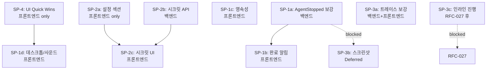

# RFC-028: Web UI Delivery — 알림·관찰성·설정 완결성

> **Status:** Implemented (SP-1, SP-2, SP-3a, SP-4). SP-3b (screenshots) and SP-3c (inline progress) remain Deferred.
> **Created:** 2026-06-22
> **Depends on:** RFC-024 (web daemon reliability), RFC-022 (knowledge provenance)
> **Affected by:** RFC-027 (unified intent handling — Phase model 변경)

## Problem

Oxios의 Web UI는 기능적 커버리지와 관찰성 아키텍처에서 성숙하지만, "Web UI만으로
에이전트를 운용한다"는 목표에 4가지 영역이 미달한다. 전수 감사(`docs/2025-06-09-ui-ux-audit.md`)
및 백엔드 라우트 130+ 엔드포인트, `KernelEvent` ~45 변형, `OxiosConfig` 28개 섹션 교차
검증을 통해 다음을 확인했다.

### 1. 알림 시스템이 작동하지 않는다 (Critical)

`web/src/hooks/use-global-events.ts::eventTitle()`는 3개 이벤트만 처리한다:

```typescript
case 'approval_requested': return 'Approval Required'
case 'agent_failed':       return 'Agent Failed'
case 'agent_started':      return 'Agent Started'
default:                   return null   // ← agent_stopped 포함, 전부 무시
```

`agent_stopped`(정상 완료)가 **의도적으로 생략**된다(주석: "there is no
`agent_completed` event — notification rules intentionally omit it"). 그 결과,
장기 실행 에이전트가 성공적으로 완료돼도 사용자는 알지 못한다.

**근본 원인:** `AgentStopped` 이벤트가 `success` 플래그를 전달하지 않는다.
`src/api/routes/events.rs::sanitize_event`의 직렬화:

```rust
KernelEvent::AgentStopped { id } => json!({ "type": "agent_stopped", "agent_id": id }),
KernelEvent::AgentFailed { id, error } => json!({ "type": "agent_failed", "agent_id": id, "error": error }),
```

`supervisor.rs`에서 `AgentStopped`는 `Ok(result)` 경로에서 **무조건** 발생한다
(`result.success == false`인 평가 실패 포함). `AgentFailed`는 인프라 에러
(panic, timeout)에만 발생한다. 즉 프론트엔드는 `agent_stopped`만 보고는 성공인지
평가 실패인지 구분할 수 없다.

또한 알림 store(`web/src/stores/notifications.ts`)가 **순수 인메모리**(Zustand,
persist 미들웨어 없음)이며, 브라우저 Notification API(`new Notification()`)와
사운드(`Audio`) 사용이 코드베이스에 전혀 없다. 새로고침 시 알림이 전부 소실되고,
백그라운드 탭에서 데스크톱 알림이 나가지 않는다.

### 2. 설정 완결성 갭

`field-defs.ts:532-538`가 명시적으로 8개 섹션을 "no field definitions and no
render path yet"로 생략한다:

```
resource_monitor, otel, daemon, persona, cron, mcp, browser, marketplace
```

이 중 `mcp`(서버 CRUD는 `/mcp`에서 처리), `persona`(`/personas`), `cron`
(`/cron-jobs`)은 기능 관리 UI가 있지만 **설정 편집** UI가 없다. 반면
`calendar`, `otel`, `agent_log`, `browser`, `budget`, `resource_monitor`는
해당 Rust 구조체(`config.rs`)가 모두 존재함에도 Web UI에서 편집할 수 없다.

**보안 문제:** `[secrets]` 섹션(telegram token, email password, oxios_api_key,
clawhub_api_key)을 config.toml 평문으로 편집하는 것은 보안 회귀다.
`CredentialStore`(`credential.rs`)는 `~/.oxi/auth.json`에 안전하게 저장하지만,
LLM 키 외의 시크릿을 Web UI에서 입력할 수단이 없다.

### 3. 관찰성 갭

- **에이전트 트레이스가 툴 호출 한정:** `AgentInfo`(`types.rs`)가 `tool_calls`만
  보관. `/api/agents/{id}/trace`는 툴 호출만 반환. 메모리 회상·추론 이력이 전용
  페이지에 없다(채팅 타임라인에만 존재).
- **스크린샷 이미지 미렌더링:** `ScreenshotMeta`가 `bytes/width/duration_ms`만
  전달. PNG 데이터는 oxi-sdk 영역이라 커널에 도달하지 않는다.

### 4. UI Polish

`docs/2025-06-09-ui-ux-audit.md`의 Critical 3건(폰트 미로딩, sparkline raw RGB,
aria-label/i18n 불일치)과 Major 다수가 미해결 상태다.

---

## Design

### 범위

이 RFC는 **Web UI를 1순위 운용 인터페이스로 완성**하는 것을 목표로 한다.
우선순위별 4개 스토리포인트(SP)로 구성한다.

```
SP-1: 알림 시스템 (Critical — 백엔드 + 프론트엔드)
SP-2: 설정 완결성 (선언적 프론트엔드 + 시크릿 API)
SP-3: 관찰성 갭 (백엔드 + 프론트엔드)
SP-4: UI Quick Wins (프론트엔드 only)
```

---

## SP-1: 알림 시스템

### SP-1a: AgentStopped 이벤트 보강 (백엔드)

`KernelEvent::AgentStopped`에 `success: bool` 필드를 추가한다.

**`crates/oxios-kernel/src/event_bus.rs`:**
```rust
AgentStopped {
    id: AgentId,
    success: bool,   // ← 추가. result.success 전달
},
```

**`crates/oxios-kernel/src/supervisor.rs`** — 3곳 발생 사이트 수정:
- `run_with_seed` Ok 경과 (line ~485): `success: result.success`
- `run_with_directive` Ok 경과 (line ~677): `success: result.success`
- `terminate()` / kill 경과 (line ~752): `success: false` (사용자 중단)

**`src/api/routes/events.rs::sanitize_event`:**
```rust
KernelEvent::AgentStopped { id, success } => json!({
    "type": "agent_stopped",
    "agent_id": id.to_string(),
    "success": success,   // ← 추가
}),
```

**audit 매핑** (`kernel_event_to_audit_action`): `success` 필드를 reason에 반영.

### SP-1b: 완료 알림 처리 (프론트엔드)

**`web/src/hooks/use-global-events.ts`:**

```typescript
function eventTitle(e: OxiosEvent): string | null {
  switch (e.type) {
    case 'approval_requested': return 'Approval Required'
    case 'agent_failed':       return 'Agent Failed'
    case 'agent_started':      return 'Agent Started'
    case 'agent_stopped':
      return e.data?.success ? 'Task Completed' : 'Task Failed'
    default:                   return null
  }
}
```

`eventSeverity`: `agent_stopped` + `success: true` → `success`,
`success: false` → `warning`.

**중복 억제:** `agent_failed` → (30s 내) `agent_stopped(success:false)`가 올 수
있다. dedup 키를 `type-agent_id`에서 `type-agent_id-result`로 세분화하거나,
`agent_failed` 수신 시 30s 윈도우 내 `agent_stopped`를 무시한다.

**i18n:** `web/src/i18n/locales/{ko,en}.json`에 키 추가.

### SP-1c: 알림 영속성 (프론트엔드)

**`web/src/stores/notifications.ts`:**

```typescript
import { persist, createJSONStorage } from 'zustand/middleware'

export const useNotificationStore = create<NotificationState>()(
  persist(
    (set) => ({ /* 기존 로직 동일 */ }),
    {
      name: 'oxios-notifications',
      storage: createJSONStorage(() => localStorage),
      partialize: (s) => ({
        notifications: s.notifications.filter(n => !n.read).slice(0, 30),
        unreadCount: s.unreadCount,
      }),
    },
  ),
)
```

읽은 알림은 영속화하지 않고 새로고침 후 제거. 최대 30개만 localStorage에 보관.

### SP-1d: 데스크톱 알림 + 사운드 (프론트엔드)

**`web/src/lib/desktop-notify.ts`** (신규):

```typescript
export async function requestNotificationPermission(): Promise<boolean> {
  if (!('Notification' in window)) return false
  if (Notification.permission === 'granted') return true
  if (Notification.permission === 'denied') return false
  const result = await Notification.requestPermission()
  return result === 'granted'
}

export function showDesktopNotification(title: string, body: string, link?: string) {
  if (!document.hidden) return   // 포그라운드 탭은 toast로 충분
  if (Notification.permission !== 'granted') return
  const n = new Notification(title, {
    body,
    icon: '/icon.png',
    tag: 'oxios-agent',
  })
  n.onclick = () => {
    window.focus()
    if (link) window.location.hash = link
    n.close()
  }
}
```

**`web/src/lib/sound.ts`** (신규) — Web Audio API oscillator, 외부 파일 없음:

```typescript
let ctx: AudioContext | null = null
export function playNotificationSound(severity: NotificationSeverity) {
  // success: C5→E5 (ascending), error: A4→F4 (descending), warning: single A4
}
```

**연동:** `use-global-events.ts`의 `add()` 호출 시 동시에 `showDesktopNotification()`
+ `playNotificationSound()` 호출. Settings 토글로 개별 제어.

### SP-1e: 알림 설정 섹션

**`web/src/components/settings/field-defs.ts`** — `notificationSection` 추가:

| 필드 | 타입 | 기본값 |
|------|------|--------|
| `desktop_notifications_enabled` | toggle | false |
| `sound_enabled` | toggle | true |
| `complete_sound_enabled` | toggle | true |
| `error_sound_enabled` | toggle | true |

이 값들은 `OxiosConfig`가 아닌 **클라이언트偏好**(localStorage)로 저장한다.
설정 프레임워크의 선언적 모델을 빌려 렌더링하되, 저장은 `useNotificationPrefs`
훅이 localStorage에 write한다. 백엔드 config PATCH를 거치지 않는다.

### SP-1 검증

- 에이전트 성공 완료 → `agent_stopped(success:true)` → success 알림 + 사운드 + (백그라운드 시) 데스크톱 알림
- 에이전트 평가 실패 → `agent_stopped(success:false)` → warning 알림
- 에이전트 인프라 에러 → `agent_failed` → error 알림
- 새로고침 후 읽지 않은 알림 유지
- SSE 단절 후 재연결 시 `resync` 처리 (기존 동작 유지)

---

## SP-2: 설정 완결성

### SP-2a: 선언적 설정 섹션 추가 (프론트엔드)

`field-defs.ts`의 선언적 프레임워크에 새 섹션을 추가한다. **모든 Rust 구조체가
이미 존재**하므로 백엔드 변경 불필요. 각 섹션은 `NEW_SECTIONS` 배열에 등록하고
`SECTION_META` + `SETTINGS_GROUPS`에 메타데이터를 추가하면 자동 렌더링된다.
`settings-consistency.test.ts`가 누락을 자동 검증한다.

| 섹션 | 구조체 | 필드 수 | 그룹 |
|------|--------|---------|------|
| `calendar` | `CalendarConfig` | 7 (enabled, timezone, reminder_minutes, alarm_channels, journal_sync, system_calendar, archive_after_days) | channels |
| `otel` | `OtelConfig` | 4 (enabled, endpoint, service_name, sampling_ratio) | system |
| `agent_log` | `AgentLogConfig` | 5 (max_entries, ttl_hours, max_tool_calls_per_agent, prune_batch_size, db_path) | system |
| `resource_monitor` | `ResourceMonitorConfig` | 5 (interval_secs, history_max, cpu/mem/load thresholds) | system |
| `browser` | `BrowserConfig` | 2 (enabled toggle, engine JSON multiline) | system |
| `budget` | `BudgetConfig` | 4 (enabled, default_token_budget, default_calls_budget, default_window_secs) | system |

**`SETTINGS_GROUPS`**의 주석 처리된 `advanced` 그룹을 활성화하거나, 각 섹션을
기존 그룹(system / channels)에 배치한다.

### SP-2b: 시크릿 관리 API (백엔드)

**설계 원칙:** 시크릿을 config.toml 평문에 쓰지 않는다. `CredentialStore`가
`~/.oxi/auth.json`에 안전하게 저장하는 기존 패턴을 따른다.

새 엔드포인트 그룹 `/api/secrets`:

| Method | Path | 목적 |
|--------|------|------|
| GET | `/api/secrets` | 등록된 시크릿 키 목록 (값 마스킹, 소스 표시) |
| PUT | `/api/secrets/{key}` | 시크릿 저장 (CredentialStore経由) |
| DELETE | `/api/secrets/{key}` | 시크릿 삭제 |
| GET | `/api/secrets/{key}/source` | 소스 확인 (env / auth.json / none) |

**키 공간:** `telegram_bot_token`, `email_smtp_password`, `oxios_api_key`,
`clawhub_api_key`, 그리고 provider 키 (`anthropic`, `openai`, `google` — 기존
Engine API와 공유).

**저장:** `CredentialStore::store(key, value)` 호출 → `~/.oxi/auth.json`에 저장.
provider 키의 경우 기존 `set_api_key` 경로를 재사용한다.

**응답 마스킹:** GET 응답은 값 대신 `has_value: bool` + `source: string` +
`preview: "sk-...****"` (앞 4자 + 마스킹) 반환. `ApiKeyInput` 컴포넌트 패턴 재사용.

### SP-2c: 시크릿 UI (프론트엔드)

**`web/src/components/settings/field-defs.ts`** — `secretsSection` 추가. 각
시크릿을 `password` 타입 필드로 렌더링하되, 값이 아닌 상태(`has_value`, `source`)를
표시. 입력 시 `PUT /api/secrets/{key}` 호출 (config PATCH가 아님).

**텔레그램 토큰 정정:** 기존 `telegramSection`의 `bot_token_env`(환경변수 이름)은
유지하되, `secretsSection`에 실제 `telegram_bot_token` (password) 필드를 추가.
환경변수 이름은 "어디서 읽을지" 지정이고, 시크릿 UI는 "값 자체"를 입력한다.
우선순위: 시크릿 스토어 → 환경변수(`bot_token_env`가 가리키는 것).

### SP-2 검증

- Settings 페이지에서 calendar/otel/agent_log/resource_monitor/browser/budget 설정 편집 → Diff Preview → 저장 → config.toml 반영
- 시크릿 UI에서 telegram token 입력 → `~/.oxi/auth.json`에 저장 (config.toml에 평문 없음)
- GET `/api/secrets` 응답에 평문 값 노출 없음

---

## SP-3: 관찰성 갭

### SP-3a: 에이전트 트레이스 보강 (백엔드 + 프론트엔드)

**접근:** `AgentInfo`에 필드를 추가하는 대신 API 레벨에서 세션 trajectory를 조인한다.
이유: `AgentInfo`는 영구 저장되는 agent 레코드이고 메모리/추론은 세션에 귀속되므로,
agent 페이지에서 세션 trajectory를 fetch해 보여주는 것이 데이터 모델에 부합한다.

**`src/api/routes/system.rs::handle_agent_trace`:**

현재: `AgentInfo.tool_calls` → steps.

변경: `tool_calls` + 세션의 `trajectory_steps`를 병합. agent가 `session_id`를
가지므로(`AgentInfo.session_id`), 해당 세션의 `trajectory_steps`를 StateStore에서
로드. tool_call 외에 memory_recall / reasoning 타입도 step으로 포함.

```rust
// 의사코드
let agent = state_store.get_agent(id)?;
let mut steps = agent.tool_calls.clone();
if let Some(sid) = &agent.session_id {
    let trajectory = state_store.load_trajectory(sid)?;
    steps.extend(trajectory.into_iter()
        .filter(|s| !is_tool_call(s))  // 중복 방지
        .map(to_trace_step));
}
// steps를 시간순 정렬
```

**프론트엔드:** `TraceStepCard`가 memory/reasoning 타입을 렌더링하도록 확장.
`AgentTrace` 타입(`types/agent.ts`)에 `kind: 'tool' | 'memory' | 'reasoning'` 추가.

### SP-3b: 스크린샷 이미지 — 조사 항목 (Blocked)

**현황:** 스크린샷은 oxi-sdk의 브라우저 툴이 캡처. 커널은 `ScreenshotMeta`
(bytes/width/duration_ms)만 이벤트로 수신. 이미지 데이터(PNG)는 커널에 전달되지 않는다.

**옵션:**
1. oxi-sdk가 스크린샷을 디스크에 저장하고, 경로를 이벤트에 포함 →
   `GET /api/screenshots/{path}` 엔드포인트로 서빙. oxi-sdk 변경 필요.
2. oxi-sdk가 base64 인코딩 이미지를 이벤트에 포함 → payload 크기 폭증.

**결정:** oxi-sdk는 crates.io 외부 의존이므로, 이 항목은 **oxi-sdk 업스트림
변경이 선행되어야 구현 가능**. 이 RFC에서는 **Deferred**로 표기하고,
업스트림에서 screenshot 경로 또는 데이터가 노출되면 즉시 구현한다.

### SP-3c: 인라인 진행 표시 — RFC-027 의존 (Deferred)

RFC-027이 Ouroboros 5페이즈(Interview → Seed → Execute → Evaluate → Evolve)를
폐지하고 통합 인텐트 모델(assess → crystallize → execute → review → retry)로
전환한다. `PhaseStarted`/`PhaseCompleted` 이벤트가 새 진행 단계 이벤트로 대체된다.

현재 `kernel_event_to_ws_chunk`(`chat.rs`)가 PhaseStarted/Completed를 스킵하지만,
RFC-027 이후 이벤트 이름과 의미가 변하므로 **RFC-027 구현 완료 후 별도
스토리포트에서 설계**한다. 이 RFC에서는 제외한다.

---

## SP-4: UI Quick Wins

`docs/2025-06-09-ui-ux-audit.md`의 Critical/Major 중 즉시 적용 가능한 것.
**프론트엔드 전용**, 백엔드 변경 없음.

### SP-4a: 폰트 로딩 (Critical)

`web/index.html`에 Geist 폰트 로드 추가 (DESIGN.md가 이미 Geist를 지정).

```html
<link rel="preconnect" href="https://fonts.googleapis.com" />
<link rel="preconnect" href="https://fonts.gstatic.com" crossorigin />
<link href="https://fonts.googleapis.com/css2?family=Geist:wght@400;500;600;700&family=Geist+Mono:wght@400;500&display=swap" rel="stylesheet" />
```

또는 `@fontsource/geist` npm 패키지로 자체 호스팅 (오프라인 보장).

### SP-4b: focus-visible 전역 적용 (Major)

sidebar 프리미티브(`itemBase`), header 아이콘 버튼, DataTable 행에
`focus-visible:outline-none focus-visible:ring-1 focus-visible:ring-ring` 추가.

### SP-4c: 다크모드 섀도우 + Card elevation (Major)

`web/src/index.css`:
- Dark: shadow alpha `0.06` → `0.3`
- Light: `--card`를 `oklch(0.985 0 0)`로 낮춰 background와 구분
- Card에 `ring-1 ring-border/50` 또는 dark에서 `ring-white/5` 추가

### SP-4d: 단축키 표시 통일 + timeAgo i18n (Minor)

공통 `kbdStyle` 유틸, `<kbd>` 태그 통일, `timeAgo()`에 i18n 키 연결.

---

## 의존성 및 순서



**병렬 착수 가능:**
- SP-4 (프론트엔드), SP-2a (프론트엔드), SP-1a (백엔드) — 동시 시작
- SP-1b는 SP-1a 완료 후
- SP-2c는 SP-2a + SP-2b 완료 후

---

## 테스트 전략

### 백엔드
- `KernelEvent::AgentStopped` success 필드: 단위 테스트에서 `run_with_seed`
  Ok/Fail 경로 각각 emit 검증 (`supervisor.rs` 기존 테스트 확장)
- `/api/secrets` CRUD: 통합 테스트에서 저장 → 마스킹 조회 → 삭제 검증
- `handle_agent_trace`: trajectory 조인 후 memory/reasoning step 포함 검증

### 프론트엔드
- `use-global-events.ts`: `agent_stopped(success:true/false)` → 올바른 알림 생성
- `notifications.ts` persist: 새로고침 후 unread 유지, read는 제거
- `desktop-notify.ts`: `document.hidden` 조건 분기
- `settings-consistency.test.ts`: 새 섹션 등록 누락 자동 감지 (기존)
- Playwright E2E: 에이전트 완료 → 알림 벨 배지 증가

### 수동 검증
- 장기 실행 에이전트 완료 시 백그라운드 탭에서 데스크톱 알림 수신
- Settings에서 calendar 설정 변경 → config.toml 반영 확인
- telegram token 입력 → `~/.oxi/auth.json` 확인 (config.toml에 평문 없음)

---

## 리스크

| 리스크 | 완화 |
|--------|------|
| AgentStopped success 필드 추가가 기존 이벤트 소비자에 영향 | 선택 필드(`#[serde(default)]`)로 추가. 기존 소비자는 무시 |
| `/api/secrets`가 CredentialStore 키 공간과 충돌 | provider 키는 Engine API 경로 유지, `/api/secrets`는 non-provider 키만 |
| localStorage persist가 대용량 알림으로 용량 초과 | `partialize`로 unread 최대 30개 제한 |
| RFC-027 진행 중 PhaseStarted/Completed 이벤트 변경 | SP-3c를 명시적으로 Deferred로 분리 |

---

## 변경 대상 파일 요약

### 백엔드 (Rust)
- `crates/oxios-kernel/src/event_bus.rs` — AgentStopped에 success 필드
- `crates/oxios-kernel/src/supervisor.rs` — 3곳 emit 사이트 수정
- `src/api/routes/events.rs` — sanitize_event에 success 포함
- `src/api/routes/mod.rs` — `/api/secrets` 라우트 등록
- `src/api/routes/system.rs` (또는 신규 `secrets_routes.rs`) — 시크릿 핸들러
- `src/api/routes/system.rs::handle_agent_trace` — trajectory 조인
- `crates/oxios-kernel/src/credential.rs` — non-provider 키 저장 지원 (필요시)

### 프론트엔드 (TypeScript)
- `web/src/hooks/use-global-events.ts` — agent_stopped 처리
- `web/src/stores/notifications.ts` — persist 미들웨어
- `web/src/lib/desktop-notify.ts` (신규), `web/src/lib/sound.ts` (신규)
- `web/src/components/settings/field-defs.ts` — 6개 설정 섹션 + secrets 섹션
- `web/src/i18n/locales/` — 번역 키
- `web/src/types/index.ts` — OxiosEvent.data에 success 필드
- `web/src/types/agent.ts` — AgentTrace step에 kind 필드
- `web/src/components/agent/trace-step.tsx` — memory/reasoning 렌더링
- `web/index.html` — 폰트 로드
- `web/src/index.css` — 섀도우/Card elevation 수정
- `web/src/components/layout/` — focus-visible 추가

---

## 구현 이력 (2026-06-22)

SP-1 (알림 시스템), SP-2 (설정 완결성), SP-3a (트레이스 보강), SP-4 (UI Quick
WIns) 구현 완료. **SP-3b (스크린샷)** 및 **SP-3c (인라인 진행 표시)**는
선행 의존성(oxi-sdk 업스트림 변경, RFC-027 통합 인텐트 모델)으로 인해
Deferred로 유지.

### 구현 편차

- **OxiosEvent.data.success:** RFC는 `e.data?.success`를 직접 읽도록 설계했으나,
  TS 타입 안전성을 위해 `agentStoppedSuccess()` 헬퍼에서 `typeof === 'boolean'`
  narrow 후 기본값 `true`를 반환하도록 구현 (구 백엔드 호환).
- **CredentialStore 확장:** RFC에 명시된 `store(key, value)` 외에 `delete()` 및
  `resolve_secret()` 메서드를 추가하여 `/api/secrets` DELETE와 non-provider 키
  해상도를 지원.
- **설정 섹션 그룹:** RFC의 `advanced` 그룹 제안 대신 기존 `system` / `channels` /
  `security` 그룹에 섹션을 배치하여 네비게이션 일관성 유지.
- **알림/시크릿 섹션:** 선언적 프레임워크(`NEW_SECTIONS`) 대신 전용 컴포넌트
  (`SecretsSectionCard`, `NotificationSectionCard`)로 구현 — 저장 경로가 config
  PATCH가 아닌 `/api/secrets` 및 `localStorage`이므로 별도 렌더링이 필요.
