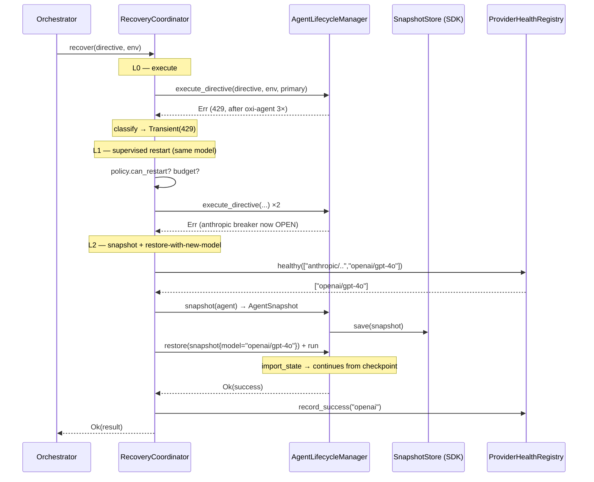

# RFC-029: Execution Resilience — Unix Mechanism + OTP Policy

> Status: Proposed (rev. 3 — redesigned around SDK lifecycle adoption)
> Layer: `oxios-kernel` (lifecycle, agent-runtime, orchestrator, a2a)
> Depends on: RFC-027 (unified intent handling), `oxi-sdk` `lifecycle` module

> **rev.3 changelog** — fundamental redesign driven by a key discovery:
> - **Discovery:** `oxi-sdk` already ships a complete **OTP/Erlang-style agent
>   lifecycle** (`AgentSnapshot`, `SnapshotStore`, `AgentSupervisor` +
>   `SupervisorPolicy` + `RestartBackoff`, `AgentStatus::Suspended`, lifecycle
>   events incl. `Suspended`/`Resumed`/`ModelSwitched`). **oxios-kernel uses none
>   of it** — it reimplemented an inferior Unix-only `Supervisor` + `AgentPool`.
>   Clinging to Unix philosophy, we turned off our own SDK's recovery primitives.
> - **Shift:** stop building a parallel `RetryCoordinator`. Instead **adopt the
>   SDK lifecycle as the recovery foundation** and layer provider resilience on
>   top. Unix stays as *mechanism* (fork/exec/kill/sandbox); OTP becomes the
>   *policy* (snapshot/restore/restart/model-switch).
> - **Collapsing win:** the old design's two weakest layers — L2 (model swap,
>   loses state) and L3 (respawn-with-state, unverified accessor) — **merge into
>   one robust operation**: snapshot → restore-from-snapshot-with-new-model. State
>   is preserved natively; the `agent.messages()` verification gate disappears;
>   the side-effect duplication problem (old D8) is solved structurally because
>   restore continues from the checkpoint rather than re-executing tools.
> - Goal reframed: "unconditional completion guarantee" → **"zero silent death +
>   bounded best-effort + deterministic failure reporting."** No OS guarantees
>   task success — it guarantees lifecycle integrity.

## 1. Problem

When an agent hits a provider error, execution **terminates and stays
terminated**. The orchestrator's only retry is *review-driven* (`verify_or_retry`)
— it re-runs only when the **quality** of a *successful* execution fails review,
never when an **exception** is thrown.

### What breaks today (concrete trace)

```
provider 429 / 5xx / quota
  → oxi-agent stream_with_retry_core: 3× same-model backoff   ← EXISTING, OK
  → exhausted → Err bubbles to run_streaming()
  → run_agent (agent_runtime.rs:1210):
        returns Ok(("Agent failed: {e}", success=FALSE, ...))   ← SWALLOWED
  → execute_inner (agent_runtime.rs:571):  ALWAYS returns Ok(ExecutionResult)
  → lifecycle.execute_directive → Ok(success:false)
  → user gets "Agent failed: …" and the task is dead.
```

`execute_inner` **always returns `Ok`**. The error is buried in
`ExecutionResult.output` as a string with `success: false`. Only timeouts and
"agent not found" propagate as `Err`. **Any retry design matching on `Err` at the
lifecycle boundary is dead on arrival** until this is fixed (§4.7 P0).

### The five recovery scenarios

| # | Scenario | Required response |
|---|----------|-------------------|
| 1 | Transient overload (429/5xx) | Backoff + retry (same model first) |
| 2 | Quota exhaustion on provider A | **Switch provider** — waiting won't help |
| 3 | Auth/key invalid | **Switch provider/credential** |
| 4 | Context window overflow | Compact, or switch to larger-context model |
| 5 | All models exhausted | **Delegate** to a fresh agent via A2A (agent-specific failures only) |

## 2. The Philosophical Shift: Unix Mechanism + OTP Policy

### Why pure Unix fails for agent recovery

Unix process semantics assume: **restart is cheap** (stateless processes),
**failure is binary** (exit code), **the OS doesn't manage process state**, and
**resources are local/fungible**. Every one of these is wrong for AI agents:

| Unix assumption | Agent reality | Consequence for retry |
|---|---|---|
| Restart is cheap | Agent state (trajectory) IS the work | Re-fork loses expensive reasoning |
| Failure is binary (exit code) | "Completed but wrong" is a spectrum | Errors get swallowed into `success:false` |
| OS doesn't manage process state | Agent state is the recovery unit | No checkpoint/resume infrastructure |
| Retry = re-run same thing | Agents are non-deterministic | Richer recovery (model/approach swap) is valid |
| Resources are local/fungible | LLM tokens are external/spent-once | Provider-aware admission, not OOM-kill |

### The resolution: two layers that compose

```
┌───────────────────────────────────────────────────────┐
│  POLICY layer — OTP supervisor (recovery decisions)   │  ← retry lives here
│  AgentSnapshot · SnapshotStore · SupervisorPolicy     │
│  RestartBackoff · ModelSwitched · AgentStatus::Suspended
├───────────────────────────────────────────────────────┤
│  MECHANISM layer — Unix (how agents run/die)          │  ← unchanged
│  fork/exec/wait/kill · scheduling · sandbox · CSpace  │
└───────────────────────────────────────────────────────┘
```

Unix is the right model for the *mechanism* (spawn, kill, sandbox, schedule,
resource-limit). OTP is the right model for the *policy* (when to restart, what
state to preserve, when to switch model, when to escalate). They do not conflict;
they compose. **This is not "abandon Unix" — it is "use Unix for spawning, OTP
for recovery."**

### The smoking gun: our SDK already has the OTP layer

`oxi-sdk 0.45.1` `lifecycle/` ships a complete OTP-style lifecycle that
**oxios-kernel does not use** (`grep oxi_sdk::lifecycle` in the kernel → 0 hits):

| SDK provides (OTP) | oxios-kernel built instead (Unix) |
|---|---|
| `AgentStatus`: Created/Running/**Suspended**/Terminated/Failed (`is_runnable()` includes Suspended) | Running/Idle/Failed — no Suspended, no resume |
| `AgentSnapshot { config, state, tool_manifest, metrics }` + `from_agent()` | own `AgentPool.export_state()` (crude JSON) |
| `SnapshotStore` / `FileSnapshotStore` (save/load/list/delete) | none |
| `AgentSupervisor::suspend/restore/restart` with `SupervisorPolicy{max_restarts,restart_window,backoff}` | `Supervisor` trait: fork/exec/kill only |
| `AgentLifecycleEvent::Suspended/Resumed/ModelSwitched` | no lifecycle events |
| `RestartBackoff { None, Fixed, Exponential }` | dead `DelegationConfig` (`#[allow(dead_code)]`) |

The SDK author understood agents need suspend/resume/checkpoint/supervised
restart. oxios-kernel ignored it and rebuilt a Unix-only supervisor. **This RFC's
core move is to stop ignoring it.**

## 3. Design

### 3.1 Adopt the SDK lifecycle as recovery foundation

oxios keeps its **agent construction** (CSpace tool registration, AccessGate,
AuditTrail — the rich stuff `AgentRuntime::run_agent` does that the SDK's bare
`spawn` does not). But it **delegates recovery state/policy to SDK primitives**:

- **Checkpoint:** `AgentSnapshot::from_agent(id, &config, &state, &tools, …)` →
  `SnapshotStore::save()`. The `state` comes from `Agent::export_state()` — the
  **same seam** oxios's `AgentPool` already uses (`supervisor.rs:87`). No new
  accessor needed.
- **Resume:** `SnapshotStore::load()` → `Agent::import_state()` (same seam).
- **Restart policy:** `SupervisorPolicy { max_restarts, restart_window_secs,
  backoff }` + `RestartBackoff` — replaces the dead `DelegationConfig`.
- **Model switch:** a first-class `AgentLifecycleEvent::ModelSwitched` — model
  swap is a native SDK concept, not an oxios invention.

> **Why not replace oxios's Supervisor wholesale with `AgentSupervisor`?** The
> SDK's `spawn()` builds a bare agent (`Agent::new(provider, config, empty
> ToolRegistry)`) — it lacks oxios's CSpace/GatedTool/AccessGate/AuditTrail
> wiring. Full migration would require teaching the SDK supervisor to accept a
> pre-built tool registry or a construction hook. That is a larger, separate
> effort (§6, future). This RFC adopts the **primitives** (snapshot/policy/
> events) behind a bridge, keeping oxios's construction path. Pragmatic and
> incremental.

### 3.2 The unified operation: snapshot → restore-with-new-model

The old design's two weakest layers collapse into one. On a provider failure
that warrants a model/provider change:

```
1. SNAPSHOT the failing agent:
     AgentSnapshot::from_agent(id, &config, &agent.export_state(), &tools, …)
     → SnapshotStore::save()              (persist conversation + tool results)

2. RESTORE with a different model:
     snapshot.config.model_id = fallback_model
     → restore_from_snapshot(snapshot)    (new agent, new provider, SAME state)
     emit ModelSwitched { from, to }

3. CONTINUE the run:
     the restored agent's next turn sees the prior tool results in context
     → it picks up where it left off, NOT from scratch
```

**Why this solves three old problems at once:**
- **State loss (old L2):** the snapshot carries the full conversation; restore
  continues from the checkpoint. No work is lost.
- **Unverified accessor (old L3 gate):** gone — we use `Agent::export_state()`,
  which oxios's own `AgentPool` already calls. No upstream contribution needed.
- **Side-effect duplication (old D8):** gone — restore does NOT re-execute
  completed tool calls; they're already in the conversation state. The agent
  sees prior results and proceeds. No double-PR, no double-email. The guard
  becomes unnecessary rather than a band-aid.

### 3.3 Error Classification

A `classify` function maps the `anyhow::Error` (or the §4.7 typed tag) to a
`FailureClass` that selects the recovery strategy. **Honest limitation:** the
typed `ProviderError` is stringified at the SDK boundary
(`From<anyhow::Error>` → `AgentError::Stream(String)`), so classification is
**message-pattern heuristic on the Display string** + the §4.7 typed tag when
present. Downcast to `ProviderError` is not possible and not relied upon.

| ProviderError / signal | FailureClass | Snapshot+restore? | Swap provider? |
|---|---|:--:|:--:|
| 429 / 5xx / network / timeout | **Transient** | retry same model first (restart policy) | only if breaker open |
| 402 (billing/quota) | **QuotaExhausted** | ❌ same provider | ✅ **mandatory** |
| 401/403 / MissingApiKey | **AuthFailure** | ❌ same provider | ✅ **mandatory** |
| ContextOverflow | **ContextOverflow** | compact first; then larger model | if larger available |
| ModelNotFound | **ModelUnavailable** | ❌ | ✅ swap model |
| TokenBudget/CostBudget exceeded | **BudgetExceeded** | ❌ | ❌ (policy — report) |
| anything else | **Unknown** | conservative once | escalate |

This **replaces** the inert `KernelError::is_retryable()` and the gateway's
heuristic `classify_error()` with one shared classifier.

### 3.4 The Recovery Ladder (OTP policy on Unix mechanism)

```rust
/// crates/oxios-kernel/src/resilience/coordinator.rs (NEW — thin)

/// Recovery coordinator: drives the OTP policy on top of the Unix supervisor.
/// Owns no agent construction — it snapshots/restores via the SDK store and
/// re-runs via the existing lifecycle. Bounded by a shared AttemptBudget.
pub struct RecoveryCoordinator {
    lifecycle: Arc<AgentLifecycleManager>,
    snapshots: Arc<dyn SnapshotStore>,      // SDK primitive — adopted
    policy: SupervisorPolicy,               // SDK primitive — adopted
    health: Arc<ProviderHealthRegistry>,    // per-provider breaker (§3.6)
    budget: Arc<AttemptBudget>,             // shared with verify_or_retry
    config: ResilienceConfig,
}
```

```
L0  EXECUTE  — lifecycle.execute_directive  (oxi-agent 3× same-model inside)
    │ on HardFail (§4.7 P0 makes failures propagate as Err):
    ▼
L1  RESTART (same model) — Transient/Unknown only, no tools-fence needed
    │   snapshot + SupervisorPolicy.restart (backoff, window-bounded)
    │   budget.try_consume()
    ▼
L2  SNAPSHOT + RESTORE-WITH-NEW-MODEL — Quota/Auth/Overload/breaker-open
    │   iterate engine.fallback_models (skip open providers, skip same-provider
    │   for quota/auth); for each: snapshot → restore(config.model=alt) → run
    │   record FallbackEvent{from,to,reason}  (wires the dead record_fallback)
    ▼
L3  COMPACT-OR-LARGER — ContextOverflow only
    │   oxi-agent maybe_compact already tried in-loop; here: restore with a
    │   larger-context model from fallback list
    ▼
L4  DELEGATE (A2A) — agent-specific failures only (NOT infra-wide outages)
    │   a2a_breaker.is_allowed() gates; delegate to a fresh agent
    │   (different persona/capability) — useless if ALL providers are down
    ▼
L5  TERMINAL — structured ResilientFailure{class, attempts, last_error}
```

**Key differences from the old ladder:**
- **L1 is a supervised restart** (`SupervisorPolicy`), not a hand-rolled loop —
  the SDK enforces window-bounded restart counting and backoff.
- **L2 is snapshot+restore+model-switch in one operation** (§3.2) — preserves
  state natively. Old L2 (state loss) + old L3 (respawn hack) are merged.
- **No separate respawn layer** — restore-from-snapshot IS the respawn, and it's
  backed by the SDK, not an unverified accessor.
- **L4 is honestly scoped** — delegation helps only for agent-specific failures
  (bad persona, missing tool). If every provider is quota-locked, delegating to
  another agent using the same dead providers is pointless; the ladder goes to L5.

### 3.5 Two axes of resilience (do not conflate)

This RFC delivers **Axis A**. **Axis B** is acknowledged as a separate concern.

| | Axis A — Infra/Provider resilience | Axis B — Semantic completion |
|---|---|---|
| Failure type | 429, quota, auth, overload, context | Stall, loop, wrong output, impossible task |
| Mechanism | snapshot/restore/restart/model-switch (this RFC) | stall detection, re-assessment, checkpoint/resume, user escalation |
| Bounded? | Yes (AttemptBudget, SupervisorPolicy) | Requires judgment (when is a task impossible?) |
| Status | **This RFC** | Future RFC |

Axis B is where real "completion rate" gains live (stalls are more common than
provider crashes), but it is a different problem requiring different machinery
(loop-pattern detection, directive re-structuring). Mixing it into this RFC would
inflate scope and blur the design. It is called out, not solved, here.

### 3.6 Per-Provider Circuit Breaker (`ProviderHealthRegistry`)

The existing global `LLM_CIRCUIT_BREAKER` cannot express "Anthropic is down, use
OpenAI." Replace with a per-provider registry; when a provider trips, L2 skips
every model on that provider.

```rust
pub struct ProviderHealthRegistry {
    breakers: DashMap<String, ProviderCircuitBreaker>,
    config: BreakerConfig,   // failure_threshold=5, reset_after=60s
}
// is_healthy(provider) · record_success/failure · healthy(candidates)
```

The global gauge (`llm_circuit_breaker_state`) is kept as an aggregate metric.

### 3.7 Prerequisite P0: propagate provider errors as `Err` (BLOCKING)

Nothing in §3.4 works until failures are visible at the lifecycle boundary.

**Change A:** `run_agent` (agent_runtime.rs:1210) must propagate `run_streaming`'s
`Err` instead of returning `Ok(("Agent failed: {e}", success=false))`. Then
`execute_inner` propagates via its existing `.await?`, and
`lifecycle.execute_directive` returns `Err`.

**Change B:** attach `ExecutionResult.failure_class: Option<FailureClass>` so
the class travels even when a caller insists on `Ok(success:false)` (e.g. to feed
review). `run_agent` populates it from the error before returning.

This is small, localized to `agent_runtime.rs`, and is the single highest-leverage
edit. **P0, non-negotiable.**

### 3.8 Stall handling (existing, crude — Axis B preview)

oxios already has crude stall detection: `max_execution_time_secs` (timeout kill,
`agent_lifecycle.rs:135`) + `zombie_timeout_secs` (reap, default 300s). A timeout
becomes a failure → this RFC's ladder. **Caveat:** a stall is often task/persona-
specific, so model-swap (L2) may not fix it and will burn budget. A proper Axis-B
watchdog (detect looping tool-call patterns, intervene before timeout) is future
work. For now, `BudgetExceeded`-style discipline (AttemptBudget) bounds the waste.

## 4. Configuration

Reuse `engine.fallback_models`. Add `[intent.resilience]`:

```toml
[engine]
default_model = "anthropic/claude-sonnet-4-20250514"
fallback_models = ["openai/gpt-4o", "google/gemini-2.5-flash"]  # cross-provider

[intent.resilience]
enabled = true
max_total_attempts = 8          # global budget (ladder + quality-retry)

# L1 — supervised restart (maps to SupervisorPolicy)
restart_max = 2                 # max_restarts within window
restart_window_secs = 60
backoff = "exponential"         # None | Fixed{ms} | Exponential{base_ms,max_ms}
backoff_base_ms = 1000
backoff_max_ms = 30000

# L2 — model swap via snapshot+restore (reads engine.fallback_models)
snapshot_dir = "~/.oxios/snapshots"   # FileSnapshotStore base

# Per-provider circuit breaker
breaker_failure_threshold = 5
breaker_reset_secs = 60

# L4 — A2A delegation (agent-specific failures)
enable_delegation = true
```

## 5. Data Flow

> `Err` propagation (LCM→RC) depends on §3.7 P0.



## 6. Decision Record

### D1 — Unix mechanism, OTP policy (the foundational decision)
**Decision:** Keep Unix (fork/exec/kill/sandbox/schedule) as the *mechanism*;
adopt SDK OTP lifecycle (snapshot/restore/restart-policy/model-switch) as the
*policy*. Do not force recovery into Unix process semantics.
**Rationale:** Agents are stateful, non-deterministic, externally-resourced —
Unix's cheap-restart/binary-failure/local-resource assumptions all fail. OTP's
suspend/resume/supervised-restart is purpose-built for stateful long-running
actors, and the SDK already implements it. See §2.

### D2 — Adopt SDK primitives behind a bridge, not full supervisor migration
**Decision:** Use `AgentSnapshot`/`SnapshotStore`/`SupervisorPolicy` directly;
do NOT replace oxios's `Supervisor` with `AgentSupervisor` yet.
**Rationale:** The SDK `spawn()` builds a bare agent without oxios's
CSpace/AccessGate/AuditTrail wiring. Full migration needs a construction hook in
the SDK (future). The primitives (snapshot/policy/events) are reusable now via
the `export_state`/`import_state` seam oxios already calls. Incremental, low-risk.

### D3 — Snapshot+restore+model-switch is ONE operation
**Decision:** On model/provider change, snapshot then restore-from-snapshot with
a new `config.model_id`. Do not re-fork from scratch.
**Rationale:** Merges old L2 (state loss) + old L3 (respawn hack) into one
operation. Preserves state natively; eliminates the unverified-accessor gate;
eliminates side-effect duplication (restore continues from checkpoint, doesn't
re-execute tools). `ModelSwitched` is a native SDK lifecycle event.

### D4 — Delegation (L4) is honestly scoped to agent-specific failures
**Decision:** A2A delegation helps only when the failure is agent-specific (bad
persona, missing tool). It does NOT help when all providers are down.
**Rationale:** Delegating to a fresh agent using the same dead providers is
pointless. The ladder goes to L5 for infra-wide outages. This is honest about
what "guarantee" means: bounded best-effort, not unconditional.

### D5 — Per-provider breaker over global
**Decision:** `ProviderHealthRegistry` (per-provider) gates L2; the global
breaker is kept as an aggregate metric only.
**Rationale:** A global breaker can't express "skip Anthropic, use OpenAI."

### D6 — Two axes; this RFC is Axis A only
**Decision:** This RFC delivers infra/provider resilience. Semantic completion
(stall/loop detection, re-assessment) is Axis B, a separate future RFC.
**Rationale:** Stalls are the more common failure but need different machinery.
Conflating them inflates scope and blurs the design.

### D7 — Global AttemptBudget shared with quality-retry
**Decision:** One budget caps total directive executions across the ladder and
`verify_or_retry`.
**Rationale:** Prevents cost/latency blowup when multiple retry layers stack.

### D8 — `classify` is heuristic-only; honest about it
**Decision:** One `classify` (Display-string heuristic + §3.7 tag) replaces the
inert `KernelError::is_retryable()` and gateway `classify_error()`.
**Rationale:** Three classifiers drift. One shared classifier stays consistent.
**Limitation:** downcast impossible (stringified at boundary); patterns depend on
`ProviderError` Display text and are tested (§7).

## 7. Implementation Plan (phased)

| Phase | Scope | Files |
|-------|-------|-------|
| **P0** ⚠️ blocking | Propagate provider errors as `Err`; add `ExecutionResult.failure_class` | `agent_runtime.rs` |
| **P1** | `FailureClass` + `classify` | `resilience/{mod,classify}.rs` (new) |
| **P2** | Adopt SDK lifecycle: wire `SnapshotStore` (FileSnapshotStore) + `SupervisorPolicy`; implement snapshot+restore+model-switch (D3); wire `record_fallback`; `ExecEnv.model_override`; `AttemptBudget` | `resilience/coordinator.rs` (new), `agent_lifecycle.rs`, `agent_runtime.rs`, `directive.rs` |
| **P3** | `ProviderHealthRegistry` (per-provider breaker), integrate into L2 | `resilience/provider_health.rs` (new) |
| **P4** | L4 A2A delegation (wire `a2a_breaker`); honest infra-vs-agent gating | `resilience/coordinator.rs`, `a2a/` |
| **P5** | `ResilienceConfig` + metrics + Web UI fallback panel + share `AttemptBudget` with `verify_or_retry` | `config.rs`, `metrics.rs`, `engine_api.rs` |
| **Future** | Full migration: oxios `Supervisor` → SDK `AgentSupervisor` with CSpace construction hook; Axis B (stall watchdog, re-assessment) | large, separate |

**P0 is non-negotiable.** P0+P1+P2 close the majority of real-world failures
(transient + state-preserving model/provider swap) and are independently
shippable. The snapshot+restore seam (`export_state`/`import_state`) is already
exercised by oxios's `AgentPool`, so P2 is low-risk.

## 8. Testing Strategy

- **Unit:** `classify` against each `ProviderError` Display string + the §3.7 tag
  fast-path; `SupervisorPolicy` window/restart-count enforcement; `RestartBackoff`
  delays; `AttemptBudget` exhaustion → L5 short-circuit; `ProviderHealthRegistry`
  open/half-open/closed.
- **Integration (D3, the core):** mock provider returns 429 after 2 tool calls →
  assert L2 snapshots (state includes the 2 tool results), restores with fallback
  model, and the restored agent does **NOT** re-execute those tools (state
  preserved). `FallbackEvent` recorded. `ModelSwitched` event emitted.
- **Integration (D4):** all providers quota-locked → assert L4 delegation is
  **skipped** (no point) and L5 returns a structured "all providers exhausted"
  failure.
- **Integration (D7):** budget exhausted mid-ladder → immediate L5.
- **Regression (P0):** a provider `Err` reaches `execute_directive` as `Err`, not
  `Ok(success:false)`.
