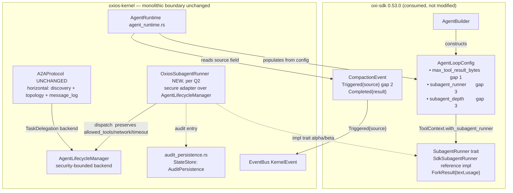

# RFC-035: oxi-sdk 0.52.1 → 0.53.0 통합 — 에이전트 실행 계층 단일화

> **Status:** Proposed
> **Created:** 2026-07-04
> **Scope:** `crates/oxios-kernel` (agent execution layer) + `src/kernel.rs` (binary)
> **Precedents:** RFC-014 (0.24→0.26 migration), RFC-026 (crate restructure), RFC-009 (single-source-of-truth framing)
> **Dependency:** `oxi-sdk` 0.53.0 ([CHANGELOG](https://github.com/a7garden/oxi/blob/main/CHANGELOG.md)) — closes consumption of [issue #28](https://github.com/a7garden/oxi/issues/28) gaps 1/2/3
> **Non-goal:** crate restructuring (kernel stays monolithic per `ARCHITECTURE.md §10`), Web UI changes, new oxi-sdk features, removal of the A2A protocol

---

## 1. Motivation

`oxi-sdk` 0.53.0 (released 2026-07-03) closes all three gaps from upstream
issue #28. Two of them fix latent failure modes oxios already *configures for*
but does not *benefit from*: `agent_runtime.rs:914` sets
`CompactionStrategy::Threshold(0.8)`, yet the pre-0.53 token heuristic
undercounts real tokens by 3–4× on CJK/JSON/base64 content, so the threshold
can be a silent no-op (the exact #28 failure: 35 k estimated vs 122 k actual,
139 KB body growing across 11 rounds). The third gap gives oxios a primitive it
currently lacks: library-native, depth-safe sub-agent recursion that does **not**
require a CLI subprocess and does **not** abuse `std::env::set_var` (UB under
concurrent forks).

oxios today owns **one** delegation surface — the horizontal `A2AProtocol` — and
**no** recursion primitive. The 0.53.0 `SubagentRunner` fills the recursion gap
without colliding with A2A, because the two operate on different axes (§4.2).
The single, load-bearing design decision is therefore **not** "which to keep" but
"which execution *backend* the new recursion path should use, and whether the
agent-visible tool surface consolidates" — the subject of Open Question Q2 and
the security fork in §4.3.

### 1.1 Why now

- 0.53.0 is the first release in which all three #28 gaps ship together; bumping
  earlier would consume partial surface and force a second pass.
- oxios has **zero compile coupling** to the new symbols — `grep` for
  `SubagentRunner|ForkResult|TokenSource|max_tool_result_bytes|subagent_runner|
  subagent_depth` across `crates/` returns nothing (verified). The migration is
  purely additive on the oxios side.
- The `..Default::default()` tail on the `AgentConfig` literal
  (`agent_runtime.rs:928`) means new 0.53 fields default in cleanly; no
  exhaustive-struct breakage.

---

## 2. Goals & Non-Goals

### Goals

1. **Consume gap 2 (compaction accuracy)** — provider-reported token counts drive
   `Threshold` automatically on upgrade; surface the new
   `CompactionEvent::Triggered { source }` for drift observability.
2. **Consume gap 1 (tool-result eviction)** — wire
   `AgentLoopConfig::max_tool_result_bytes` from oxios config so a single large
   tool output cannot consume the context window.
3. **Consume gap 3 (library-native delegation)** — give oxios vertical, in-process,
   depth-bounded sub-agent recursion via `SubagentRunner`, routed through a
   **security-preserving** backend (§4.3).
4. **Observability consolidation** — compaction source and sub-agent runs emit on
   the existing `EventBus` / `AuditPersistence` channels.
5. **Preserve every kernel boundary** — no new crate, no module split, no removal
   of A2A; all changes live inside `oxios-kernel` modules or the binary assembler.

### Non-Goals

- Splitting `oxios-kernel` (forbidden by `ARCHITECTURE.md §10`; reaffirmed by
  RFC-026).
- Proposing upstream `oxi-sdk` features — consume 0.53.0 surface only.
- **Web UI changes** — including removal or rewiring of A2A topology types. The
  live `GET /api/a2a/topology` endpoint (`src/api/routes/a2a.rs:130`, routed at
  `src/api/routes/mod.rs:402`) derives nodes from `AgentCardRegistry` and edges
  from `recent_messages(300)`. Any change that stops delegation from flowing
  through `A2AProtocol.message_log` would silently drop topology edges the Web UI
  renders. This is an explicit scope fence (§4.2, §7).
- Replacing `A2AProtocol`. A2A and `SubagentRunner` are orthogonal (§4.2).
- Fixing the `DelegationHandler` payload-drop bug (`src/kernel.rs:1402` builds a
  `Directive` from `task.description` only, dropping `payload`/`priority`) —
  noted in §7, deferred (Q5).

---

## 3. Current State

### 3.1 oxi-sdk version pins (verified)

```toml
# Cargo.toml (workspace root), line 83
oxi-sdk = "0.52.1"
# crates/oxios-kernel/Cargo.toml, ~line 35
oxi-agent = "0.52.1"
```

`oxi-agent` is a direct dep because the SDK does not re-export `MemoryBackend`
or the `memory_*` tools; both pins move together.

### 3.2 Current execution layer (ASCII)

```
                         oxi-sdk 0.52.1 (embedded via Oxi)
            ┌──────────────────────────────────────────────────────┐
            │ Oxi → AgentBuilder → Agent                            │
            │ AgentConfig{ compaction: Threshold(0.8) }  ←── :914   │
            │   token count  = bytes/4 HEURISTIC   ← gap 2: no-op   │
            │   tool results = UNLIMITED in history ← gap 1: blowup │
            │ AuditLogMW / CostMW / AuthMW  (build_hooks, RFC-014D) │
            └───────────────────────┬──────────────────────────────┘
                                    │ Agent::run_streaming()
            ┌───────────────────────┴──────────────────────────────┐
            │ AgentRuntime                      agent_runtime.rs    │
            │   • builds AgentConfig @ :905-928                     │
            │   • AgentBuilder branch @ :996  / pool branch @ :929  │
            │   • summarize_tool_result @ :1434  (200ch, DISPLAY)   │
            │   • matches Compaction::Completed @ :1278             │
            │     (no Triggered arm — gap 2 signal lost)            │
            └───────────────────────┬──────────────────────────────┘
                                    │ Supervisor.run_with_directive (supervisor.rs:289)
        ┌───────────────────────────┴────────────────────────────────────┐
        │  VERTICAL recursion                 HORIZONTAL delegation      │
        │  (NONE in oxios — CLI-spawn path    A2aDelegateTool            │
        │   is dormant; no OXI_SUBAGENT_        a2a_tools.rs:42          │
        │   DEPTH plumbing)                     (capability-ROUTED)       │
        │                                       → A2AProtocol::execute_  │
        │                                         delegation a2a/mod:623 │
        │                                       → DelegationHandler †    │
        │                                         kernel.rs:1402         │
        │                                       → AgentLifecycleManager │
        │                                         ::execute_directive :73│
        │                                       (security-bounded ‡:     │
        │                                        allowed_tools, network, │
        │                                        timeout, access, budget)│
        └────────────────────────────────────────────────────────────────┘
   † src/kernel.rs:1402 builds Directive from task.description ONLY;
     payload + priority are dropped (latent bug, §7).
   ‡ AgentLifecycleManager constructed at src/kernel.rs:1387-1396 WITH
     config.security.{max_execution_time_secs, allowed_tools, network_access}
     + config.kernel.workspace + access_manager. This is the security boundary
     any gap-3 backend MUST preserve (§4.3).
```

### 3.3 Responsibility matrix (module × responsibility × oxi-sdk surface × before/after)

| Module | Responsibility | oxi-sdk 0.52 surface | oxi-sdk 0.53 surface | Before | After |
|---|---|---|---|---|---|
| `agent_runtime.rs::run_agent` | Build `Agent` from `AgentConfig` | `AgentBuilder`, `AgentConfig` | + `AgentLoopConfig` fields (gap 1, 3) | Sets `Threshold(0.8)`; no eviction; no recursion | Sets `max_tool_result_bytes`; wires `subagent_runner` per Q2 |
| `agent_runtime.rs:1278` | Compaction event handling | `CompactionEvent::Completed` | + `Triggered { source }` (gap 2) | Handles `Completed` only | + `Triggered` → publish source |
| `agent_runtime.rs:1434` `summarize_tool_result` | Display truncation (trajectory) | — | — | 200-char char-aware truncation for SONA trajectory | **Unchanged** (orthogonal to gap 1; Q3) |
| `a2a/mod.rs::A2AProtocol` | Horizontal delegation + discovery + topology | — | — | Owns `DelegationHandler`, `execute_delegation`, `message_log`, registry | **Unchanged** — feeds `/api/a2a/topology` (scope fence) |
| `tools/a2a_tools.rs::A2aDelegateTool` | Capability-routed delegation tool | `AgentTool` | — | Routes to `execute_delegation` | Per Q2 (α: unchanged; β: rewired backend) |
| `src/kernel.rs:1402` | Wires A2A delegation → lifecycle backend | — | — | Closure → `AgentLifecycleManager` (security-bounded) | Per Q2 |
| `agent_lifecycle.rs::AgentLifecycleManager` | Full security-bounded lifecycle | — | — | A2A backend; carries `allowed_tools`/`network`/`timeout` | **Unchanged**; candidate backend for gap 3 (Q2-B) |
| `audit_persistence.rs` | `StateStore: AuditPersistence` | `AuditPersistence` trait | — | Bridges SDK audit trail to FS | **Unchanged** |
| `engine.rs::OxiosEngine` | Authorizer/tracer/cost-tracker attach | `AgentBuilder` helpers | — | `with_authorizer/tracer/cost_tracker` (RFC-014D) | **Unchanged** |
| **NEW** `subagent_runner.rs` | Vertical in-process recursion backend | — | `SubagentRunner` trait + `ForkResult` + `SdkSubagentRunner` (gap 3) | Does not exist | Per Q2: secure adapter (α/β) or defer (γ) |
| `config.rs` | Runtime config mirror | `AgentLoopConfig::provider_options` | + eviction + depth fields | — | + `max_tool_result_bytes`, `subagent_max_depth` |
| `agent_group.rs` | Historical group-read types | — | — | Read-only types backing `/api/agent-groups` (creation logic removed in RFC-027) | **Unchanged** — not part of this integration |
| **`tools/builtin/mod.rs::register_all_kernel_tools` (lines 55-121)** | Kernel tool registry | `AgentTool` registry | + `oxi_agent::SubagentTool` (gap 3) | Registers `MemoryRecallTool`/`MemoryRetainTool`/`MemoryEditTool`/`MemoryReflectTool` from oxi-agent (lines 63-66) but **not** `SubagentTool` — verified 0 matches across `crates/` | **Add `registry.register(oxi_agent::SubagentTool);` next to the memory-tools block.** Without this, `OxiosSubagentRunner` is wired into `ToolContext` but nothing in any kernel-built agent's `ToolRegistry` invokes it — the runner is dead until this line exists. `SubagentTool::new()` is zero-arg (`oxi-agent-0.53.0/src/tools/subagent.rs:530-535`); the tool consults `ToolContext.subagent_runner` at execute time, so the wiring order is: (1) build the runner, (2) build the agent with the runner wired into `ToolContext`/`AgentLoopConfig`, (3) register the tool in the same registry. **This is a Phase C prerequisite that cannot be deferred.** |

---

## 4. Proposed Architecture

### 4.1 Layering after migration (mermaid)



### 4.2 The boundary: backend overlap, protocol orthogonality (load-bearing)

> `SubagentRunner` overlaps A2A **only** at the execution *backend* — the
> `DelegationHandler` (`a2a/mod.rs:442-451`) that turns a delegated task into a
> running agent. It does **not** overlap the rest of the A2A protocol: agent
> discovery (`AgentCardRegistry`), the other four message types
> (`StatusUpdate`/`ResultSharing`/`CapabilityQuery`/`Handshake`), the
> `message_log`, the circuit breaker, or the topology types. Those feed
> `/api/a2a/topology` and are out of scope to remove.

The two agent-callable tools are **different operations**, not duplicates — but
under the §4.3 **Q2-secure-constraint** (mandating `AgentLifecycleManager` as the
backend in every option), the *backend* rows of the table collapse to parity.
Only the operation-level axes remain distinct:

| Axis | `a2a_delegate` (EXISTING) | native `subagent` tool (gap 3) |
|---|---|---|
| Semantics | **Capability-routed** — query registry, pick a *different* agent by capability | **Recursive self-clone** — spawn an isolated copy of the caller |
| Target | Named, registered agent (own persona/model/tools possible) | Fresh agent, caller's configuration, empty context |
| Visibility | Topology edge in `message_log` → `/api/a2a/topology` | None unless backend logs one explicitly (§4.4 α vs β split) |
| Recursion safety | N/A (one-shot delegation) | `subagent_depth: u8` field (no env-var UB) |
| Return shape | `serde_json::Value` (rich) | `ForkResult { text, usage }` |
| **Backend dispatch** | **`AgentLifecycleManager::execute_directive`** (today's wiring at `src/kernel.rs:1402` → `:73`) | **`AgentLifecycleManager::execute_directive`** via `OxiosSubagentRunner` (Q2-secure-constraint, §4.3) |
| **Cost** | Full supervisor + perms + budget | Full supervisor + perms + budget (NOT cheap — see warning below) |
| **Identity / perms** | Independent agent, own permission gate | Caller's `KernelHandle` context carried through the lifecycle manager |

> **⚠ Important correction to a prior draft:** an earlier revision of this table
> characterized vertical recursion as "in-process, cheap, no scheduler." That
> was the upstream `SdkSubagentRunner` contract. **Under the §4.3
> Q2-secure-constraint (mandatory lifecycle-manager backend), the cost and
> identity rows collapse to parity with horizontal delegation.** Vertical
> recursion is still cheaper in three respects:
> 1. **No CLI subprocess** — `Agent::run_streaming()` directly, no `oxi` binary
>    spawn.
> 2. **No env-var depth state** — `subagent_depth: u8` on `ToolContext` (no
>    concurrent `set_var` UB).
> 3. **Final text + usage return shape** — `ForkResult` is smaller than the
>    rich `serde_json::Value` A2A returns; no A2A message serialization.
>
> The cost *axis* is no longer a meaningful differentiator. The four operation
> rows above (semantics, target, visibility, return shape) plus recursion safety
> are the genuine separation.

### 4.3 Security preservation — the non-negotiable backend requirement

The current `DelegationHandler` (`src/kernel.rs:1402`) dispatches through
`AgentLifecycleManager`, which is constructed at `src/kernel.rs:1387-1396`
**with** the full Oxios security config:

```rust
let lifecycle = oxios_kernel::AgentLifecycleManager::new(
    supervisor.clone(),
    access_manager.clone(),            // RBAC + path sandbox
    a2a_protocol.clone(),
    event_bus.clone(),
    config.security.max_execution_time_secs,   // execution timeout
    config.security.allowed_tools.clone(),     // tool allowlist filtering
    config.security.network_access,            // network policy
    config.kernel.workspace.clone(),           // path sandbox root
);
```

`SdkSubagentRunner` (the 0.53 reference impl) "wraps an `Oxi` instance, builds a
fresh `Agent` with an empty context per call" — a **generic** path that carries
**none** of these guards. Wiring the native `subagent` tool to `SdkSubagentRunner`
naïvely would let a sub-agent bypass `allowed_tools` filtering, network policy,
and execution timeouts — a **sandbox-escape vector**, not merely a cost risk.

**Requirement:** whichever backend serves gap 3 MUST route execution through a
path that applies `allowed_tools`, `network_access`, `max_execution_time_secs`,
`access_manager`, and `workspace`. The cleanest way to guarantee this is to
implement `SubagentRunner` as a thin adapter over the **existing**
`AgentLifecycleManager` (Q2-B), so the security boundary is inherited by
construction rather than re-implemented.

**Known wrinkle:** `AgentLifecycleManager::execute_directive` returns
`oxios_ouroboros::ExecutionResult` (`output`, `steps_completed`, `success`,
`tool_calls` — verified at `crates/oxios-ouroboros/src/types.rs:29-38`), which
carries **no token `usage`**. The `SubagentRunner` / `ForkResult` contract wants
`usage`. An adapter over the lifecycle manager must therefore source usage from
`AgentEvent::Usage` (already accumulated in `agent_runtime.rs::ExecuteState` as
`total_input_tokens`/`total_output_tokens`) or from the `EventBus`
`TokenUsageUpdate` event, not from the result struct. This is a concrete
implementation detail, not a blocker (Q2).

### 4.4 Observability posture

- **Gap 2 source** — `CompactionEvent::Triggered { source }` carries
  `"provider-reported"` / `"bytes/4 heuristic (cold start)"` / `"empty"`. oxios
  publishes it on the `EventBus` so the 3–4× heuristic drift is observable
  end-to-end.
- **Gap 3 runs** — the `SubagentRunner` adapter writes a `TrailEntry` via the
  existing `AuditPersistence` bridge (`audit_persistence.rs`) so sub-agent calls
  appear in the same hash-chained trail as top-level tool calls. Under Q2-β the
  run also produces a topology edge (via `message_log`); under Q2-α it does not
  unless the adapter logs one explicitly.
- **Gap 1 truncation** — the SDK appends `"... [truncated: N bytes omitted]"`;
  no oxios-side signal needed (the marker is visible in the message history).

---

## 5. Concrete Integration Points

> [VERIFIED] = directly observed in source this session.
> [INFERENCE] = derived from CHANGELOG; confirm against the 0.53.0 API at implementation time (Q1).

### 5.1 Dependency bump

| File | Change |
|---|---|
| `Cargo.toml` (root) :83 | `oxi-sdk = "0.52.1"` → `"0.53.0"` [VERIFIED line] |
| `crates/oxios-kernel/Cargo.toml` ~:35 | `oxi-agent = "0.52.1"` → `"0.53.0"` [VERIFIED pin] |

### 5.2 Gap 2 — compaction observability (additive)

| File:Line | Change |
|---|---|
| `crates/oxios-kernel/src/agent_runtime.rs:33` | `CompactionEvent` import already present [VERIFIED] |
| `crates/oxios-kernel/src/agent_runtime.rs:1278` | Add `CompactionEvent::Triggered { source }` match arm → publish a `KernelEvent` carrying `source` [VERIFIED only `Completed` matched today] |
| `crates/oxios-kernel/src/event_bus.rs` (`KernelEvent`) | Add variant for compaction trigger source (Q4: new variant vs reuse) |

No construction-site change: oxios never constructs `CompactionEvent`; the
`source` field is additive on a *received* variant, so the bump is non-breaking.

### 5.3 Gap 1 — tool-result eviction — **BLOCKED on upstream**

**Phase B verification (2026-07-04)** against oxi-sdk 0.53.0 source discovered
that `max_tool_result_bytes` exists **only** on `AgentLoopConfig`
(`oxi-agent/src/agent_loop/config.rs:100`). It is **not** on `AgentConfig`
(`config.rs:126-198`), has **no** `AgentBuilder` setter (`agent_builder.rs`,
all 25 `pub fn` enumerated), and **no** runtime setter on `Agent` or
`AgentLoop`. Both internal `AgentLoopConfig` construction sites in `agent.rs`
end with `..Default::default()`, so the field is forced to `None`. oxios
builds agents via `engine.oxi().agent(config).build()` (RFC-014 Phase D) and
has no injection point.

**Original plan (preserved for the upstream PR):**

| File:Line | Change |
|---|---|
| `crates/oxios-kernel/src/agent_runtime.rs:905-928` (`AgentConfig` literal) | ~~Populate `max_tool_result_bytes` from config~~ — `AgentConfig` does not expose this passthrough |
| `crates/oxios-kernel/src/config.rs:693` | Add `max_tool_result_bytes: Option<usize>` to the agent config mirror (still valid — the config mirror can hold the value, but wiring it to the SDK needs the upstream fix) |
| `crates/oxios-kernel/src/kernel_handle/engine_api.rs:1098` | Hot-reload path propagates the new field (also pending upstream) |
| `crates/oxios-kernel/src/agent_runtime.rs:1434` (`summarize_tool_result`) | **Unchanged** — display truncation (200ch) is orthogonal to context-window eviction (Q3) |

**Unblock path:** file an upstream PR to `a7garden/oxi` adding
`max_tool_result_bytes: Option<usize>` to `AgentConfig` as a `#[serde(skip,
default)]` passthrough (mirroring how `memory`/`todo`/`agent_pool` already
work), then thread it through the two `AgentLoopConfig` construction sites in
`agent.rs`. Until that lands, Phase B cannot be implemented from oxios.

### 5.4 Gap 3 — `SubagentRunner` (design forks on Q2)

The implementation shape depends on the Q2 decision. This RFC's **recommended**
path is **α with a security-preserving adapter (Q2-B backend)**:

| File | Change (α + Q2-B) |
|---|---|
| `crates/oxios-kernel/src/subagent_runner.rs` (**NEW**) | `OxiosSubagentRunner` impl `oxi_sdk::SubagentRunner`; wraps `Arc<AgentLifecycleManager>`; dispatches `execute_directive`, maps `ExecutionResult.output → ForkResult.text`, sources `usage` from `AgentEvent::Usage`/`EventBus` (§4.3 wrinkle). Respects `subagent_depth`. Writes a `TrailEntry`. |
| `crates/oxios-kernel/src/lib.rs` | `pub mod subagent_runner;` + re-export |
| `crates/oxios-kernel/src/agent_runtime.rs:996` (AgentBuilder branch) | Register the SDK's native `subagent` tool; wire `OxiosSubagentRunner` via `ToolContext::with_subagent_runner` (exact mechanism per Q1) |
| `crates/oxios-kernel/src/config.rs` | Add `subagent_max_depth: u8` (default e.g. 3) |
| **`crates/oxios-kernel/src/tools/builtin/mod.rs::register_all_kernel_tools` (lines 55-121)** | **Add `registry.register(oxi_agent::SubagentTool);` next to the existing `MemoryRecallTool`/`MemoryRetainTool`/`MemoryEditTool`/`MemoryReflectTool` block (lines 63-66).** This is the call site that places `SubagentTool` (whose `AgentTool::name() == "subagent"`) into every kernel-built agent's `ToolRegistry`. Without this, `OxiosSubagentRunner` is wired into `ToolContext` but no agent invocation path exists — the runner is dead until this line lands. The tool's `execute` consults `ToolContext.subagent_runner` at runtime, so the wiring order is: build runner → wire it into `ToolContext`/`AgentLoopConfig` → register the tool in the same registry. Verified at `oxi-agent-0.53.0/src/tools/subagent.rs:530-535` (`SubagentTool::new()` is zero-arg, no constructor coupling needed). |
| `src/kernel.rs` (binary assembler, near `:1387`) | Construct one shared `OxiosSubagentRunner` from the existing `lifecycle`, share via `Arc` |

Under **β** the only differences are: keep `A2aDelegateTool` registered, and
rewire the `DelegationHandler` closure (`src/kernel.rs:1402`) to dispatch through
`OxiosSubagentRunner` instead of `AgentLifecycleManager` directly (the adapter
still wraps the lifecycle manager, so security is preserved). Under **γ**, this
section is deferred entirely.

> **⚠ Phase C blocker — entire path unverified (verified 2026-07-04 against 0.53.0):**
>
> Two injection paths exist in 0.53.0, but BOTH share the same fate:
>
> - **`AgentLoopConfig.subagent_runner` + `subagent_depth`** (`agent_loop/config.rs:77,88`)
>   — `AgentConfig` exposes no passthrough, `AgentBuilder` has no setter,
>   `Agent`/`AgentLoop` have no runtime setter. **Blocked on the upstream PR
>   that adds these as `#[serde(skip)]` passthroughs on `AgentConfig`**
>   (same shape as Phase B's `max_tool_result_bytes`, §5.3).
> - **`ToolContext.subagent_runner` + `subagent_depth`** (`tools.rs:339,343`)
>   — a **second path** that does NOT route through `AgentLoopConfig`. Both
>   fields are co-located on `ToolContext` (not a runner/depth split as an
>   earlier draft of this note claimed — verify at `tools.rs:339-343`).
>   `SubagentTool::execute` reads BOTH from the same `ToolContext`
>   (`subagent.rs:648-650`: `let depth = if runner.is_some() {
>   ctx.subagent_depth } else { current_subagent_depth() }`). The builder
>   method is `ToolContext::with_subagent_runner` (`tools.rs:430`), and a
>   matching depth setter is on `ToolContext` near line 378 (`build_tool_context`).
>
> **Critical: do NOT wire `subagent_runner` without `subagent_depth`.** They
> are on the same struct for a reason — without the depth cap, recursion is
> unbounded. An earlier draft of this note incorrectly suggested the runner
> could ship without the depth cap; that path does not exist.
>
> **Net:** Phase C is **entirely contingent on verifying the ToolContext
> injection path from oxios**. If `with_subagent_runner` is reachable from
> oxios's `AgentBuilder`-based agent build path, BOTH fields wire cleanly
> (no upstream PR needed). If it is NOT reachable, BOTH are blocked
> on the same upstream PR as Phase B. A future implementer MUST trace the
> `ToolContext` construction site (`build_tool_context`) end-to-end before
> concluding either way.

### 5.5 Files NOT changed (explicit)

- `crates/oxios-kernel/src/a2a/mod.rs` — A2A protocol, discovery, topology types retained verbatim (scope fence, §2).
- `crates/oxios-kernel/src/tools/a2a_tools.rs` — unchanged under α; rewired-backend-only under β.
- `crates/oxios-kernel/src/agent_lifecycle.rs` — security-bounded lifecycle path reused as the gap-3 backend (Q2-B), not modified.
- `crates/oxios-kernel/src/agent_group.rs` — historical-read types backing `/api/agent-groups`; creation logic already removed in RFC-027. Not migrated.
- `crates/oxios-kernel/src/audit_persistence.rs` — bridge reused as-is.
- `crates/oxios-kernel/src/orchestrator.rs` — orchestration unchanged.
- `src/api/routes/a2a.rs` — topology endpoint untouched (Web UI scope fence).

---

## 6. Migration Phases

Each phase is an independently mergeable PR with its own verifiable gate,
ordered by risk ascending. Phase C branches on the Q2 decision.

### Phase A — Dependency bump + gap 2 observability (lowest risk)

**Changes**
- Bump `oxi-sdk` / `oxi-agent` to `0.53.0` (§5.1).
- Add `CompactionEvent::Triggered { source }` match arm at `agent_runtime.rs:1278`.
- Add the `KernelEvent` variant for compaction source (Q4).

**Behavior delta**
- Compaction now fires on turn 2+ using provider-reported tokens (gap 2) — a free
  consequence of the upgrade; oxios only *observes* the new event.
- Heuristic↔real drift becomes visible via the new event.
### Phase B — Gap 1 tool-result eviction — **⛔ BLOCKED on upstream**

> See §5.3 for the blocker analysis. `max_tool_result_bytes` exists only on
> `AgentLoopConfig` in 0.53.0; oxios has no injection point. Do not implement
> this phase until the upstream `AgentConfig` passthrough PR lands.

**Changes** *(blocked, preserved for the upstream fix)*
**Acceptance gate**
```bash
cargo build -p oxios-kernel
cargo test  -p oxios-kernel
cargo build --workspace          # confirm no transitive breakage
# H4: integration test — the new behavior is that gap-2 actually triggers
#     compaction on turn 2+ using provider-reported tokens. The match-arm
#     add (§5.2) is necessary but not sufficient: if the SDK never emits
#     Triggered, the arm is dead code. This test forces the trigger by
#     forcing a MockProvider response with `usage.input_tokens` past the
#     Threshold(0.8) cutoff, and asserts a KernelEvent::CompactionTriggered
#     (Q4) is published with source == "provider-reported".
cargo test -p oxios-kernel --features sqlite-memory -- --nocapture \
    integration_compaction_triggers_on_provider_reported_tokens
```
- A run that previously blew past the threshold silently now emits a
  `Triggered { source: "provider-reported" }` event.
- Cold-start (turn 1) still reports `source: "bytes/4 heuristic (cold start)"`.
### Phase C — Gap 3 sub-agent recursion — **⛔ BLOCKED pending ToolContext trace**

> See §5.4 for the blocker analysis. Both `subagent_runner` and
> `subagent_depth` share the same fate: either the `ToolContext` injection
> path is reachable from oxios's agent build path (in which case both wire
> cleanly), or it is not (in which case both are blocked on the same upstream
> PR as Phase B). A future implementer MUST trace `build_tool_context` before
> starting this phase. **Do not wire `subagent_runner` without
> `subagent_depth` — unbounded recursion risk.**

**Changes (recommended α + Q2-B)** *(blocked, preserved for reference)*
  to the heuristic, the test fails (asserts `source == "provider-reported"`).

### Phase B — Gap 1 tool-result eviction

**Changes**
- Add `max_tool_result_bytes: Option<usize>` to the config mirror (`config.rs`).
- Populate it on the agent build path (`agent_runtime.rs:905`, exact mechanism per Q1).
- Hot-reload via `engine_api.rs`.

**Behavior delta**
- A tool result exceeding the limit is truncated in the message history with a
  `"... [truncated: N bytes omitted]"` marker before the next model turn.
- The full result still reaches the trajectory log via `summarize_tool_result`
  (display path, unchanged) — no observability regression.

**Acceptance gate**
```bash
cargo test -p oxios-kernel --features sqlite-memory
# integration: an exec_tool returning ~100 KB must not consume the context
# window; the truncated marker must appear in the next-turn prompt prefix.
```
### Phase C — Gap 3 sub-agent recursion (branches on Q2)

**Changes (recommended α + Q2-B)**
- New `subagent_runner.rs` implementing `oxi_sdk::SubagentRunner` as a secure
  adapter over `AgentLifecycleManager`.
- Wire `subagent_runner` + `subagent_depth` into the agent build path (Q1).
- Register the SDK's native `subagent` tool; add `subagent_max_depth: u8` to config.
- **`tools/builtin/mod.rs::register_all_kernel_tools`: add `registry.register(oxi_agent::SubagentTool);`** next to the existing memory-tools block (lines 63-66). **This is a hard prerequisite** — without it, no kernel-built agent has `subagent` in its `ToolRegistry`, so the wired `OxiosSubagentRunner` cannot be invoked by any agent. The line is one `registry.register(oxi_agent::SubagentTool);` insertion; pairing it with the runner construction in `src/kernel.rs:1387` makes the vertical-delegation path observable end-to-end.
- `allowed_tools`/`network_access`/`max_execution_time_secs`/`access_manager` all
  apply (inherited from the lifecycle manager — §4.3).
- `A2AProtocol` and `a2a_delegate` are **completely unaffected** under α; under β
**Acceptance gate**
```bash
# 1. Static: SubagentTool is registered in the kernel tool registry.
#    (Without this line, every other Phase C change is invisible to agents.)
#    H1: tighten the grep — match the literal `registry.register(oxi_agent::SubagentTool`
#    call so a doc-comment or test-only mention of "SubagentTool" does not
#    pass this gate. The acceptance is "this exact registration call exists".
grep -nE 'registry\.register\(\s*oxi_agent::SubagentTool\s*[,)]' \
    crates/oxios-kernel/src/tools/builtin/mod.rs
# Expected: exactly one match in the MemoryRecallTool/RetainTool block area
# (next to lines 63-66).
# 2. Unit: secure adapter conforms to SubagentRunner trait and preserves
#    allowed_tools / network / timeout / access_manager guards.
cargo test -p oxios-kernel -- --nocapture oxios_subagent_runner_secure
# 3. Integration: an agent call to `subagent` returns text + usage in-process;
#    depth limit enforced (depth+1 returns an error, not a hang).
#    Regression: `a2a_delegate` still completes end-to-end via A2AProtocol +
#    AgentLifecycleManager with full security context.
cargo test -p oxios-kernel --features sqlite-memory -- --nocapture integration_subagent_runtime
# 4. Security regression: a `subagent` invocation MUST NOT be able to call a
#    tool outside `config.security.allowed_tools`; this catches a naive
#    `SdkSubagentRunner` swap-in regression (Q2-A risk in §7).
cargo test -p oxios-kernel --features sqlite-memory -- --nocapture integration_subagent_denied_tool
```
- No `OXI_SUBAGENT_DEPTH` env reads anywhere in `crates/`.

### Phase D — Observability consolidation + docs

**Changes**
- Unify compaction-source reporting into the transparency session surface
  (RFC-015) so the Web UI can later consume it without a second backend pass.
- Update `docs/ARCHITECTURE.md §3.17` (A2A) to document `SubagentRunner` as the
  vertical complement and state the backend-overlap boundary (§4.2).
- Remove now-stale comments referencing the dormant CLI-spawn subagent path, if any.

**Acceptance gate**
```bash
cargo fmt && cargo clippy -D warnings --workspace
cargo test --workspace
```
- `ARCHITECTURE.md` A2A section names `OxiosSubagentRunner` and states the
  vertical/horizontal routing rule (§4.2) and the security-backend requirement (§4.3).

---

## 7. Risk Analysis

| Risk | Likelihood | Impact | Mitigation |
|---|---|---|---|
| **Sandbox escape via gap-3 backend** — `SdkSubagentRunner`'s generic path bypasses `allowed_tools`/`network`/`timeout`/`access_manager` baked into `AgentLifecycleManager` (`kernel.rs:1387`) | Medium if Q2 picks the generic path; Low if Q2-B adapter | **Critical** — sub-agent runs unsandboxed | Q2-B: impl `SubagentRunner` as adapter over `AgentLifecycleManager` so security is inherited by construction. Phase C gate includes a denied-tool regression test. |
| **Topology-edge loss** — under Q2-α, native `subagent` calls bypass `A2AProtocol.message_log`, so `/api/a2a/topology` loses those edges | Medium (α only) | Web UI shows fewer edges (out-of-scope UI, but data regression) | Acceptable: sub-agent recursion is vertical/anonymous, arguably not a topology edge. Mitigate: adapter logs a synthetic edge if observability parity is required. β avoids this entirely. |
| **`AgentConfig` vs `AgentBuilder` field bridge** — unclear whether `max_tool_result_bytes` / `subagent_runner` are struct-literal fields or builder methods | Medium | Blocks Phases B/C | Resolve Q1 against 0.53.0 source before Phase B; `..Default::default()` absorbs unknown fields so Phase A lands regardless |
| **`ForkResult.usage` sourcing** — `ExecutionResult` carries no token usage (`types.rs:29-38`); a Q2-B adapter must reconstruct it from `AgentEvent::Usage`/`EventBus` | Medium (Q2-B only) | Adapter returns zero usage → cost tracking blind for sub-agents | Source usage from the runtime's existing `total_input_tokens`/`total_output_tokens` accumulation (`agent_runtime.rs::ExecuteState`) or the `TokenUsageUpdate` event; emit zero only as last resort with a warn log |
| **Compaction behavior change surprises users** — gap 2 makes `Threshold(0.8)` actually fire, compacting conversations that previously grew unbounded | Medium | User-visible (more frequent summarization) | Document in CHANGELOG. Net positive — prevents the #28 OOM-growth mode. |
| **`SubagentRunner` trait shape mismatch** — oxios's `KernelHandle`-heavy context may not fit the `ForkResult { text, usage }` contract | Low–Medium | Phase C rework | Adapter keeps `KernelHandle` usage internal; trait impl returns only the contracted fields |
| **`DelegationHandler` payload-drop bug** (`src/kernel.rs:1402`) — exposed by the gap-3 comparison but out of scope | Low | Pre-existing | Note in CHANGELOG; defer to a dedicated A2A-hardening RFC (Q5) |
| **Backward compat** — all 0.53 additions are additive; `..Default::default()` at `:928` absorbs new `AgentConfig` fields | Low | Low | Phase A gate confirms `cargo build --workspace` green with no oxios source change beyond the bump + match arm |
| **Runtime cost of eviction** — truncation runs on every tool result when configured | Low | Negligible (one `&str` length check + slice) | Opt-in via `None` default |

---

## 8. Open Questions

Each is answerable yes/no or A/B/C with rationale. Decisions block the indicated phase.

**Q1 — `AgentLoopConfig` field bridge — RESOLVED 2026-07-04 (was: blocks Phase B/C).**

**Answer: (D) neither** — verified against oxi-sdk 0.53.0 source.

- `max_tool_result_bytes`, `subagent_runner`, `subagent_depth` exist **only**
  on `AgentLoopConfig` (`oxi-agent/src/agent_loop/config.rs:77,88,100`).
- `AgentConfig` (`config.rs:126-198`) exposes no passthrough for any of them.
- `AgentBuilder` (`oxi-sdk/src/agent_builder.rs`, all 25 `pub fn` enumerated)
  has no setter for any of them.
- `Agent` and `AgentLoop` have no runtime setter for any of them.
- Both `AgentLoopConfig` construction sites in `agent.rs` (run_with_channel_inner
  + run_tokio_stream) end with `..Default::default()`, forcing gap 1/3 fields
  to `None`/`None`/`0`.

**Implication:** Phase B cannot be implemented from oxios without an upstream
PR adding these as `#[serde(skip)]` passthroughs on `AgentConfig` (mirroring
`memory`/`todo`/`agent_pool`). Phase C has a possible ToolContext escape
hatch (`with_subagent_runner`, `tools.rs:430`) but that path is unverified
end-to-end — see §5.4 blocker note. This question is closed; the resolution
supersedes the (A)/(B)/(C) options originally proposed.

**Q2 — Gap-3 tool surface + backend (blocks Phase C).** The central decision.
How should oxios consume `SubagentRunner`?

- **(α) Add the native `subagent` tool + secure adapter; keep `a2a_delegate` unchanged.**
  Single recursion tool (RFC-009 single-source). Backend = `OxiosSubagentRunner`
  over `AgentLifecycleManager` (security preserved, §4.3). `a2a_delegate` keeps
  capability-routed horizontal delegation. *Cost:* two tools that both "run
  another agent" (but different operations — §4.2); native-subagent calls
  produce no topology edge (mitigable).
- **(β) Rewire `a2a_delegate`'s `DelegationHandler` backend to dispatch through `OxiosSubagentRunner` (which still wraps the lifecycle manager).**
  One delegation tool, full topology/observability parity, security preserved.
  *Cost:* the SDK's native `subagent` tool is not registered, so single-recursive
  self-clones still need the capability-discovery round-trip; semantics stretch
  ("delegate to self by capability" is awkward).
- **(γ) Defer gap 3.** Ship gaps 1+2 only; keep `a2a_delegate` + lifecycle as-is.
  *Cost:* leaves vertical recursion unavailable (it is unavailable today too —
  verified), but avoids the tool-surface decision until the trait shape is
  confirmed against 0.53.0 source.

*Recommended:* **(α)**. It honors the upstream contract, gives oxios the
recursion primitive it lacks, preserves security via the adapter, and keeps the
two operations cleanly separated. **(β)** conflates capability-routing with
self-recursion. **(γ)** is the safe fallback if Q1 reveals the trait is hard to
satisfy.

**Q2-secure-constraint (orthogonal to α/β/γ):** whichever option is chosen,
the **backend must be the security-bounded `AgentLifecycleManager`** (§4.3) —
never raw `SdkSubagentRunner`. This is *not* a fourth α/β/γ option; it is a
non-negotiable constraint that all three options must satisfy. Under this
constraint, the §4.2 cost/lifecycle rows are *not* differentiators (see §4.2
correction note).
- **(B)** unified with `max_tool_result_bytes` (single source of truth)?

*Recommended:* **(A)** — they serve different layers (SONA trajectory storage
vs LLM context window) with different budgets (200 chars vs kilobytes). Q3-B
would couple display fidelity to context policy.

**Q4 — `CompactionEvent::Triggered` publish target (Phase A).**
- **(A)** new `KernelEvent::CompactionTriggered { session_id, source }` variant (explicit, queryable, small enum edit), **or**
- **(B)** reuse `KernelEvent::ReasoningFragment { source: "compaction:provider-reported" }` (no enum edit, mirrors the existing `Completed` handling at `:1285`)?

*Recommended:* **(A)** — Web UI is out of scope here, but a dedicated variant
keeps the contract explicit. **(B)** is acceptable if the enum edit is
undesirable; the backend emits either way.

**Q5 — `DelegationHandler` payload-drop bug (`src/kernel.rs:1402`) scope (deferred).**
The handler builds `Directive { goal: task.description, ..default }`, dropping
`task.payload` and `task.priority`. Fix now or defer?
- **(A)** fix in this RFC (adjacent — the gap-3 comparison surfaces it), **or**
- **(B)** defer to a dedicated A2A-hardening RFC (scope discipline).

*Recommended:* **(B)** — this RFC is about *unifying execution*, not A2A
semantics. Mixing the fix in muddies the diff. Track separately.

---

## Appendix A — Verified source citations

| Claim | Evidence |
|---|---|
| `oxi-sdk = 0.52.1` | root `Cargo.toml:83` |
| `oxi-agent = 0.52.1` | `crates/oxios-kernel/Cargo.toml` (direct dep, MemoryBackend access) |
| `AgentConfig` literal + `Threshold(0.8)` | `agent_runtime.rs:905-928` (threshold `:914`, `..Default::default()` `:928`) |
| AgentBuilder branch / pool branch | `agent_runtime.rs:996` / `:929` |
| `CompactionEvent::Completed` only match | `agent_runtime.rs:1278` (no `Triggered` arm) |
| `summarize_tool_result` display-only, 200ch | `agent_runtime.rs:1434` (def), `:1190` (call, trajectory) |
| Zero oxios coupling to 0.53 gap symbols | `grep` of `SubagentRunner\|ForkResult\|TokenSource\|max_tool_result_bytes\|subagent_runner\|subagent_depth` → no matches in `crates/` |
| `DelegationHandler` type | `a2a/mod.rs:442-451` |
| `execute_delegation` | `a2a/mod.rs:623` |
| `set_delegation_handler` registration | `src/kernel.rs:1402-1422` (builds `Directive` from `task.description` only) |
| **Security-bounded lifecycle construction** | `src/kernel.rs:1387-1396` — `allowed_tools`, `network_access`, `max_execution_time_secs`, `access_manager`, `workspace` all from `config.security.*`/`config.kernel` |
| `AgentLifecycleManager::execute_directive` | `agent_lifecycle.rs:73` |
| `A2aDelegateTool` (capability-routed) | `tools/a2a_tools.rs:42` (execute `:99-187`, calls `query_capabilities` `:121`) |
| **`ExecutionResult` has no token usage** | `crates/oxios-ouroboros/src/types.rs:29-38` (`output`, `steps_completed`, `success`, `tool_calls` only) |
| **`/api/a2a/topology` is live** | `src/api/routes/a2a.rs:130` (handler), `src/api/routes/mod.rs:402` (route); edges from `recent_messages(300)` |
| `StateStore: AuditPersistence` | `audit_persistence.rs` (RFC-014 Phase F) |
| Engine authorizer/tracer/cost-tracker | `engine.rs:538-554` (RFC-014 Phase D) |
| `agent_group.rs` is historical-read | `agent_group.rs:1-6` doc-comment: creation logic removed in RFC-027, types back `/api/agent-groups` |
| CHANGELOG gap 1 (`max_tool_result_bytes`) | 0.53.0 — `oxi-agent/src/agent_loop/{config,mod}.rs` |
| CHANGELOG gap 2 (provider token accounting, `Triggered { source }`) | 0.53.0 — `oxi-agent/src/{state,agent_loop/streaming,agent_loop/mod,compaction}.rs` |
| CHANGELOG gap 3 (`SubagentRunner` + `ForkResult` + `SdkSubagentRunner`) | 0.53.0 — `oxi-agent/src/tools/{,subagent}.rs`, `oxi-sdk/src/delegation.rs` |
| Kernel monolithic boundary | `ARCHITECTURE.md §10`, reaffirmed RFC-026 |

## Appendix B — CHANGELOG excerpt (oxi-sdk 0.53.0)

Source: <https://github.com/a7garden/oxi/blob/main/CHANGELOG.md> (read 2026-07-04).

> **[0.53.0] - 2026-07-03**
>
> *Fixed — issue #28 gap 2:* provider-reported token accounting drives
> `CompactionStrategy::Threshold`; `CompactionEvent::Triggered` gained a
> `source: String` field (`"provider-reported"` /
> `"bytes/4 heuristic (cold start)"` / `"empty"`).
>
> *Added — issue #28 gaps 1 + 3:*
> - Gap 1: `AgentLoopConfig::max_tool_result_bytes: Option<usize>` — tool
>   results exceeding the limit are truncated with a `"... [truncated: N bytes
>   omitted]"` marker. Default `None`.
> - Gap 3: `SubagentRunner` trait + `ForkResult` + `SdkSubagentRunner`
>   (`oxi-sdk/src/delegation.rs`). Wired via `ToolContext` /
>   `with_subagent_runner`; depth via `ToolContext.subagent_depth: u8`
>   (replaces `OXI_SUBAGENT_DEPTH` env var — avoids concurrent `set_var` UB).
>   `AgentLoopConfig` gains `subagent_runner` + `subagent_depth`. The `subagent`
>   tool checks `ctx.subagent_runner` first; if `Some`, calls `execute_in_process`
>   (single/parallel/chain modes); else falls back to the CLI spawn path.
>
> *Notes:* all three #28 gaps addressed; #28 can be closed.
