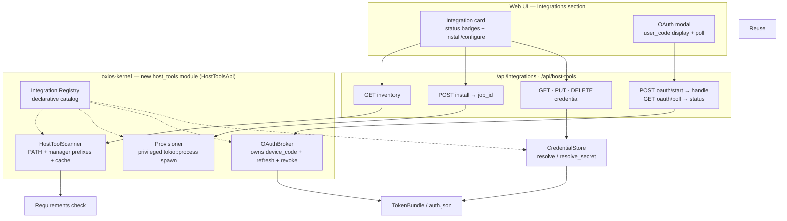

# RFC-041: Host Integrations Subsystem

> **Status:** Proposed (rev. 2 — review findings H1–H6, M1–M6 folded in) · **Date:** 2026-07-12
> **Scope:** `oxios-kernel`, `src/api`, `web/`, `share/`

## 1. Motivation

Oxios is a daemon running **directly on the host** (no containers — see DESIGN.md). That
gives it a capability web UIs normally don't have: it can see, install, and configure the
CLIs already present on the user's machine.

Today this capability is latent but fragmented:

- Skills declare what they need (`Requirements { bins, env, config }`), but the only check is
  `has_bin()` — a boolean `which <name>`, not an inventory.
- Skills declare how to install themselves (`SkillInstallSpec` / `InstallKind`), but **no code
  ever executes those specs** — they are parsed and displayed, never run.
- Credentials are stored via `oxi_sdk::save_token` in the oxios auth store
  (`~/.oxios/auth.json` via `OXI_HOME`; `~/.oxi/auth.json` is the read-only oxi-cli fallback —
  `credential.rs:100`), but there is **no OAuth handshake**. `src/api/quota.rs:15` states this
  explicitly: *"Oxios is a daemon — it has no browser session, Keychain, or interactive OAuth
  device flow."*
- The web UI has a secrets section and provider cards, but no unified view of "what's
  installed", "what needs configuring", or "install this with one click".

**Goal:** a single subsystem that lets the user, from the web UI, (1) see which CLIs are
installed on the host, (2) install missing ones, and (3) configure credentials — including
OAuth device-code flows — all driven by a declarative registry.

## 2. Non-goals

- **Agent-initiated installation.** Provisioning is user-triggered from the UI only (D3).
- **Authorization-code (redirect) OAuth.** Device-code only (D2). Note this is a *coverage
  limitation*, not just a deferral: providers without device-code support (e.g. Slack) cannot
  be added until redirect flow lands.
- **Plan-window quota scraping** — still out of reach; requires browser session tokens
  (`quota.rs:16`).
- **Pure-TOML OAuth provider config.** Each OAuth provider's HTTP client (endpoint URLs,
  request/response shapes) is Rust code (D9). TOML selects *which* provider + scopes; Rust
  implements *how*. Adding a new OAuth provider requires Rust.
- **Reimplementing oxi-sdk primitives.** `TokenBundle`, `save_token`/`load_token`, and the
  auth store are reused as-is (D4). Only the handshake + refresh scheduler are new.
- **LLM provider management.** anthropic/openai/google stay in `engine_api.rs` (role routing,
  billing model, validation, hot-swap). The registry does **not** replicate them (D7).

## 3. Current state — reuse vs. build

| Asset | Location | Role | Action |
|-------|----------|------|--------|
| `oxi_sdk::TokenBundle` + `save_token`/`load_token` | `credential.rs:104-115` | Token **storage** (works) | **Reuse** — OAuth populates `refresh_token`; static keys leave it `None` |
| `CredentialStore::resolve(provider)` | `credential.rs:43` | Provider credential resolution, **6-source** chain (env `OXIOS_<P>_API_KEY` → config → store → oxi-cli → oxi-ai env → `<p>-coding-plan`) | **Reuse** — `Provider` resolver delegates here |
| `CredentialStore::resolve_secret(key, env_var)` | `credential.rs:160` | Non-provider secret resolution, **3-source** (raw env var → store → oxi-cli) | **Reuse** — `Secret` resolver delegates here |
| `SkillInstallSpec` / `InstallKind` | `skill/types.rs:21-65` | Install instructions | **Extend** (add Cargo/Bun/Pip) + **execute** for the first time |
| `Requirements { bins, any_bins, env, config }` | `skill/types.rs:9` | Skill dependency declaration | **Reuse + extend** (`integrations`, `any_integrations`) |
| clawhub/skills_sh installer pattern | `skill/clawhub/installer.rs` | Privileged kernel-side process spawning for installs | **Reuse the pattern** (D8) — provisioning is a privileged op, not an agent-tool call |
| Protected `api` route group | `routes/mod.rs:652-674` | `require_auth` middleware | **Reuse** — new routes auto-covered (D5) |

**Three capabilities that do NOT exist and must be built:**

1. **Discovery / Inventory** — enumerate host CLIs across package managers.
2. **OAuth handshake** — device-code flow with refresh + revoke.
3. **Provisioning** — actually run `SkillInstallSpec` → install command.

> **Review fix H6:** the registry does **not** collapse credential configuration into a single
> `env_var` field. `resolve` (provider) and `resolve_secret` (non-provider) use *different*
> store keying *and* different env-var conventions, so the descriptor must name the store key,
> the env var, **and** which resolver applies (§5).

## 4. Architecture



Key change from rev. 1: the **Provisioner no longer routes through `ExecTool`** (D8). It spawns
processes directly as a privileged kernel op — the same pattern the clawhub/skills_sh
installers already use. ExecTool is an agent-sandbox primitive for *untrusted* command strings;
here the command is kernel-constructed from a trusted registry spec, so the sandbox defenses
are redundant and the existing installer precedent is the right model.

## 5. Integration Registry (D1)

`share/default-integrations.toml` — user-editable, hot-reloadable, mirrors the skill model.
User overrides in `~/.oxios/integrations.d/*.toml`, merged **by id, whole-entry replace** (an
override with `id = "github"` replaces the entire shipped `github` entry — no field merge).

```toml
# Package managers (bootstrap — no credential)
[[integration]]
id = "brew"
label = "Homebrew"
cli = "brew"
credential = { resolver = "none" }

[[integration]]
id = "npm"
label = "npm"
cli = "npm"
credential = { resolver = "none" }

[[integration]]
id = "cargo"
label = "Cargo"
cli = "cargo"
credential = { resolver = "none" }

[[integration]]
id = "bun"
label = "Bun"
cli = "bun"
credential = { resolver = "none" }

# CLI tool — OAuth (device-code). provider "github" is a Rust impl (D9).
[[integration]]
id = "github"
label = "GitHub CLI"
cli = "gh"
install = [
  { kind = "brew", formula = "gh" },
  { kind = "download", url = "https://github.com/cli/cli/releases/latest", strip_components = 1 },
]
credential = { resolver = "oauth", store_key = "github", provider = "github", scopes = ["repo", "read:org"] }

# CLI tool — static secret (resolve_secret class)
[[integration]]
id = "resend"
label = "Resend"
cli = "resend"
install = [{ kind = "npm", package = "resend" }]
credential = { resolver = "secret", store_key = "resend", env_var = "RESEND_API_KEY" }

# Non-provider secret absorbed from KNOWN_SECRETS (resolve_secret class)
[[integration]]
id = "telegram"
label = "Telegram Bot"
credential = { resolver = "secret", store_key = "telegram_bot_token", env_var = "TELEGRAM_BOT_TOKEN" }
```

> LLM providers (anthropic/openai/google) are **deliberately absent** (D7) — they are owned by
> `engine_api.rs`. The integrations view may render a provider's resolved status as a
> **read-only** info card that deep-links to the Providers tab, but the write-path stays in
> engine_api. This avoids a dual source of truth for provider credentials.

### Credential descriptor (fix H6)

A single `env_var` cannot serve both resolvers, so the descriptor is explicit about all three
roles — store key, env var, and which resolver applies:

```rust
struct CredentialDescriptor {
    store_key: String,            // key passed to load_token/save_token (and resolve_secret's `key`)
    env_var: Option<String>,      // raw env var — Secret only; Provider/None leave this None
    resolver: Resolver,
}

enum Resolver {
    None,
    /// Non-provider secret → CredentialStore::resolve_secret(store_key, env_var).
    /// 3-source: raw env var → oxios store → oxi-cli store.
    Secret,
    /// OAuth device-code → TokenBundle stored under store_key.
    OAuth { provider: String, scopes: Vec<String> },  // `provider` names a Rust OAuthProvider impl
}
```

> **No `Provider` variant (D7).** LLM providers are *not* registry entries — their
> write-path stays in `engine_api`. A provider may still appear in the Integrations
> view as a **read-only** status card that calls `CredentialStore::resolve` directly
> (the full 6-source chain) and deep-links to the Providers tab for configuration;
> that card is rendered by a separate UI path, not via `Resolver`. So `Resolver` has
> exactly three variants: `None`, `Secret`, `OAuth`.

**The status endpoint must call the matching resolver, not poke one env var.** A
`Secret` runs the 3-source chain; `OAuth` checks for a non-expired `TokenBundle`.
Reading a single declared env var would report "unconfigured" when the key sits in
the store under `store_key` — that was the Phase-2 break (H6).

### OAuth provider credentials (fix H2)

Device-code native apps (GitHub, Google) use a **public `client_id`** and need no secret.
Where a provider *does* require a confidential secret, it is stored in `CredentialStore`
under a dedicated key (`oauth_<provider>_client_secret`) — **never** in the TOML, preserving
the "never in config plaintext" stance (`secrets_routes.rs:1-4`). The `client_id` and all
endpoint/param shapes live in the Rust `OAuthProvider` impl (D9), so the registry is not a
secret-bearing file.

### Why `Integration` is not `Integration + provider keys`

`SkillInstallSpec` / `InstallKind` are reused for the install vocabulary (§7 extends the enum
for parity with detection). Credential configuration is the `CredentialDescriptor` above.
Keeping these as two distinct fields — not one blob — is what makes `resolve` vs
`resolve_secret` addressable per integration.

## 6. Capability Layer 1 — Discovery (`HostToolScanner`)

Generalizes `requirements.rs::has_bin` from "is X present?" to "what is present?".

- **Binary lookup is per-OS and shelling-free.** `has_bin` (`requirements.rs:6`) runs
  `which`, which **does not exist on Windows** — every binary check silently fails there
  today. The scanner uses Rust `PATH` traversal (`std::env::var("PATH")` + path probing,
  with `PATHEXT` resolution on Windows) instead of shelling to `which`/`where.exe`. This is
  testable and fixes the Windows breakage as a side effect.
- **Manager prefixes are per-platform** (probed in addition to `PATH`):

  | Manager | macOS | Linux | Windows |
  |---------|-------|-------|---------|
  | brew | `/opt/homebrew/bin`, `/usr/local/bin` | `/home/linuxbrew/.linuxbrew/bin`, `~/.linuxbrew/bin` | (n/a — skipped) |
  | cargo | `~/.cargo/bin` | `~/.cargo/bin` | `%USERPROFILE%\.cargo\bin` |
  | bun | `~/.bun/bin` | `~/.bun/bin` | `%USERPROFILE%\.bun\bin` |
  | npm (global) | `$(npm prefix -g)/bin` | same | `%APPDATA%\npm` |
  | pip/uv | `~/.local/bin` | `~/.local/bin` | `%APPDATA%\Python\Scripts` |
  | go | `$(go env GOPATH)/bin` | same | `%USERPROFILE%\go\bin` |

- **Dynamic prefixes** (`npm prefix -g`, `go env GOPATH`) are resolved **only after** the
  manager binary is itself detected — the scanner never shells out to a manager that isn't
  present.
- Per binary: `{ name, path, version, source }`, `source ∈ {path, brew, cargo, npm, bun, go, pip, binary}`.
- **Version**: `<bin> --version` (or `-Version` for some Windows CLIs), 3s timeout, first
  line parsed.
- **Source inference canonicalizes first (fix M1).** npm global installs, pip installs, and
  `/usr/local/bin` (Intel macOS) are symlinks. The scanner `std::fs::canonicalize`s the
  resolved path before matching it against the prefix table, so a brew/npm/pip symlinked
  binary is classified by its real install root, not the link location.
- **Bootstrap**: managers are themselves integrations with `resolver = "none"`. If no manager
  is found, the UI shows "install a package manager" guidance. On Windows, brew is absent —
  npm/cargo/scoop are reported instead.

### Caching (fix M2)

Concrete model (was an open question in rev. 1):
- Version cache keyed by `(canonical_path, mtime)`: probed once per binary per mtime.
- Full inventory result cached with a **60s TTL**; `GET /api/host-tools` serves the cache.
- `POST /api/integrations/{id}/detect` and the UI "rescan" button force-invalidate the whole
  cache. No per-request fan-out of process spawns.

`check_requirements` consults the cached inventory; `has_bin` becomes a thin wrapper (and
inherits the Windows fix).

## 7. Capability Layer 2 — Provisioning (`Provisioner`)

Executes `SkillInstallSpec` — the thing that has never run.

### Install vocabulary parity (fix H3)

`InstallKind` is **extended** (additive, touches `frontmatter.rs:52` parsing) so install
covers the same managers detection reports:

| `InstallKind` | Command | Note |
|---------------|---------|------|
| `Brew` | `brew install {formula}` | |
| `Node` | `npm install -g {package}` | |
| `Bun` | `bun install -g {package}` | **new** |
| `Cargo` | `cargo install {package}` | **new** |
| `Pip` | `pip install / uv tool install {package}` | **new** |
| `Go` | `go install {module}` | |
| `Uv` | `uv tool install {package}` | (alias of Pip path) |
| `Download` | fetch `{url}`, extract (honoring `strip_components`), place in `target_dir` | reuses `skill/clawhub/installer.rs` archive logic |

No more "reuse `Node` kind to mean bun" hack — the vocabularies are now in parity.

### Privileged op, not ExecTool (fix H4)

The Provisioner spawns `tokio::process::Command` directly as a **privileged kernel
operation**, exactly as `skill/clawhub/installer.rs` and the skills_sh installer already do.
It does **not** route through `ExecTool`:

- ExecTool is an agent-sandbox primitive for *untrusted* command strings (allowlist,
  metacharacter blocking, agent-context RBAC — `exec_tool.rs:17-19`). The install command is
  **kernel-constructed from a trusted registry spec**, so there is no untrusted input to
  sandbox — the defenses are redundant.
- The marketplace install precedent (`routes/mod.rs:652`) calls into the clawhub installer on
  a privileged path, not through ExecTool. Provisioning follows that precedent.

**Security gate (D3):** user consent at the API layer (button + confirm dialog) +
`AccessManager` audit logging (Merkle trail) + command derived from the registry spec (no
free text → no injection surface). Agents may *report* a missing dependency but cannot invoke
the install endpoint; an agent request is routed to the user as an approval prompt via the
existing `pending_tool_approvals` flow.

### Install progress streaming (fix M3)

`POST /api/integrations/{id}/install` returns immediately with `{ job_id }`. Output is
streamed over the existing SSE event bus (`/events`), tagged by `job_id`; terminal status is
pollable. This matches how long kernel operations already surface progress and avoids a
multi-minute blocking POST.

## 8. Capability Layer 3 — OAuth (`OAuthBroker`)

Device-code flow only (D2). Daemon-friendly: no local callback server, no in-daemon browser.

### Provider implementations (D9, fix H2)

Each supported provider is a Rust `OAuthProvider` trait impl holding `client_id`, device/token
endpoints, and request/response shapes:

```rust
#[async_trait]
trait OAuthProvider: Send + Sync {
    fn name(&self) -> &str;
    async fn start(&self, scopes: &[String]) -> Result<DeviceCode>;   // POST device-authz endpoint
    async fn poll(&self, device_code: &str) -> Result<PollOutcome>;    // POST token endpoint
    async fn refresh(&self, refresh_token: &str) -> Result<TokenBundle>;
    async fn revoke(&self, token: &str) -> Result<()>;                 // best-effort
}
```

The registry TOML selects *which* provider + scopes (`provider = "github"`); Rust implements
*how*. Refresh reads `client_id` from the Rust impl, **decoupled from registry reload**
(fix M6 left half) — a registry hot-reload can't break a stored token's refresh. First impl:
GitHub (`gh`).

### Flow (fix H1 — device_code never leaves the daemon)

1. `POST /api/integrations/{id}/oauth/start` → broker calls `provider.start()`, stores the
   `device_code` + integration id in a **transient in-memory map keyed by an opaque `handle`**
   (auto-expiring at the provider's `expires_in`). Returns only
   `{ handle, user_code, verification_url, expires_in }`. **`device_code` is never returned to
   the client** — per RFC 8628 it is a polling bearer secret; the user only needs `user_code`.
2. UI shows `user_code` + "Open {verification_url}"; the user authorizes in their browser.
3. UI polls `GET /api/integrations/{id}/oauth/poll?handle=...`; the broker looks up the
   stored `device_code` by `handle` and polls the provider's token endpoint at `interval`,
   returning `pending | success | expired | denied`. Closing the modal cancels (drops the
   handle → the broker stops polling).
4. On success the broker builds an `oxi_sdk::TokenBundle` (`refresh_token` populated) and
   calls `oxi_sdk::save_token(store_key, &token)` — the exact path
   `email_routes.rs:430` / `credential.rs:115` already use; the only difference is
   `refresh_token`/`expires_in` are real instead of `None`/`0`.

### Refresh + revoke (fix M6)

- **Refresh scheduler:** background task scans stored `TokenBundle`s near expiry
  (`expires_in` within ~5 min) that have a `refresh_token`; calls `provider.refresh()` and
  re-saves. Static keys are skipped (`refresh_token: None`). `client_id`/endpoints come from
  the Rust impl, so a registry reload cannot break refresh.
- **Revoke (right half of M6):** `DELETE /api/integrations/{id}/credential` for an `OAuth`
  integration calls `provider.revoke()` at the provider **before** removing the token locally
  (best-effort; local removal proceeds even if revoke fails). This is "disconnect", not just
  "forget".
- Failures surface as a "credential needs re-auth" badge; the stale token remains usable until
  hard expiry.

## 9. API

All routes in the existing protected `api` group (`routes/mod.rs`), so `require_auth` applies
automatically (D5).

```
# Inventory
GET  /api/host-tools                        # cached scanner output: everything detected
GET  /api/integrations                      # registry entries + live detect + credential status

# Provisioning (user-triggered)
POST /api/integrations/{id}/install         # → { job_id }; output streamed via SSE
POST /api/integrations/{id}/detect          # force re-scan (invalidates cache)
# Credentials
GET    /api/integrations/{id}/credential    # status — CALLS the declared resolver (H6)
PUT    /api/integrations/{id}/credential    # set static value (Secret write-path only; providers via engine_api — D7)
DELETE /api/integrations/{id}/credential    # remove; OAuth → revoke then delete (M6)

# OAuth (device-code) — handle-based, device_code stays server-side (H1)
POST /api/integrations/{id}/oauth/start     # → { handle, user_code, verification_url, expires_in }
GET  /api/integrations/{id}/oauth/poll      # ?handle=… → pending | success | expired | denied
```

### Keyspace / backward compat (fix M5)

`GET /api/integrations` supersedes the `resolve_secret`-class entries in `KNOWN_SECRETS`
(telegram/email/oxios/clawhub). The migration is keyed by an explicit triple — `id` (URL) ↔
`store_key` (auth store) ↔ `env_var` (raw env) — all named in the descriptor, so there is no
implicit mapping to get wrong. The existing `/api/secrets/{key}` endpoints remain for backward
compat and operate on the same `store_key`s; the frontend migrates call sites to
`/api/integrations/{id}/credential`. LLM provider keys (anthropic/openai/google) stay on
`/api/secrets` + engine_api and are **not** moved (D7).

## 10. UI

New **Integrations** section in settings, slotted into the existing section system
(`settings-shell.tsx` / `field-defs.ts`), **alongside** (not replacing) the secrets section
initially; the `resolve_secret`-class secrets migrate once the call sites move. Provider
credentials get a read-only "configured in Providers" card that deep-links to the
Engine/Providers tab.

- **Card per integration**: status badges (installed ✓/✗, configured ✓/✗/expired), version,
  source. Buttons: Install (if missing + a manager is available), Configure, Disconnect (OAuth).
- **Static-key configure**: masked input + validate (reuses `engine/validate-key`).
- **OAuth modal**: shows `user_code` prominently, "Open browser" button, live poll status.
- **Install**: confirm dialog → SSE progress stream → terminal status.
- Patterns mirror `provider-card.tsx`, `secrets-section.tsx`, marketplace install dialogs.

## 11. Skill ↔ integration linking (fix M4)

- A skill's `requires.bins: ["gh"]` already gates eligibility (works today).
- **New frontmatter** `requires.integrations: ["github"]` (hard gate) and
  `any_integrations: ["github"]` (soft/optional, mirrors `any_bins`). The requirements check
  becomes: bin present **and** hard-listed integration credentials satisfied.
- **No regression risk:** `integrations` is a *new* field defaulting to empty. Existing skills
  that worked before are unaffected. A skill that only *conditionally* needs `gh` should not
  list it in `requires.integrations` — it should check at runtime via a tool. Hard-listing is
  for "cannot run at all without this."
- When a skill is ineligible due to a missing integration, the UI deep-links to that
  integration's card — a guided setup wizard rather than a silent "not eligible".

## 12. KernelHandle placement (fix L8)

`host_tools` is a new kernel module exposing a **`HostToolsApi`** in the KernelHandle facade
(the typed-API pattern from AGENTS.md "Adding a New Tool" / `*_api.rs`). Stateful parts —
scanner cache, OAuthBroker (device_code map + refresh scheduler) — live inside the module and
are owned by the kernel assembler, consistent with the star topology around `EventBus` /
`StateStore`.

## 13. Relationship to MCP (fix L7)

MCP servers (`oxios-mcp`, `web/src/components/mcp/`) are conceptually adjacent: they are CLIs
that need detection + config (env vars, args, and OAuth for some transports). This RFC does
**not** absorb MCP server management — the existing MCP add/edit dialogs and the MCP client
keep their own model — but the registry + scanner are designed so MCP *could* later become an
integration `kind` without restructuring. Acknowledged overlap, explicitly deferred.

## 14. Phased rollout (fix L9)

| Phase | Scope | Risk | Deliverable |
|-------|-------|------|-------------|
| **1** | `HostToolScanner` (per-OS, symlink-aware, cached) + `/api/host-tools` + UI badges | Low | "What's installed"; `has_bin` generalized; Windows fixed |
| **2** | Registry TOML + full `CredentialDescriptor` schema (incl. OAuth variant fields) + `/api/integrations` exercising `Secret`/`Provider` resolvers; absorbs `resolve_secret`-class `KNOWN_SECRETS` | Low | Unified, truthful credential status (H6) |
| **3** | OAuth device-code (`OAuthProvider` for GitHub) + refresh + revoke; broker owns `device_code` (H1) | Medium | First real OAuth in the daemon. *Note:* end-to-end gh OAuth also needs P4 to install gh; the OAuth machinery itself is independently testable with a mock provider. |
| **4** | Provisioning — extend `InstallKind` (Cargo/Bun/Pip), privileged spawn, SSE progress, user-gated | Medium | "Install" button works |
| **5** | `requires.integrations` / `any_integrations` + guided setup wizard | Low | Skill dependency guidance |

P2 defines the **full** descriptor schema (all resolver variants) even though only
`Secret`/`Provider` are exercised — so P3/P4 don't reopen the schema. Each phase ships
independently.

## 15. Testing (fix L6)

- **Scanner**: behind an injectable `PathLookup` trait so unit tests supply a virtual PATH +
  prefix set + fixture binaries, with no real filesystem or `which`. Covers per-OS env-var
  construction and symlink canonicalization.
- **Source inference**: fixture trees with symlinks (npm global link, `/usr/local/bin` link)
  asserting correct `source` classification after `canonicalize`.
- **OAuth**: a `MockOAuthProvider` impl of `OAuthProvider` exercising start/poll/refresh/revoke
  state transitions, including `expired_token` / `access_denied` / refresh-failure → re-auth.
  Asserts `device_code` is never serialized into any API response.
- **Provisioning**: a **dry-run** mode that builds the command string and returns it without
  spawning, asserting command construction per `InstallKind`; a sandboxed integration test
  installs a harmless package (`cowsay`/equivalent) end-to-end.
- **Credential status**: fixture auth stores asserting a `Secret`-resolver integration runs
  the full 3-source chain — specifically that a key present only in the store (not in any env
  var) is reported as configured (the H6 regression guard). Provider read-only cards (D7) are
  tested separately via `CredentialStore::resolve`'s own 6-source tests.

## 16. Decisions

| ID | Decision | Rationale |
|----|----------|-----------|
| **D1** | Registry as TOML in `share/` | User-editable, hot-reloadable, mirrors the skill model |
| **D2** | Device-code OAuth only | Daemon-friendly; coverage limitation noted (no Slack-style providers until redirect lands) |
| **D3** | Provisioning user-triggered only | Agents report missing deps, cannot install; every install audit-logged |
| **D4** | Reuse `TokenBundle` + `save_token`/`load_token` | OAuth only adds handshake + refresh/revoke, not new storage |
| **D5** | Routes in existing protected `api` group | `require_auth` auto-applies |
| **D6** | `CredentialDescriptor { store_key, env_var, resolver }` | One `env_var` cannot serve both `resolve` (provider) and `resolve_secret` (non-provider); status must call the matching resolver (H6) |
| **D7** | LLM providers excluded from registry | Owned by `engine_api.rs` (routing/billing/validation); registry absorbs `resolve_secret`-class secrets only — avoids dual source of truth (H5) |
| **D8** | Provisioning is a privileged kernel op (clawhub pattern) | ExecTool is an agent-sandbox for untrusted strings; install commands are kernel-built from a trusted spec — sandbox redundant, installer precedent correct (H4) |
| **D9** | OAuth providers are Rust `OAuthProvider` impls | TOML selects provider + scopes; Rust holds `client_id`/endpoints/shapes. Decouples refresh from registry reload (H2, M6) |
| **D10** | `requires.integrations` hard gate; `any_integrations` optional | New field, empty default → no regression; mirrors `bins`/`any_bins` (M4) |

## 17. Security summary

- Provisioning → privileged kernel spawn + user-consent gate + audit log; command from registry
  spec, no free text. **Not** routed through the agent sandbox (D8).
- OAuth `device_code` stays daemon-side behind an opaque `handle`; the client sees only
  `user_code` (H1).
- OAuth `client_id` in Rust impls; confidential secrets (if any) in `CredentialStore`, never
  TOML plaintext (H2).
- Tokens → `TokenBundle` in `~/.oxios/auth.json`; never config plaintext. `user_code` never
  reaches agents.
- DELETE credential for OAuth revokes at the provider before local removal (M6).
- Refresh reads creds from Rust impls, decoupled from registry reload (M6).
- All routes auth-protected (D5); refresh failures degrade gracefully (stale token + re-auth
  badge).

## 18. Open questions

- **Oxios-owned OAuth client IDs**: ship Oxios's own registered `client_id` for GitHub/Google,
  or document per-user registration? Lean: ship Oxios-owned public client IDs (device-code
  native apps need no secret); allow override via Rust for private deployments.
