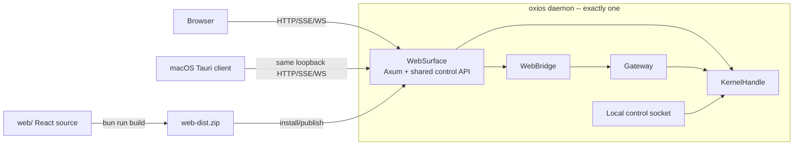
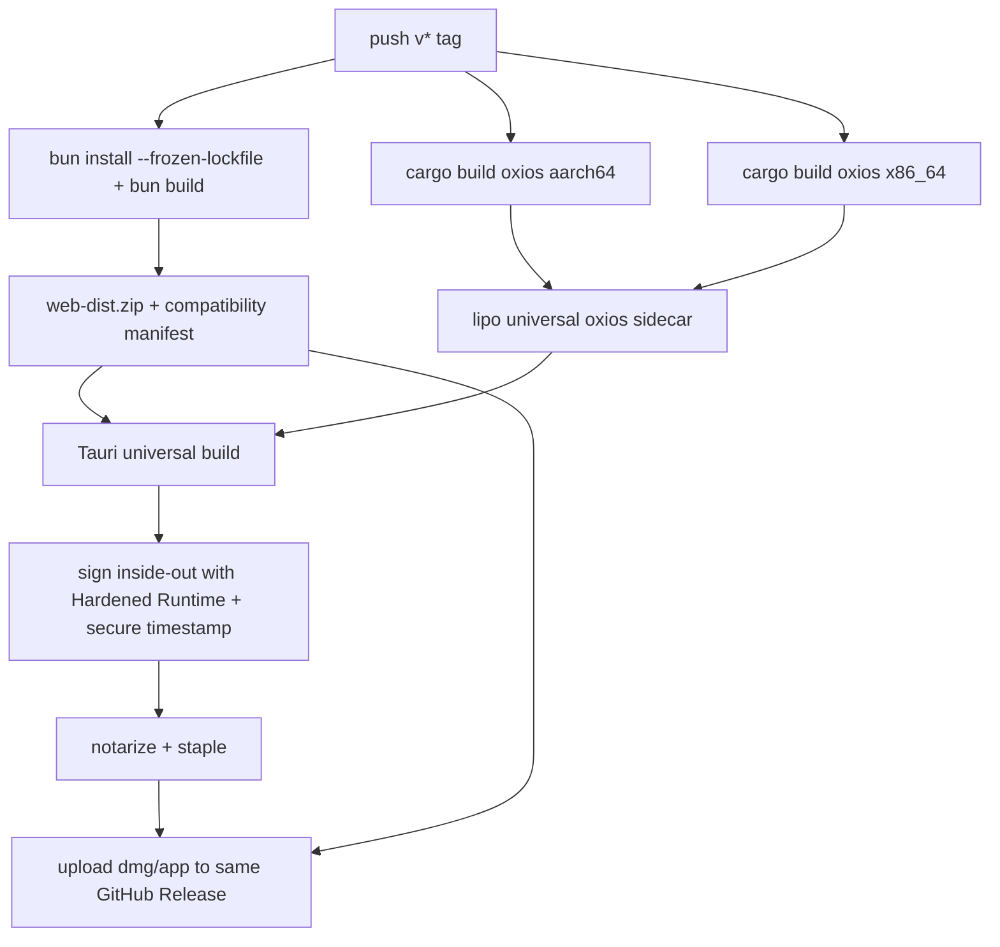

# RFC-042: Product Interface Layout and macOS Desktop Client

> **Status:** Proposed
> **Created:** 2026-07-18
> **Extends:** RFC-026 (Application Crate Binary Integration)
> **Depends on:** RFC-024 (Web-Daemon Reliability), RFC-028 (Web UI Delivery), RFC-040 (Daemon Supervision)
> **Scope:** Repository Folder Boundaries, Web Surface, Shared React UI, macOS Tauri Packaging, Local Daemon Connection Contract

## 1. Decision Summary

This RFC establishes the following:

1. The root `web/` is retained. `web/` is not a Surface implementation but the **shared React UI source** consumed by both browser and desktop.
2. `src/api/` is also retained. It is not browser-only code but the daemon's **shared HTTP control plane**.
3. The actual Web Surface implementation lives in `src/api/web_surface.rs`. The current `plugin.rs` is renamed to match its role.
4. The Web Gateway connection lives in `src/api/web_bridge.rs`. The current `bridge.rs` is renamed to match its role.
5. The macOS app lives in `apps/macos/`. The product contract is a **thin native client** that connects to an existing daemon, not a Surface receiving `KernelHandle` directly, so `surface/mac/` is not used.
6. The macOS app is a standalone Tauri project not included in the root Cargo workspace. It does not depend on Oxios library crates, communicating via the bundled `oxios` executable and a versioned local control protocol.
7. Exactly one daemon runs per user home. The browser and Tauri see the same daemon, the same WebSurface, the same React build, the same state.
8. Tauri does not serve the main UI via its own asset protocol. It opens the daemon's loopback URL. The bundled web asset is only a seed for the first offline boot; the daemon is always the actual serving owner.
9. Local desktop authentication does not reuse provider API keys. A one-time bootstrap is issued via an owner-only Unix socket and then transitions to existing Bearer authentication.
10. Legacy artifacts, generated files, and documentation drift remaining after RFC-026 are cleaned up. The `surface/` ghost, `.programs/`, root `memory/`, Playwright/benchmark outputs, and dead `share/knowledge/` are not part of the target structure.

---

## 2. Problem

After RFC-026 the high-level compilation boundary is correct, but names and disk state conflate three different concepts.

### 2.1 `web/` and Web Surface Appear the Same

The actual relationships are:

- `web/`: React/Vite source, tests, and build configuration
- `src/api/plugin.rs::WebSurface`: Axum listener, REST/SSE/WS, SPA asset serving
- `src/api/bridge.rs::WebBridge`: Message transport between Web chat and Gateway
- `src/api/routes/`: Daemon control API used by all clients

Moving `web/` to `surface/web/` would misrepresent a shared UI asset as depending on a specific Rust Surface implementation. Conversely, moving `src/api/` to `src/surfaces/web/` would misrepresent a shared API used by the macOS app and external clients as being browser-owned.

### 2.2 `surface/mac/` Appears to Be a First-Class Product

The local `surface/mac/` is entirely gitignored and has no `Cargo.toml`, `src/`, or `tauri.conf.json`. What remains are Tauri build cache, a placeholder HTML, and a deliberately broken sidecar stub. It is not an implementation but the artifact of an abandoned experiment.

### 2.3 No Stable Contract Between Desktop and Daemon

Simply having Tauri open `http://127.0.0.1:4200/` does not solve:

- Verifying that the process occupying the port is actually Oxios
- Starting exactly one daemon when none is running
- WebView authentication with the default `auth_enabled=true`
- Compatibility check between daemon and Web build
- Securing a Web build for offline first launch
- Keeping long-running agents and token-maxing alive after the app exits

Adding a folder without defining this contract produces a native window but not a working product.

---

## 3. Terminology and Invariants

### 3.1 Terminology

| Term | Definition | Current/Target Example |
|---|---|---|
| **Surface** | An in-daemon runtime component that receives `KernelHandle` and provides management, observation, and configuration functionality | `WebSurface` |
| **Channel** | A transport adapter that carries user messages and agent responses through the Gateway | CLI, Telegram, `WebBridge` |
| **Control API** | The public HTTP/SSE/WS contract that a Surface exposes to external clients | `src/api/routes/` |
| **UI source** | Platform-independent React source | `web/` |
| **Client app** | A product package that consumes the protocol exposed by an existing Surface | `apps/macos/` |
| **Web build** | An immutable asset generation produced from `web/` | `web-dist.zip`, `~/.oxios/web/dist-*` |

### 3.2 Invariants

#### I1. Single daemon

Only one daemon mutates state per Oxios home at a time. The instance lock is the final authority. Tauri app launch does not create a second kernel.

#### I2. Single UI source

Both the browser and Tauri use the same React build produced from the root `web/`. No platform-specific React fork is created.

#### I3. Daemon-owned serving

The daemon owns downloading, verification, active generation selection, and HTTP serving of the React build. Tauri does not implement a separate asset update algorithm.

#### I4. Shared control plane

`src/api/routes/` is not an internal implementation detail of the web browser. It is the daemon API shared by browser, Tauri, and automation clients.

#### I5. No kernel linkage in desktop shell

`apps/macos` does not link to `oxios-kernel`, `oxios-gateway`, or the root `oxios` crate. The Tauri dependency graph is separate from the daemon dependency graph.

#### I6. No provider-secret-as-app-auth

Provider credentials (Anthropic/OpenAI, etc.) are not reused as daemon control-plane authentication tokens. Desktop bootstrap uses a separate local trust channel.

#### I7. Desktop close does not stop work

Closing the Tauri window or quitting the app does not stop the daemon or running agents. Explicit user action is required to stop the daemon.

#### I8. Generated artifacts are never source

`target/`, sidecar binaries, Web dist, Tauri schema, Playwright snapshots, benchmark reports, and runtime memory are not tracked in the source tree.

---

## 4. Target Repository Structure

```text
oxios/
├── Cargo.toml                       # Rust libraries + daemon binary workspace
├── Cargo.lock
│
├── crates/                          # Reusable Rust libraries
│   ├── oxios-kernel/
│   ├── oxios-gateway/
│   ├── oxios-memory/
│   ├── oxios-markdown/
│   ├── oxios-ouroboros/
│   ├── oxios-calendar/
│   └── oxios-mcp/
│
├── src/                             # oxios daemon/CLI binary
│   ├── main.rs                      # Process bootstrap + command dispatch
│   ├── kernel.rs                    # Kernel assembler; kept in binary crate
│   ├── surface.rs                   # Surface registry/activation
│   ├── supervisor.rs
│   ├── web_dist.rs                  # Web generation install/publish
│   ├── local_control.rs             # Owner-only local control socket
│   ├── commands/
│   │   ├── mod.rs
│   │   ├── run.rs
│   │   ├── update.rs
│   │   └── desktop.rs               # Machine-readable desktop prepare command
│   ├── api/                         # Shared daemon HTTP control plane
│   │   ├── mod.rs
│   │   ├── web_surface.rs           # Was plugin.rs; Axum + static serving
│   │   ├── web_bridge.rs            # Was bridge.rs; optional Gateway channel
│   │   ├── server.rs
│   │   ├── middleware.rs
│   │   ├── error.rs
│   │   ├── api_docs.rs
│   │   └── routes/
│   │       ├── mod.rs
│   │       ├── desktop.rs            # One-time bootstrap HTTP exchange
│   │       ├── chat.rs
│   │       ├── system.rs
│   │       └── ...                   # Shared control APIs
│   └── channels/                    # Message-only adapters
│       ├── cli/
│       └── telegram/
│
├── web/                             # Shared React UI source
│   ├── package.json
│   ├── bun.lock
│   ├── vite.config.ts
│   ├── src/
│   ├── public/
│   └── dist/                        # Generated, ignored
│
├── apps/
│   └── macos/                       # Standalone thin Tauri client
│       ├── README.md
│       ├── shell/                   # Local splash/fatal-error UI only
│       │   ├── index.html
│       │   └── style.css
│       └── src-tauri/
│           ├── Cargo.toml            # Own empty [workspace]
│           ├── Cargo.lock
│           ├── build.rs
│           ├── tauri.conf.json
│           ├── tauri.macos.conf.json
│           ├── capabilities/
│           ├── icons/
│           ├── binaries/             # Generated sidecar, ignored
│           ├── resources/            # Generated web seed, ignored
│           └── src/
│               ├── main.rs
│               ├── bootstrap.rs
│               ├── window.rs
│               └── tray.rs
│
├── share/                           # Binary-shipped defaults only
│   ├── default-config.toml
│   └── default-skills/
│
├── scripts/                         # Repeatable maintained automation only
├── tests/
├── docs/
│   ├── designs/
│   ├── production-audit/
│   └── archive/
└── .github/workflows/
```

### 4.1 Why `apps/macos`

The macOS app in this RFC does not implement the `Surface` trait. It does not receive a `KernelHandle`. It consumes the loopback HTTP/API of an already-running WebSurface. Therefore `apps/macos`, expressing the product responsibility of an app package, is correct.

If in the future a separate product embeds the daemon in-process and receives `SurfaceContext` directly, that constitutes a different lifecycle, security, and state ownership contract than this app. That change is scoped to a separate RFC and does not reinterpret this directory name.

### 4.2 Why Keep `src/api`

`src/api/routes/` contains not just chat but the entire daemon control plane: system, workspace, knowledge, email, infra, audit, git, host-tools, integrations, and more. Since Tauri and external clients use the same API, it is not moved to `src/surfaces/web/`.

The Surface boundary is clarified through file names only:

```text
src/api/plugin.rs  → src/api/web_surface.rs
src/api/bridge.rs  → src/api/web_bridge.rs
```

### 4.3 Cargo Workspace Policy

`apps/macos/src-tauri` is not a root workspace member.

```toml
# apps/macos/src-tauri/Cargo.toml
[package]
name = "oxios-macos"
# ...

[workspace]
```

The empty `[workspace]` table in `apps/macos/src-tauri/Cargo.toml` is the required and sufficient workspace boundary. The root workspace keeps its existing explicit member list and does not need a redundant `exclude` entry.

Rationale:

- macOS/Tauri dependencies are not propagated to crates.io workspace CI.
- Linux workspace builds do not resolve AppKit/WebKit dependencies.
- The macOS package has its own signing/notarization pipeline.
- The desktop shell does not link to Oxios crates, so workspace dependency inheritance offers no benefit.

---

## 5. Runtime Architecture



### 5.1 App Launch Flow

```text
Oxios.app launch
  1. Show local shell/splash window
  2. Run bundled sidecar:
       oxios desktop prepare --json --web-seed <bundle-resource>
  3. Sidecar command:
       a. Parse config/Oxios home
       b. Verify active daemon identity
       c. If none, install the Web seed through the local helper's unified installer path, then start the daemon from the same sidecar binary
       d. Check /health identity and local control socket readiness
       e. Run desktop.hello, then request desktop bootstrap via the owner-only local control socket
       f. Return one-time bootstrap URL
  4. Tauri validates strict JSON response
  5. Create main WebView with bootstrap URL
  6. Daemon consumes the one-time code
  7. Daemon origin stores Bearer token in sessionStorage then replaces with `/`
  8. Close splash window
```

### 5.2 App Exit Flow

```text
Window close / Quit Oxios.app
  └─ Only Tauri process exits
      └─ Daemon keeps running
          ├─ Agents keep running
          ├─ Cron/token-maxing keeps running
          └─ Browser client remains usable
```

Tauri does not hold the daemon child handle long-term. The `desktop prepare` helper calls a detached start path that creates a new Unix session/process group before `exec` (for example, `setsid` in a narrowly scoped `pre_exec` path), redirects stdin to null and stdout/stderr to the existing daemon log, waits for readiness, then exits. `DaemonManager::start` and OS service launchers MUST share this explicit detachment contract. Tauri shutdown therefore only owns the short-lived helper; force-quit, helper cancellation, and shell-plugin cleanup cannot signal the daemon process group. This contract is verified with a packaged-app quit test, not inferred from orphan reparenting.

### 5.3 Coexistence with Existing Daemon

- Probe `/health` first. Phase 3 extends its public response with a fixed `service: "oxios"` identity and `api_version`; only that exact schema is accepted. An occupied port without that identity is a different service and fails closed.
- If the Oxios health probe succeeds but no local control socket exists, classify it as a pre-RFC-042 daemon and show an upgrade-required state. Do not label it as a foreign process and do not start a second daemon.
- If the control socket exists, send side-effect-free `desktop.hello` before `desktop.prepare`. Continue only when the client protocol range intersects the daemon range; otherwise show an upgrade notice.
- A daemon started by Tauri and one started by CLI/launchd are identical in terms of state, home, and port.

---

## 6. Local Control Protocol

Creating a desktop session securely without an HTTP API key requires a local owner channel separate from browser-accessible loopback HTTP.

### 6.1 Transport

- macOS: Unix domain socket
- Path: `~/.oxios/run/control.sock`
- Parent directory mode: `0700`; socket mode: `0600`
- Startup opens and validates every path component without following symlinks, obtains the instance lock, rejects any pre-existing non-socket or unexpected-owner entry, removes a stale socket only while holding the lock, then binds and re-validates lock ownership before accepting requests
- The daemon records its boot instance ID alongside the held instance lock; local-control responses echo that ID so the helper can reject a stale or substituted socket
- On macOS the daemon MUST verify peer UID with `getpeereid`; on Linux it MUST use `SO_PEERCRED`. Unsupported platforms fail closed for credential-minting operations. Filesystem ownership and mode remain mandatory defense in depth
- Protocol: one UTF-8 JSON object per line
- Maximum request/response size: 64 KiB

This socket is never exposed to a remote network and is not accessible from Web UI JavaScript.

### 6.2 Discovery Request

```json
{
  "protocol": 1,
  "request_id": "019...",
  "op": "desktop.hello"
}
```

The response contains `protocol_min`, `protocol_max`, daemon/API versions, `instance_id`, and exact loopback origin. It is side-effect-free and never mints credentials. An old Oxios daemon that answers `/health` but lacks the socket is classified as upgrade-required.

### 6.3 Prepare Request

```json
{
  "protocol": 1,
  "request_id": "019...",
  "op": "desktop.prepare",
  "nonce": "<Tauri-generated single-use value>",
  "client": {
    "name": "oxios-macos",
    "version": "1.24.0"
  }
}
```

The daemon binds the issued code to `(instance_id, origin, peer_pid, nonce, exp)`. The bootstrap URL therefore carries only the code, while the server-side store carries all bind factors and re-checks them on redemption.

### 6.4 Prepare Response

```json
{
  "protocol": 1,
  "request_id": "019...",
  "ok": true,
  "daemon": {
    "version": "1.24.0",
    "pid": 12345,
    "instance_id": "boot_019...",
    "api_version": 1,
    "web_version": "1.24.0"
  },
  "endpoint": "http://127.0.0.1:4200",
  "bootstrap_url": "http://127.0.0.1:4200/api/desktop/bootstrap?code=...",
  "started": true
}
```

Errors also use the same envelope, not arbitrary stdout strings. Log and progress messages go to stderr. Tauri parses exactly one JSON object from stdout.

### 6.5 Protocol Compatibility

- A mismatch in the `protocol` major version causes a fail-closed.
- The response endpoint host MUST be a loopback literal.
- The app does not accept arbitrary remote URLs or a config `0.0.0.0` bind address as the WebView URL.
- Both sidecar exit code 0 and a valid response are required.
- The helper cross-checks `instance_id`, PID liveness, `/health` service identity, `api_version`, and exact loopback origin before opening a WebView

---

## 7. Desktop Authentication Bootstrap

### 7.1 Problem

The default deployment configuration is `security.auth_enabled=true`. The current React app reads the Bearer token from `sessionStorage['oxios-api-key']` but has no separate login/token-entry screen. Opening the daemon URL returns 401 on protected APIs for both browser and Tauri.

Injecting provider credentials as the control-plane Bearer is forbidden. LLM provider keys and local daemon identity belong to different security domains.

Desktop bootstrap is an additional local-client path, not a replacement for browser authentication. Before `auth_enabled=true` can remain the shipped default, the shared React UI MUST provide a normal browser login/token-entry flow and route 401 responses there. Browser users must not need the Tauri local socket, and the public `/api/status` contract must expose only the boolean needed to select the flow.

**Status (2026-07-18):** the browser login flow is implemented. `web/src/components/auth/login-page.tsx` renders when `auth_enabled=true` and the user has no valid session token. The required public boolean is exposed on `/health` (not `/api/status`, to keep channels and component health behind auth). The login screen validates the entered token against `/api/status` with the Bearer header; 200 unmounts the gate, 401 clears the token and shows the "invalid token" error. Valid token sources (server side, in `require_auth`) are `[engine].api_key` in `config.toml` and the `OXIOS_API_KEY` env var.

**Status (2026-07-18, second update):** the browser self-bootstraps for loopback callers — no manual token paste required when the dashboard and daemon share a host. Two pieces:

1. **First-boot auto-issue.** `cmd_serve` in `src/main.rs` calls `auto_issue_first_boot_token` after acquiring the instance lock. When `auth_enabled=true` and no key source is configured anywhere (no `[engine].api_key`, no `OXIOS_API_KEY`, no persisted `~/.oxios/api-keys.json`), the kernel generates a `default` key, persists its SHA-256 hash, and prints the full token to stderr. Subsequent boots find the file and skip the banner.

2. **Loopback-only `/api/auth/issue`.** `src/api/routes/auth_routes.rs::handle_auth_issue` exposes a `POST /api/auth/issue` route on the public router. The handler extracts `ConnectInfo<SocketAddr>` (enabled by `into_make_service_with_connect_info::<SocketAddr>()` in `src/api/plugin.rs`) and rejects non-loopback callers with 403. Loopback callers get a fresh `session:default` key, audit-logged under `api:auth_issue`. The `LoginPage` calls this endpoint on mount and stores the returned token in `sessionStorage` — the user never sees the form. The paste form remains as a fallback when the endpoint returns 403/503.

Resolved (2026-07-18): `spawn_session_key_pruner` in `src/main.rs` runs an hourly background task that calls `SecurityApi::prune_stale_session_keys` and removes `session:`-prefixed keys whose `last_used` is older than 24 hours. Permanent keys (`default`, `desktop:macos`) are never touched. The pruning lives on the daemon — it works without the Web UI being open.

### 7.2 Key Persistence Enabled

As Phase 3 implementation work, `AuthManager::with_persistence(~/.oxios/api-keys.json)` MUST replace the current in-memory `AuthManager::new()` construction in kernel assembly. The already-provided persistence implementation stores only SHA-256 hashes and metadata, not raw keys. `~/.oxios`, its runtime subdirectories, and secret-file staging paths MUST be verified as non-symlink paths owned by the current UID; secret staging uses exclusive, no-follow creation before atomic rename.

The desktop prepare request reuses an existing valid `desktop:macos` key when possible and rate-limits creation/rotation. It does not rotate the key on every same-UID request.

```text
key name: desktop:macos
raw key: delivered only inside the one-time bootstrap payload
at rest: hash only
```

The local request carries the Tauri-generated single-use nonce supplied to the helper through its environment. The daemon verifies peer credentials (UID via §6.1) and nonce before issuing a code; the issued code itself is bound to `(instance_id, origin, peer_pid, nonce, exp)` as defined in §6.3 and §7.3, and redemption re-checks the same factors plus the same-UID HttpOnly cookie minted at issuance. Single-instance Tauri is UX coordination, not the security boundary.

### 7.3 One-Time Bootstrap Code

The local control handler does not return the raw Bearer directly to Tauri stdout.

1. Reuse or create the rate-limited desktop API key
2. Store `{code → raw key, expires_at, instance_id, origin, peer_pid, nonce}` in daemon memory. Set an HttpOnly `oxios-bootstrap` cookie bound to the same bind factors
3. Return only a fixed-length 256-bit random one-time code in the bootstrap URL
4. Code TTL is 30 seconds; deleted immediately after one verification
5. `/api/desktop/bootstrap` is the only unauthenticated desktop API route. `require_auth` bypasses exactly `GET` on this path; the handler strictly validates code shape and performs the one-time exchange. All other `/api/desktop/*` traffic remains authenticated
6. The bootstrap response returns `Cache-Control: no-store`, `Pragma: no-cache`, `Referrer-Policy: no-referrer`, `X-Content-Type-Options: nosniff`, `X-Frame-Options: DENY`, and `frame-ancestors 'none'`. The same response headers apply to every daemon-served HTML page

### 7.4 Bootstrap Document

`GET /api/desktop/bootstrap?code=...` consumes the code and returns a small HTML document. The secret is embedded only as HTML-escaped inert data, not interpolated into JavaScript source:

```html
<meta id="oxios-bootstrap-token" content="HTML_ATTRIBUTE_ENCODED_TOKEN">
<script nonce="PER_REQUEST_NONCE" src="/assets/desktop-bootstrap.js"></script>
```

The external bootstrap script reads the meta `content`, stores it in `sessionStorage`, clears/removes the element, and calls `location.replace('/')`. The bootstrap response uses a per-request CSP nonce or hash and no inline secret-bearing script. Every daemon-served HTML response, including the long-lived React SPA shell, receives a production CSP at minimum equivalent to `default-src 'self'; script-src 'self'; object-src 'none'; base-uri 'none'; connect-src 'self'; frame-ancestors 'none'` with only explicitly required font/image/style exceptions. The framing directive is mandatory: `frame-ancestors` does not fall back to `default-src`, and the SPA is browser-reachable with a Bearer in `sessionStorage` per §7.1.
The HTTP redemption of the bootstrap code MUST require both the URL `code` query parameter and the `oxios-bootstrap` HttpOnly cookie; absence of either returns 401. This is the only daemon-side mechanism that can bind the redeem path to the original same-UID caller across the WebView process boundary.

The raw Bearer never appears in a query or log. REST and SSE use the Bearer header. WebSocket authentication is ticket-only: if `POST /api/chat/ticket` fails, the connection fails closed. The existing `?token=` fallback in `src/api/routes/chat.rs` and `web/src/stores/chat.ts` is removed rather than inherited by desktop.

### 7.5 Error Handling

- Expired/used code: 401 bootstrap error page
- Daemon restart between prepare/bootstrap: Tauri retries `desktop prepare` once
- Persistent key file error: bootstrap fails, auth is not automatically disabled
- `auth_enabled=false`: may return the endpoint `/` without bootstrap, but the same prepare flow is maintained

---

## 8. Web Build Ownership and Compatibility

### 8.1 Single Build Graph

```text
web/ source
   └─ bun run build
       ├─ web/dist/
       ├─ web-dist.zip                 # GitHub Release
       └─ apps/macos resource seed     # Same zip byte stream
```

No Tauri-specific React build is created. Platform branching exists only in native shell capabilities.

### 8.2 Offline First Launch

The macOS app bundle includes `web-dist.zip` as a resource. Tauri passes the resource path to `oxios desktop prepare --web-seed`.

Seed application rules:

1. If the daemon has a consistent active generation, ignore the seed.
2. Only when there is no active generation, pass seed bytes to the unified daemon-owned Web installer defined below; `extract_zip_into` alone is not a complete publish operation.
3. The installer stages extraction, verifies consistency and compatibility, writes the active marker, and retains the prior generation as one end-to-end operation.
4. Tauri does not directly modify `~/.oxios/web/`.
5. Start the daemon after seed installation.
6. Subsequent updates use the same installer.

All Web installation paths MUST converge on one daemon-owned installer that performs staging extraction, internal consistency checks, compatibility checks, atomic marker publication, and prior-generation retention. Startup download, daily health update, `oxios update --web-only`, `/api/update/run`, and desktop seed installation MUST call this installer instead of extracting directly into canonical `~/.oxios/web/dist/`. This closes the current split where interactive update paths can bypass `ActiveWebDist` publication semantics.

### 8.3 Web/Daemon API Compatibility Manifest

Currently comparing only the product version in `version.json` can pair the latest Web UI with an outdated daemon API. The manifest is extended as follows:

```json
{
  "version": "1.24.0",
  "git_sha": "abc1234",
  "built_at": "2026-07-18T00:00:00Z",
  "api_version": 1,
  "min_daemon_version": "1.24.0"
}
```

Rules:

- Daemon `/api/status` and `/health` report `api_version`
- Startup seed and daily Web update verify manifest compatibility after extraction
- Incompatible generations are not published as active markers
- The current compatible generation continues serving and logs an upgrade-needed event

`api_version` is incremented only on breaking API changes. Within the same API version, only additive response changes are allowed.

### 8.4 Web Update and App Update Separation

| Change | Web release | macOS app rebuild |
|---|---:|---:|
| React component/route/style | Required | Not required |
| Daemon API compatible frontend | Required | Not required |
| Rust daemon/sidecar | N/A | Required |
| Tauri shell/tray/window | N/A | Required |
| Offline seed freshness | Automatic release asset | Included in next app build |

An existing user's Tauri WebView sees the latest UI after reload when the daemon publishes a new Web generation.

---

## 9. Tauri Package Design

### 9.1 Local Shell and Main UI Separation

`build.frontendDist` points to `apps/macos/shell/` (splash/error) rather than the full Oxios React app. The main window is created dynamically in Rust using the bootstrap URL.

```text
local shell window
  - Starting daemon
  - Retry
  - Open logs
  - Incompatible daemon notice

remote main window
  - Shared React UI served by daemon
  - No Tauri IPC capability
```

### 9.2 Sidecar

`binaries/oxios` is declared in Tauri `bundle.externalBin`. The source files are generated during packaging and follow Tauri's target-triple suffix convention:

```text
binaries/oxios-aarch64-apple-darwin
binaries/oxios-x86_64-apple-darwin
binaries/oxios-universal-apple-darwin    # lipo output used by the universal package
```

For `tauri build --target universal-apple-darwin`, the packaging step MUST create `oxios-universal-apple-darwin` before Tauri runs. The development bootstrap MUST also create `oxios-$(rustc --print host-tuple)` (normally a symlink or copy to the current host build) because `tauri dev` resolves the host triple rather than the universal target. Architecture-specific inputs and generated symlinks/copies are build artifacts, never tracked source.

The Tauri Rust backend invokes the `desktop prepare` helper via the shell plugin's `sidecar("oxios")`. The shell plugin is initialized in Rust; no JavaScript shell API or arbitrary executable path is exposed to either WebView. The helper launches the detached daemon and exits, so Tauri's shutdown cleanup only observes the short-lived helper, not the long-running daemon.

### 9.3 Capability Policy

- `withGlobalTauri=false`
- `freezePrototype=true`
- No capability file defines a `remote` origin for the daemon-served main window
- The remote main window is granted no Tauri command or plugin capability; by default Tauri APIs remain available only to bundled code
- Sidecar spawning is performed only from the Rust backend, so `shell:allow-spawn` is not granted to JavaScript
- The local shell window also has no arbitrary file or shell access
- Native menu/tray actions are handled directly by Rust event handlers
- Main-window navigation is restricted to the exact loopback origin returned by bootstrap; navigation attempts outside that origin open in the system browser or are rejected

### 9.4 Process Policy

- App launch: connect-or-start
- Window close: daemon keeps running
- App Quit: daemon keeps running
- `Stop daemon`: initiated only from a separate confirm action in tray
- OS login start: out of v1 scope; does not conflict with existing `oxios daemon install`
- App Sandbox: not used
- Before SIGTERM or SIGKILL, every PID source (instance lock, PID file, or port discovery) MUST pass Oxios process-identity verification; liveness alone is insufficient because PIDs can be recycled
- Distribution: Developer ID signed + notarized direct download

Oxios daemon uses host filesystem, subprocesses, and CLI detection/execution, which is incompatible with the Mac App Store sandbox model.

### 9.5 Single Instance

`tauri-plugin-single-instance` focuses the existing window on a second app launch. This is UX coordination only. The daemon-side `desktop.prepare` handler is the concurrency authority: credential reuse/rotation and code issuance are atomic or single-flight, so direct CLI calls, retries, or same-UID races cannot invalidate an already-issued bootstrap.


## 10. Build and Release Pipeline

### 10.1 Source of Truth

- Product version: root `Cargo.toml [package].version`
- Web version manifest: generated from root version
- Tauri release config: generated from root version by release script
- Sidecar `oxios --version`: MUST match root version

There is no separately manually managed second version in `apps/macos`.

### 10.2 Release DAG



### 10.3 Required Release Gates

1. `bun install --frozen-lockfile`
   The existing `.github/workflows/release.yml` step is changed from `bun install` to this frozen-lockfile command; the gate is not documentation-only.
2. Frontend typecheck, unit test, lint, build
3. Root Rust CI passes
4. aarch64/x86_64 sidecar `--version` verification
5. `lipo -info` confirms both architectures
6. Sidecar execution verification in packaged app
7. Offline first launch on clean macOS user home
8. Existing daemon connection
9. Browser and Tauri simultaneous connection
10. Sign every nested Mach-O, beginning with the `oxios` sidecar, then sign the app bundle inside-out using Developer ID, `--options runtime`, and a secure timestamp; do not use `--deep` for signing
11. Verify signatures with `codesign --verify --strict --verbose=4`, assess with `spctl -a -vv`, then verify notarization and stapling
12. DMG smoke install

---

## 11. Error UX

The native shell does not replace the daemon's raw stderr with an empty WebView.

| State | User Screen | Action |
|---|---|---|
| Daemon starting | Splash with step indicator | Wait |
| Web seed installing | Progress label | Wait |
| Port occupied, not Oxios | Explicit conflict notice | Show `lsof`/log path |
| Incompatible daemon | Display daemon/app version | Update notice, second daemon prohibited |
| Daemon startup failure | Recent log summary | Retry / Open Logs |
| Bootstrap expired | Retry status | Re-run prepare once |
| Active Web build incompatible | Keep current compatible UI | Daemon update notice |
| Offline + seed corrupt | Fatal local shell | App reinstall/log notice |

Error UI uses local shell assets, so it can always be displayed even if the daemon/Web build is damaged.

---

## 12. Structural Cleanup Scope

### 12.1 Removals and Untracking

| Path | Action | Reason |
|---|---|---|
| `surface/` | Delete local ghost; do not reintroduce in repo structure | Tauri cache/stub with no source |
| `.programs/` | Delete | Pre-RFC-009 program model |
| `memory/` | Untrack + ignore | User/test runtime state |
| `.playwright-mcp/` | Untrack + ignore | Generated snapshot/log |
| `.playwright-cli/` | Untrack | Already ignored but tracked |
| `.oxios-bench/` | Untrack | Generated report |
| `.oxi/issues/.alive/` | Untrack + ignore | Local process state |
| `share/knowledge/` | Delete | Legacy static app with no routes |
| root `package-lock.json` | Delete | Actual JS project uses `web/bun.lock` |

### 12.2 Retained

| Path | Reason |
|---|---|
| `share/default-config.toml` | Binary `include_str!` source |
| `share/default-skills/` | Binary `include_dir!` source |
| `web/` | Shared React source |
| `src/api/` | Shared daemon control plane |
| `src/channels/` | Message transport adapters |
| `crates/` | Reusable libraries |
| `docs/archive/` | Intentional historical record |

### 12.3 Unsupported Container Definitions

The project principle is direct host execution, and the current Dockerfile/Containerfile/docker-compose are not CI-verified and serve different purposes. This RFC does not promote them to supported deployment structures.

- If the host-only principle is maintained, delete the three files.
- To officially support OCI deployment, a separate deployment RFC should introduce one tested definition with a CI smoke build.

Two unverified root container definitions are not kept in the target structure.

---

## 13. Documentation and Configuration Consistency

The same migration closes the following drifts:

1. Change RFC-026 status to `Implemented`
2. Remove separate `oxios-web/cli/telegram` crates from `docs/ARCHITECTURE.md`
3. Update architecture layers to `WebSurface + WebBridge`, `CLI/Telegram Channel`
4. Update crate list in `CONTRIBUTING.md`
5. `share/default-config.toml`:

```toml
[surfaces]
enabled = ["web"]

[channels]
enabled = []
```

6. Remove deleted `oxios-web` package and Dioxus paths from `Justfile`
7. Remove pre-RFC-026 paths from `.dockerignore` or delete together with container files
8. Replace `web/README.md` with actual dev/build/proxy/release contract
9. Fix `surface/oxios-web` paths in active documents; `docs/archive/` is preserved as historical record

---

## 14. Migration Plan

### Phase 0 — Documentation Baseline

- Mark RFC-026 as Implemented
- Approve RFC-042
- Update current topology in `ARCHITECTURE.md`

**Gate:** Workspace members in documentation match `cargo metadata --no-deps`.

### Phase 1 — No-Op Structural Cleanup

- Remove generated/local/legacy tracked files
- Clean up `.gitignore`
- Remove `share/knowledge/`
- Update default `[surfaces]/[channels]`
- Update Justfile/Contributing/Web README

**Gate:** No runtime/user artifacts in clean checkout; default config validation no longer warns about `channels.enabled: web`.

### Phase 2 — Web Surface Name Clarification

- `plugin.rs → web_surface.rs`
- `bridge.rs → web_bridge.rs`
- Migrate all imports via LSP rename
- Keep `src/api/` boundary

**Gate:** Web feature builds, API route tests, browser smoke test.

### Phase 3 — Desktop Protocol and Authentication

- Wire `AuthManager::with_persistence`
- Local control socket
- Versioned `desktop.prepare`
- Public `/health` service identity/API version and side-effect-free `desktop.hello` discovery
- One-time bootstrap store/route
- Shared React browser login/token-entry route and 401 redirect flow
- `oxios desktop prepare --json`
- Web/daemon API compatibility manifest
- Unified daemon-owned Web installer used by startup, daily update, CLI update, HTTP update, and desktop seed paths
- Remove raw-Bearer WebSocket query fallback and add production CSP to daemon-served HTML
- Process identity verification for all daemon stop PID sources
- Explicit detached daemon process-group/session contract

**Gate:** Protocol unit tests, socket permission test, bootstrap replay/expiry test, auth-enabled browser/WebView behavior test.

### Phase 4 — `apps/macos` Thin Client

- Standalone Tauri project
- Splash/error shell
- Sidecar prepare invocation
- External loopback main window
- Single-instance + tray
- No remote Tauri capability

**Gate:** Existing daemon connect, stopped daemon start, app close leaves daemon alive, incompatible daemon fails closed.

### Phase 5 — Universal Release

- Dual-arch daemon builds
- Universal sidecar and Tauri app
- Web seed resource
- Signing/notarization
- GitHub Release integration

**Gate:** Clean-machine offline install and full chat SSE/WS flow.

### Phase 6 — Internal Source Decomposition (Independent Follow-up)

The size of `src/main.rs` and `src/kernel.rs` is real maintenance debt but is a separate concern from Web/macOS folder ownership. It does not block the desktop release. Subsequently, expand `src/commands/` to progressively move command parsing/dispatch while keeping the `src/kernel.rs` assembler boundary.

---

## 15. Testing and Verification Contract

### 15.1 Behavioral Tests

1. `desktop prepare` starts exactly one daemon when none is running
2. Two simultaneous prepare requests still result in one daemon thanks to instance lock
3. Does not connect if a non-Oxios process occupies the port
4. Control socket access denied for non-owner processes
5. Bootstrap code succeeds only once
6. Bootstrap code expires after 30 seconds
7. Raw Bearer never appears in URLs or logs
8. REST, SSE, and WS all authenticate successfully after bootstrap
9. Persistent desktop key validates after daemon restart
10. Bundle seed does not downgrade when an active Web generation exists
11. Incompatible Web manifest publish is rejected
12. Daemon and agents persist after app exit
13. Browser login/token-entry remains usable with `auth_enabled=true`
14. CLI and HTTP Web update paths use the same atomic installer as desktop seed
15. A helper launched through Tauri exits while the detached daemon remains alive
- Bootstrap redemption requires both the URL `code` parameter and the `oxios-bootstrap` HttpOnly cookie minted at issuance

### 15.2 Security Tests

- Daemon-served HTML refuses cross-origin framing and emits `X-Frame-Options: DENY` plus `frame-ancestors 'none'`
- Tauri global/IPC inaccessible from external main window
- Arbitrary remote URL navigation blocked
- Sidecar arguments allowlist
- Control socket parent `0700`, socket `0600`
- API key file `0600`
- Bootstrap response `no-store` + CSP + no-referrer
- Malformed/oversized local protocol request rejected
- Local control socket rejects symlink, non-socket, and unexpected-owner paths
- Bootstrap code is bound to the issuing daemon instance and exact loopback origin

### 15.3 Smoke Test

```text
fresh macOS account
  → install Oxios.dmg
  → network off
  → launch app
  → bundled Web seed installs
  → one daemon starts
  → dashboard displayed
  → network on + provider registration
  → chat sent
  → reasoning/tool/token SSE/WS displayed
  → same URL opened from browser
  → same session/state confirmed
  → app exits
  → browser and daemon continue running
```

---

## 16. Rejected Alternatives

### A. `surface/web/` + `surface/mac/`

Rejected. Treats React source and runtime Surface implementation as the same abstraction. Also blurs ownership of the shared control plane in `src/api/routes/`.

### B. Move all API to `src/surfaces/web/`

Rejected. The API is not browser-only. macOS and external clients use the same endpoints.

### C. Embed kernel in Tauri

Rejected. Daemon and desktop would each own a kernel, breaking the single-daemon, background-agent, and CLI/browser shared-state contract.

### D. Serve React directly via Tauri asset protocol

Rejected. API/WS/SSE become cross-origin, duplicating CORS, auth, and update paths. Each Web update would also require an app rebuild.

### E. Tauri manages `~/.oxios/web` directly

Rejected. The ActiveWebDist atomic publish algorithm splits into two implementations, creating race and downgrade potential.

### F. Inject provider API key into WebView authentication

Rejected. Combines external provider secrets with local daemon identity and widens the exposure scope.

### G. Add Tauri as root Cargo workspace member

Rejected. macOS-only GUI dependencies enter the core workspace CI/publish graph without any crate reuse benefit.

---

## 17. Completion Criteria

The following must all hold for this RFC to be Implemented:

- A single root `web/` is the shared UI source for both browser and Tauri.
- `src/api/` is maintained as the shared control plane.
- `apps/macos/` is a tracked, first-class source project.
- The root `surface/` directory no longer exists.
- The macOS app does not link to Oxios crates.
- One daemon is shared by both browser and Tauri.
- With auth-enabled defaults, Tauri works without manual token entry.
- Raw provider keys are not used for desktop bootstrap.
- Offline first launch works.
- Web updates and native app updates are independent.
- Universal `.app`/`.dmg` is signed and notarized.
- Generated/local/legacy artifacts are removed from the repository.
- Active architecture/config/dev documentation matches the current code.

---

## 18. References

- Tauri v2 sidecar: https://v2.tauri.app/develop/sidecar/
- Tauri v2 configuration: https://v2.tauri.app/reference/config/
- Tauri v2 capabilities: https://v2.tauri.app/security/capabilities/
- Tauri v2 bundled resources: https://v2.tauri.app/develop/resources/
- Apple Hardened Runtime: https://developer.apple.com/documentation/security/hardened-runtime
- Apple Code Signing Guide (inside-out signing): https://developer.apple.com/library/archive/technotes/tn2206/_index.html
- RFC-026: `docs/rfc-026-crate-restructuring.md`
- RFC-024: `docs/rfc-024-web-daemon-reliability.md`
- RFC-028: `docs/rfc-028-web-ui-delivery.md`
- RFC-040: `docs/rfc-040-daemon-supervision-completeness.md`
